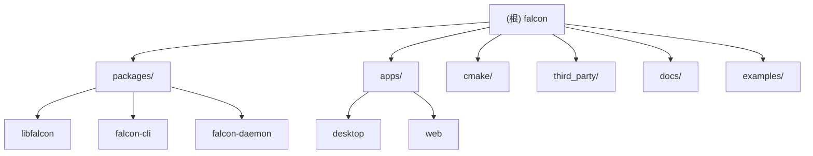

# Falcon 下载器 - 项目架构文档

## 变更记录 (Changelog)

### 2025-12-21 - 添加私有协议支持
- 实现迅雷 thunder:// 协议支持
- 实现 QQ 旋风 qqlink:// 协议支持
- 实现快车 flashget:// 协议支持
- 实现 ED2K 电驴协议支持
- 实现 HLS/DASH 流媒体协议支持
- 更新插件管理器支持所有新协议
- 为 CLI 工具添加所有新协议的命令行支持
- 添加私有协议的单元测试

### 2025-12-21 - 重构为 Monorepo 架构
- 调整项目结构为 Monorepo 模式
- 建立 packages/ 和 apps/ 目录分离
- 更新模块索引与构建系统说明
- 完善跨平台构建配置

### 2025-12-21 - 初始化项目架构
- 创建项目基础架构文档
- 定义模块化设计方案
- 建立编码规范与开发指引

---

## 项目愿景

**Falcon（猎鹰下载器）** 是一个现代化、跨平台的 C++ 下载解决方案，采用 Monorepo 架构，致力于提供高性能、可扩展的多协议下载能力。

### 核心目标
- 打造一个轻量级、高性能的下载引擎核心库（libfalcon）
- 提供直观易用的 CLI 工具（falcon-cli）
- 支持后台守护进程模式（falcon-daemon）
- 预留 GUI 桌面应用与 Web 管理界面扩展能力
- 支持主流及小众下载协议的插件化扩展
- 保持跨平台兼容性（Windows/Linux/macOS）
- 异步架构，支持大规模并发下载

### 发展阶段
- **第一阶段（MVP）**：HTTP/HTTPS 基础下载、CLI 工具
- **第二阶段**：FTP、BitTorrent/Magnet、断点续传
- **第三阶段**：ED2K（电驴）、私有链接解析（thunder://）、HLS/DASH
- **第四阶段**：Daemon 后台服务、RPC 接口、GUI/Web 应用

---

## 架构总览

### 设计原则
- **SOLID 原则**：保证代码可维护性和可扩展性
- **插件化架构**：协议处理器作为独立插件，方便新增/移除协议
- **异步优先**：基于现代 C++ 异步模型（std::async、协程或第三方异步库）
- **接口隔离**：核心库与应用层完全解耦，可独立作为库被其他项目引用
- **Monorepo 管理**：所有模块统一版本控制，便于依赖管理与协同开发

### 架构分层

```
┌─────────────────────────────────────────────────────────┐
│           应用层 (apps/)                                 │
│  ┌──────────────┐  ┌──────────────┐  ┌──────────────┐  │
│  │   desktop    │  │     web      │  │   (future)   │  │
│  │  GUI 桌面应用 │  │  Web 管理界面 │  │   移动端等    │  │
│  └──────────────┘  └──────────────┘  └──────────────┘  │
└──────────────────────────┬──────────────────────────────┘
                           │
┌──────────────────────────▼──────────────────────────────┐
│          工具层 (packages/)                              │
│  ┌──────────────┐  ┌──────────────┐  ┌──────────────┐  │
│  │ falcon-cli   │  │falcon-daemon │  │ (future)     │  │
│  │  命令行工具   │  │  后台守护进程 │  │  Python/JS   │  │
│  │              │  │  RPC 接口服务 │  │   绑定库     │  │
│  └──────┬───────┘  └──────┬───────┘  └──────────────┘  │
│         │                 │                             │
│         └─────────┬───────┘                             │
│                   │                                     │
│  ┌────────────────▼────────────────┐                   │
│  │       libfalcon                 │                   │
│  │   核心下载引擎库                 │                   │
│  │  ┌──────────────────────────┐   │                   │
│  │  │  任务管理器              │   │                   │
│  │  │  (TaskManager)           │   │                   │
│  │  └──────────────────────────┘   │                   │
│  │  ┌──────────────────────────┐   │                   │
│  │  │  下载引擎                │   │                   │
│  │  │  (DownloadEngine)        │   │                   │
│  │  └──────────────────────────┘   │                   │
│  │  ┌──────────────────────────┐   │                   │
│  │  │  协议插件管理器          │   │                   │
│  │  │  (PluginManager)         │   │                   │
│  │  └──────────────────────────┘   │                   │
│  └─────────────────┬────────────────┘                   │
└────────────────────┼────────────────────────────────────┘
                     │
┌────────────────────▼────────────────────────────────────┐
│        协议插件层 (packages/libfalcon/plugins/)         │
│  ┌──────┐ ┌──────┐ ┌──────┐ ┌──────┐ ┌──────┐         │
│  │ HTTP │ │ FTP  │ │  BT  │ │ ED2K │ │ HLS  │   ...   │
│  └──────┘ └──────┘ └──────┘ └──────┘ └──────┘         │
└─────────────────────────────────────────────────────────┘
                     │
┌────────────────────▼────────────────────────────────────┐
│       基础设施层 (third_party/ & 系统库)                 │
│  libcurl, libtorrent, spdlog, CLI11, nlohmann/json...   │
└─────────────────────────────────────────────────────────┘
```

---

## 模块结构图



---

## 模块索引

| 模块路径 | 职责 | 语言/框架 | 状态 |
|---------|------|-----------|------|
| `packages/libfalcon` | 核心下载引擎库 | C++17/20 | 待开发 |
| `packages/libfalcon/plugins/http` | HTTP/HTTPS 协议实现 | C++17/20 + libcurl | 待开发 |
| `packages/libfalcon/plugins/ftp` | FTP 协议实现 | C++17/20 + libcurl | 待开发 |
| `packages/libfalcon/plugins/bittorrent` | BitTorrent/Magnet 实现 | C++17/20 + libtorrent | 待开发 |
| `packages/libfalcon/plugins/thunder` | 迅雷 thunder:// 协议 | C++17/20 + OpenSSL | 已实现 |
| `packages/libfalcon/plugins/qqdl` | QQ旋风 qqlink:// 协议 | C++17/20 + OpenSSL | 已实现 |
| `packages/libfalcon/plugins/flashget` | 快车 flashget:// 协议 | C++17/20 + OpenSSL | 已实现 |
| `packages/libfalcon/plugins/ed2k` | ED2K 电驴协议 | C++17/20 | 已实现 |
| `packages/libfalcon/plugins/hls` | HLS/DASH 流媒体协议 | C++17/20 | 已实现 |
| `packages/falcon-cli` | 命令行下载工具 | C++17/20 + CLI11 | 待开发 |
| `packages/falcon-daemon` | 后台守护进程 + RPC 服务 | C++17/20 + gRPC/REST | 待开发 |
| `apps/desktop` | GUI 桌面应用（预留） | Qt/Tauri/Electron | 规划中 |
| `apps/web` | Web 管理界面（预留） | React/Vue + Vite | 规划中 |
| `cmake/` | CMake 辅助模块 | CMake | 待开发 |
| `docs/` | 用户文档与 API 文档 | Markdown/Doxygen | 待开发 |
| `examples/` | 使用示例代码 | C++ | 待开发 |

---

## 运行与开发

### 构建系统
- **CMake 3.15+**：主构建工具
- 支持三平台：Windows (MSVC/MinGW)、Linux (GCC/Clang)、macOS (Clang)
- Monorepo 模式：顶层 CMakeLists.txt 通过 `add_subdirectory()` 组织子项目

### 依赖管理
- 推荐使用 **vcpkg** 或 **Conan** 管理第三方依赖
- 或通过 Git Submodules 引入（放在 `third_party/`）

### 主要依赖项
| 依赖 | 用途 | 版本要求 |
|------|------|---------|
| libcurl | HTTP/FTP 协议支持 | 7.68+ |
| libtorrent-rasterbar | BitTorrent 协议 | 2.0+ |
| spdlog | 日志库 | 1.9+ |
| CLI11 | 命令行解析 | 2.3+ |
| nlohmann/json | JSON 配置解析 | 3.10+ |
| gRPC | RPC 框架（daemon 用） | 1.40+ |
| GoogleTest | 单元测试 | 1.12+ |

### 编译步骤

```bash
# 1. 克隆仓库
git clone https://github.com/yourusername/falcon.git
cd falcon

# 2. 安装依赖（以 vcpkg 为例）
vcpkg install curl libtorrent spdlog cli11 nlohmann-json grpc gtest

# 3. 配置 CMake
cmake -B build -S . -DCMAKE_BUILD_TYPE=Release \
      -DCMAKE_TOOLCHAIN_FILE=[vcpkg-root]/scripts/buildsystems/vcpkg.cmake

# 4. 编译所有模块
cmake --build build --config Release

# 5. 运行 CLI 工具
./build/bin/falcon-cli --help

# 6. 启动 Daemon（可选）
./build/bin/falcon-daemon --config daemon.json
```

### 开发模式编译

```bash
# Debug 模式 + 测试 + 示例
cmake -B build -S . \
  -DCMAKE_BUILD_TYPE=Debug \
  -DFALCON_BUILD_TESTS=ON \
  -DFALCON_BUILD_EXAMPLES=ON \
  -DFALCON_BUILD_DAEMON=OFF  # 可选关闭 daemon

cmake --build build
ctest --test-dir build --output-on-failure
```

### 独立模块编译

```bash
# 仅编译核心库
cmake -B build -S . -DFALCON_BUILD_CLI=OFF -DFALCON_BUILD_DAEMON=OFF
cmake --build build --target falcon

# 仅编译 CLI
cmake -B build -S . -DFALCON_BUILD_DAEMON=OFF
cmake --build build --target falcon-cli
```

---

## 测试策略

### 测试框架
- **Google Test (GTest)**：单元测试与集成测试
- **CMake CTest**：测试运行器
- **Google Benchmark**：性能测试（可选）

### 测试覆盖率目标
- 核心库（libfalcon）：≥ 80%
- 关键路径（下载逻辑、插件加载）：≥ 90%
- 协议插件：≥ 70%（依赖外部服务的部分可 mock）
- CLI/Daemon：≥ 60%（UI 逻辑除外）

### 测试分类
1. **单元测试** (`packages/*/tests/unit/`)
   - 每个类/模块独立测试
   - 使用 mock 隔离外部依赖（如网络、文件系统）

2. **集成测试** (`packages/*/tests/integration/`)
   - 端到端流程测试（下载小文件、断点续传、多任务等）
   - 需本地测试服务器或公开测试资源

3. **性能测试** (`packages/libfalcon/tests/benchmark/`)
   - 使用 Google Benchmark
   - 测试下载速度、并发性能、内存占用

### 持续集成
- **GitHub Actions**：多平台构建 + 测试（Ubuntu/Windows/macOS）
- **代码覆盖率**：Codecov 或 Coveralls
- **静态分析**：clang-tidy、cppcheck

---

## 编码规范

### C++ 标准与风格
- **标准**：C++17（最低要求），推荐 C++20（便于协程）
- **命名规范**：Google C++ Style Guide 或 LLVM Coding Standards
  - 类名：PascalCase（`DownloadEngine`）
  - 函数/变量：snake_case（`start_download()`）
  - 成员变量：`m_` 前缀（`m_task_queue`）或下划线后缀（`task_queue_`）
  - 常量：全大写 + 下划线（`MAX_RETRY_COUNT`）

### 代码组织
- **头文件**：
  - 公共 API 放在 `packages/libfalcon/include/falcon/`
  - 内部实现头文件放在 `packages/libfalcon/src/internal/`
  - 使用 `#pragma once` 或传统的 include guard

- **源文件**：
  - 一个类一个文件（除非是紧密相关的小类）
  - `.cpp` 文件按模块组织在对应目录

### 注释与文档
- 使用 **Doxygen** 风格注释
- 所有公共 API 必须有详细注释（参数、返回值、异常、示例）
- 复杂逻辑添加行内注释说明意图

示例：
```cpp
/**
 * @brief 启动下载任务
 *
 * @param url 下载链接（支持 http/https/ftp/magnet 等）
 * @param output_path 保存路径（绝对路径或相对路径）
 * @param options 下载选项（可选，包含并发数、超时等）
 * @return DownloadTask* 任务对象指针，失败返回 nullptr
 * @throws InvalidURLException 当 URL 格式非法时
 */
DownloadTask* start_download(const std::string& url,
                              const std::string& output_path,
                              const DownloadOptions& options = {});
```

### 异常处理
- 使用异常处理错误（非性能关键路径）
- 自定义异常类继承自 `std::exception`
- 关键异常定义在 `packages/libfalcon/include/falcon/exceptions.hpp`

### 资源管理
- 使用 **RAII** 原则
- 智能指针优先：`std::unique_ptr`（独占所有权）、`std::shared_ptr`（共享所有权）
- 避免裸指针传递所有权

### 线程安全
- 所有公共 API 必须是线程安全的或明确标注非线程安全
- 使用 `std::mutex`、`std::lock_guard`、`std::shared_mutex` 等
- 避免死锁：固定加锁顺序、使用 `std::scoped_lock` 多锁

### 格式化工具
- 使用 **clang-format** 自动格式化
- 配置文件：`.clang-format`（基于 Google 或 LLVM 风格）
- Git pre-commit hook 自动运行

---

## AI 使用指引

### 推荐交互方式
1. **架构设计**：先讨论模块划分、接口设计，确认后再生成代码
2. **接口优先**：先定义头文件与接口，再实现具体逻辑
3. **增量开发**：逐模块开发，每次明确当前模块的依赖关系
4. **测试驱动**：为每个新功能同时提供单元测试代码
5. **文档同步**：每次架构变更时更新对应模块的 `CLAUDE.md`

### 关键决策记录（ADR）
在做重要技术决策时，在 `docs/decisions/` 目录下创建 ADR 文档，格式：
```
# ADR-001: 选择异步模型为 std::async

## 背景
需要支持大规模并发下载任务...

## 决策
选择 std::async + std::future 作为异步基础...

## 后果
优点：...
缺点：...
```

### 插件开发指引
新增协议插件时，请遵循以下步骤：
1. 在 `packages/libfalcon/plugins/<protocol_name>/` 创建目录
2. 实现 `IProtocolHandler` 接口（定义在 `packages/libfalcon/include/falcon/plugin_interface.hpp`）
3. 在插件目录下创建 `CLAUDE.md` 记录协议特性、依赖库、测试方法
4. 在 `packages/libfalcon/CMakeLists.txt` 中添加编译选项（可选编译该插件）

---

## 目录结构说明

```
falcon/                              # 项目根目录
├── CMakeLists.txt                   # 根 CMake 配置（管理所有子项目）
├── LICENSE                          # Apache 2.0 许可证
├── README.md                        # 项目介绍（面向用户）
├── CLAUDE.md                        # 本文件（面向 AI 与开发者）
├── .gitignore                       # Git 忽略规则
├── .clang-format                    # 代码格式化配置
├── .github/
│   └── workflows/                   # CI/CD 配置
│       ├── build.yml                # 多平台构建
│       └── test.yml                 # 测试与覆盖率
│
├── packages/                        # C++ 核心包（库与工具）
│   ├── libfalcon/                   # 核心下载引擎库
│   │   ├── CMakeLists.txt
│   │   ├── CLAUDE.md                # 核心库架构文档
│   │   ├── include/
│   │   │   └── falcon/              # 公共 API 头文件
│   │   │       ├── download_engine.hpp
│   │   │       ├── task_manager.hpp
│   │   │       ├── plugin_interface.hpp
│   │   │       └── exceptions.hpp
│   │   ├── src/                     # 核心库实现
│   │   │   ├── download_engine.cpp
│   │   │   ├── task_manager.cpp
│   │   │   └── internal/            # 内部实现头文件
│   │   ├── plugins/                 # 协议插件
│   │   │   ├── http/
│   │   │   │   ├── CLAUDE.md
│   │   │   │   ├── http_plugin.hpp
│   │   │   │   └── http_plugin.cpp
│   │   │   ├── ftp/
│   │   │   └── bittorrent/
│   │   └── tests/                   # 核心库测试
│   │       ├── unit/
│   │       ├── integration/
│   │       └── benchmark/
│   │
│   ├── falcon-cli/                  # CLI 命令行工具
│   │   ├── CMakeLists.txt
│   │   ├── CLAUDE.md
│   │   ├── src/
│   │   │   └── main.cpp
│   │   └── tests/
│   │
│   └── falcon-daemon/               # 后台守护进程
│       ├── CMakeLists.txt
│       ├── CLAUDE.md
│       ├── src/
│       │   ├── main.cpp
│       │   └── rpc_server.cpp
│       ├── proto/                   # gRPC 协议定义（如使用 gRPC）
│       │   └── falcon_service.proto
│       └── tests/
│
├── apps/                            # 应用层（GUI/Web）
│   ├── desktop/                     # 桌面应用（预留）
│   │   ├── CLAUDE.md
│   │   └── README.md                # 技术选型说明（Qt/Tauri/Electron）
│   └── web/                         # Web 管理界面（预留）
│       ├── CLAUDE.md
│       └── README.md                # 技术选型说明（React/Vue）
│
├── cmake/                           # CMake 辅助模块
│   ├── FindLibcurl.cmake
│   ├── FindLibtorrent.cmake
│   ├── CodeCoverage.cmake
│   └── CompilerWarnings.cmake
│
├── third_party/                     # 第三方依赖（如使用 submodule）
│   └── README.md                    # 依赖说明（或使用 vcpkg）
│
├── docs/                            # 文档
│   ├── api/                         # API 文档（Doxygen 生成）
│   ├── user_guide.md                # 用户指南
│   ├── developer_guide.md           # 开发者指南
│   └── decisions/                   # 架构决策记录 (ADR)
│       └── ADR-001-async-model.md
│
├── examples/                        # 使用示例
│   ├── simple_download.cpp          # 基础下载示例
│   ├── batch_download.cpp           # 批量下载示例
│   └── CMakeLists.txt
│
└── .claude/
    └── index.json                   # AI 扫描索引（自动生成）
```

---

## 配置文件说明

### CMake 配置选项
```cmake
# 用户可配置选项
option(FALCON_BUILD_TESTS "构建测试" ON)
option(FALCON_BUILD_EXAMPLES "构建示例" ON)
option(FALCON_BUILD_CLI "构建 CLI 工具" ON)
option(FALCON_BUILD_DAEMON "构建 Daemon 服务" ON)

# 插件开关
option(FALCON_ENABLE_HTTP "启用 HTTP/HTTPS 插件" ON)
option(FALCON_ENABLE_FTP "启用 FTP 插件" ON)
option(FALCON_ENABLE_BITTORRENT "启用 BitTorrent 插件" OFF)

# 依赖管理
option(FALCON_USE_SYSTEM_LIBS "使用系统库而非 vcpkg" OFF)
option(FALCON_USE_STATIC_LIBS "静态链接依赖库" OFF)
```

### 运行时配置
CLI 程序支持配置文件（`~/.config/falcon/config.json`）：
```json
{
  "max_concurrent_tasks": 5,
  "default_download_dir": "~/Downloads",
  "log_level": "info",
  "plugins": {
    "http": {
      "timeout_seconds": 30,
      "max_retries": 3,
      "user_agent": "Falcon/1.0"
    }
  }
}
```

Daemon 配置文件（`/etc/falcon/daemon.json` 或 `~/.config/falcon/daemon.json`）：
```json
{
  "rpc": {
    "host": "127.0.0.1",
    "port": 6800,
    "enable_auth": true
  },
  "storage": {
    "task_db_path": "/var/lib/falcon/tasks.db"
  }
}
```

---

## 下一步开发计划

### 第一阶段（MVP - libfalcon + CLI）
1. **核心库架构**
   - 实现任务管理器（TaskManager）
   - 实现下载引擎核心（DownloadEngine）
   - 实现插件系统框架（PluginManager）
   - 定义公共接口（IProtocolHandler）

2. **HTTP/HTTPS 插件**
   - 基于 libcurl 实现
   - 支持断点续传、分块下载

3. **CLI 工具**
   - 命令行参数解析（CLI11）
   - 进度条显示
   - 基础日志输出

4. **测试与文档**
   - 单元测试覆盖率 ≥ 60%
   - API 文档（Doxygen）
   - 用户指南（Markdown）

### 第二阶段（协议扩展 + Daemon）
1. **新增协议插件**
   - FTP 插件
   - BitTorrent/Magnet 插件

2. **高级下载特性**
   - 多线程分块下载
   - 智能速度控制
   - 任务优先级队列

3. **Daemon 服务**
   - gRPC 或 REST 接口
   - 任务持久化（SQLite）
   - 远程任务管理

4. **完善测试**
   - 集成测试
   - 性能测试与优化

### 第三阶段（高级特性 + GUI/Web）
1. **更多协议支持**
   - ED2K（电驴）
   - HLS/DASH 流媒体
   - 网盘 API（需 OAuth2）

2. **桌面应用**
   - 技术选型（Qt/Tauri/Electron）
   - 与 Daemon 通信
   - 原生系统集成

3. **Web 管理界面**
   - 前端框架（React/Vue）
   - RESTful API 设计
   - 用户认证与权限

4. **发布 1.0 正式版本**
   - 完整文档
   - 多平台安装包
   - 社区建设

---

**文档维护**：每次架构调整、模块新增、重要功能开发时，请更新本文件对应章节，并在顶部"变更记录"中添加条目。
