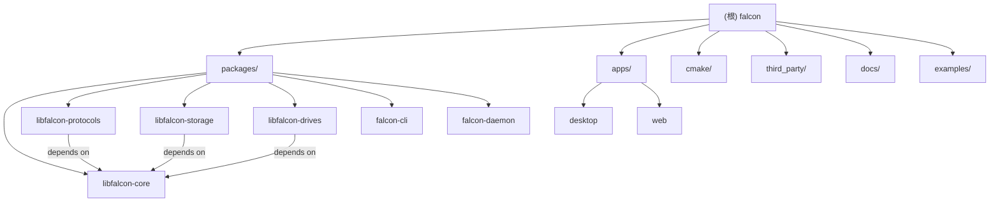

# Falcon 下载器 - 项目架构文档

## 变更记录 (Changelog)

### 2026-09-13 - Nightly Linux AppImage 打包修复（Qt 模块检测在 vcpkg 布局下失效）
- linuxdeploy-plugin-qt 的模块自动检测机制：对 AppDir 内 ELF 跑 ldd，
  按路径前缀匹配 qmake 报告的 QT_INSTALL_LIBS 计模块数。Qt 经 vcpkg
  安装时该机制不可用——qmake 报告 `tools/Qt6/lib`，实际链接的 Qt 库
  却从 `<triplet>/lib` 解析，前缀永不一致 → `Found Qt modules:` 恒
  为空 → `Could not find Qt modules to deploy`（Nightly Linux Package
  连续两轮失败的根因；非调用顺序问题，合并调用也不解决）
- 修复：`EXTRA_QT_MODULES="core;gui;widgets;network;concurrent"` 显式
  声明（分号分隔，与 apps/desktop 链接的 Qt6 组件一致）跳过自动检测；
  顺带把 `--plugin qt` 与 `--output appimage` 合并为单次 linuxdeploy
  调用（官方推荐用法）
- 验证 run 暴露第二层缺陷：vcpkg qtbase 默认不构建 xcb 平台插件
  （`platforms/libqxcb.so`），qt 插件部署 gui 模块的平台插件时报
  `Cannot deploy non-existing library file`——没有它 AppImage 即使
  打包成功在用户桌面上也起不来。修复：vcpkg.json desktop feature 的
  qtbase 增加 `"xcb"`（所需系统 X11 开发包 Ubuntu CI 步骤早已备齐）。
  **Qt configure 的 feature 是强制语义**——首次修复无平台限定导致
  macOS/Windows 的 qtbase configure 直接失败
  （`Feature "xcb": Forcing to "ON" breaks its condition`，不会静默
  降级），改为按平台拆分 qtbase 依赖条目：`platform: "linux"` 带
  xcb / `platform: "!linux"` 不带（depend-info 三平台解析验证）
- 第三层：qtbase 的 xcb 强制拉起 `system_xcb_xinput`，Ubuntu apt
  清单独缺 `libxcb-xinput-dev`（其余 xcb 系列全齐），补装后 configure
  通过（icu.h/sctp.h/tzdb 等 try-compile 报错是可选特性探测，非致命）
- 第四层（预审发现）：Create Nightly Release job 此前从未真正执行
  （总挂在 Package 层），默认只读 GITHUB_TOKEN 对 delete-asset 与
  release 发布必然 403——workflow 顶层补 `permissions: contents: write`
- 同日早前修复已验证生效：Linux qmake 定位（vcpkg_installed 树内
  find）、Windows 150min 步骤超时放宽、macOS macdeployqt 绝对路径

### 2026-09-13 - V1 段下载完整性闭环（Range 撒谎服务器静默损坏防护）
- 修复生产引擎（daemon/CLI 的 HTTP 段下载路径）三连环静默损坏缺陷：
  ① `download_segment_curl` 对 Range 请求不校验 206——服务器宣称
  Accept-Ranges 却忽略 Range 回 200 全量（透明代理/CGI 常见）时，
  curl 把整个文件传回并追加进已有段文件；② 成功路径不看段文件尺寸
  （`validate_pieces=false` 硬编码，宽松校验形同虚设），200-全量/
  短传的段无条件按 segment_size 记账标记完成；③ 恢复检测与失败
  更新两处 `min(file_size, segment_size)` clamp 把超尺寸段"祝福"为
  完成 + merge 零校验——损坏数据静默并入成品，错误结果报 COMPLETED
- 修复四层防线：`start > 0` 的段请求要求 206（否则截回本次续传起点
  按失败收尾，损坏数据不留给 merge）；段成功路径无条件精确尺寸校验
  （恰好等于段长，取代 validate_pieces 开关的宽松校验——该死配置
  字段删除）；超尺寸段删除整段重下（对旧版缺陷时代遗留的损坏段
  文件自愈）；merge 前逐段校验作最终闸门
- `download_single` 同域加固：续传请求被以 200 应答时清空临时文件
  降级完整重下（一次有界的浪费尝试优于损坏成品；现代 libcurl 自带
  resume 守卫先拒时行为不变）；段重试记账修正——失败后从段文件
  尺寸 best-effort 更新进度，超尺寸不再 clamp 成完成而是删除重来
- 新增测试：`SegmentDownloaderIntegrity` 3 用例（超尺寸遗留段自愈/
  撒谎 mock 损坏追加检测后恢复/短传拒绝不得静默出成品）+
  `RangeIntegrity` 2 个回环端到端（新增 RangeLiarServer：HEAD 宣称
  Accept-Ranges、GET 一律 200 全量——单路续传终局不变量"绝不
  COMPLETED + 内容损坏"、分段路径必须失败干净且成品不出现）；
  `mock_segment_download` 改 app 追加写入（忠于 206 服务器语义，
  旧截断重写契约在精确校验下会假失败）

### 2026-09-12 - V2 引擎临时文件发布闭环（temp_extension 端到端生效 + 死配置清扫）
- `EngineConfig::temp_extension` 与 `auto_start` 为最后两个零消费
  配置：temp_extension 自初始核心库即无任何实现；auto_start 唯一
  "引用"在被误提交进库的 `falcon-cli/src/main.cpp.bak` 死备份文件里
  （已随本commit 删除，.bak/.orig/.rej 全库清零）
- V2 实现临时文件发布语义（aria2 同思路）：temp_extension 非空
  （默认 ".falcon.tmp"）时数据写 `<最终名><扩展名>`，任务组完成时
  **原子改名**为最终名——下载中途与失败之后，半成品不再顶着最终名
  出现（媒体播放器/用户不会误取半截文件）；改名在 Completed 之前，
  监听者看到完成时成品必然已就位，改名失败按失败收尾不会假报
  COMPLETED；失败/中断的临时文件保留（未来断点续传挂点），最终名
  文件不受影响
- 与既有闭环的正交性：overwrite 门禁仍查最终名（授权覆盖的二次
  下载由"trunc 临时文件 + 完成改名"天然原子化，旧文件要么完整保留
  要么被完整替换，不再有中间态）；磁盘写缓冲冲刷先于改名（发布时
  数据必然全部落盘）；temp_extension 置空即直写最终名
- V1 两个字段删除（temp_extension 特性归属 EngineConfigV2，
  auto_start 描述的是引擎固定行为；V1 生产引擎数据路径不动）
- 新增 2 个用例（download_engine_v2_run_test）：完成改名（最终名
  完整成品 + 临时文件消失）/ 置空直写对照；异常销毁用例改为断言
  滞留数据落在临时路径且最终名不产生；既有多段定位写测试种子改
  预置临时路径（模拟引擎真实状态，完成断言经 rename 后不变）；
  全量 1477 ctest 通过，ASan 136 用例零告警

### 2026-09-12 - V2 引擎磁盘写缓冲闭环（enable_disk_cache/disk_cache_size 端到端生效）
- `enable_disk_cache`/`disk_cache_size` 自初始核心库（9b73dca 时代）
  即为愿望式配置，两引擎全链路零消费且默认 `true`（配置在撒谎）；
  V2 裸 socket 路径每 recv 块直写 ofstream（多段模式还逐块 seekp
  强制冲刷流缓冲），小块写 syscall 放大实打实存在
- V2 实现（`HttpDownloadCommand` 应用层写缓冲）：`enable_disk_cache=
  true` 时数据攒在内存、攒满 `disk_cache_size` 一次性落盘（顺带消掉
  多段逐块 seekp）；`=false` 保持直写；容量在文件打开时从引擎配置
  取定（引擎级参数，任务选项无法承载，`DownloadEngineV2::config()`
  新只读访问器），接收即记账（进度/限速按收到的字节计，与落盘解耦）
- 异常路径兜底：超时清理与停机排水直接销毁命令、不经 execute 收尾
  分支——析构补冲刷（`finish_output`），滞留缓冲的数据不再随命令
  静默丢失；完成路径冲刷失败按段错误收尾（磁盘满不会假报
  COMPLETED）；完成/失败/析构三条路径共用同一收口
- V1 `EngineConfig` 同名字段删除（curl+FILE* 已双层缓冲，实现无
  收益；按 resume_if_exists 先例清除死配置），特性归属 V2 配置
- 新增 3 个用例（`download_engine_v2_run_test.cpp`，新增
  PartialThenHangServer 部分响应后挂起服务器）：小缓冲多次落盘
  （16KB 缓冲下载 64KB 逐字节一致）/ 禁用直写对照 / 异常销毁兜底
  冲刷（4KB 滞留缓冲 + 超时清理，析构后文件必须完整含这 4KB）；
  既有全部下载用例默认走缓冲路径即回归；全量 1475 ctest 通过
  （WsRpcClient 一例并行负载抖动，串行复跑即过），ASan 134 用例
  零告警

### 2026-09-12 - 进度回调节流闭环（progress_interval_ms 端到端生效）
- 修复事件风暴缺陷：`DownloadTask::update_progress` 每次调用都
  无条件下发 `on_progress`，而 V1 curl 写回调与 V2 每 recv 块都直打
  该咽喉——监听链全量挨打（TaskStorageListener 自带 1s 节流只保
  DB 写入，其余监听者无防护）；
  `DownloadOptions::progress_interval_ms`（默认 500ms）恰为缺的
  节流值，此前全链路零消费（仅序列化往返）
- 节流收在 `DownloadTask::update_progress` 单点：非终态更新距上次
  下发不足 `progress_interval_ms` 即吞没；终态进度（downloaded ≥
  total）不节流，监听者必须能看到 100%；存储值（downloaded/total/
  speed）始终即时更新，节流只作用于监听回调
- 新增用例（download_task_test）：间隔内突发只下发一次 / 短睡后
  仍吞没（1s 间隔 + 50ms 短睡，调度延迟近 1s 才会误判，防 CI
  抖动）/ 终态穿透 / 间隔恢复下发 / 存储值不受节流影响；全量
  1472 ctest 通过，ASan 44 用例零告警

### 2026-09-12 - V2 引擎停机排水（run() 退出关闭命令持有的 fd）
- 补齐 33efedc 超时清理修复的姊妹项：运行期挂起 fd 由超时清理
  收口，但 shutdown/force_shutdown/异常停机退出 run() 时仍在队列
  或挂起中的命令随容器析构——HTTP 命令析构 `= default` 不关 fd，
  对端黑洞任务在默认 120s 兜底超时到达前停机即静默泄漏 fd
- `Command` 根基类新增 `virtual int socket_fd()`（默认 -1），
  HttpInitiate/Response/Download 三个命令 override 返回各自持有
  的 fd（fd 生命周期语义注释化：由引擎统一管理，命令析构不关）
- run() 退出统一调 `drain_command_fds()`：锁内收集两个容器中命令
  持有的 fd 并清空容器与 socket 映射 → 锁外 `remove_event` +
  `close_socket_fd`；EventPoll::poll 在 run() 线程内同步派发回调，
  循环退出后排水无并发面
- 新增用例（SilentServer 黑洞 + shutdown）：EOF 断言归因干净——
  任务/引擎兜底超时在测试时长内不触发，服务器侧观察到 EOF 只能
  来自停机排水（修复前 fd 泄漏即观察不到）；同时断言排水不改变
  任务状态（非失败语义）；全量 1471 ctest 通过，ASan 25 用例零
  告警

### 2026-09-12 - 死代码清理（resume_if_exists 死字段 + http_plugin_v2 死文件）
- 删除 `DownloadOptions::resume_if_exists`：注释自述"resume_enabled 的
  别名"，唯一消费点在一个从未接入构建的死文件里，活代码全库零读；
  断点续传语义由 `resume_enabled` 独立承载（V1 四处消费）
- 删除 `plugins/http/http_plugin_v2.cpp`（466 行）：2025-12 时代的
  `HttpPlugin` 重复实现，与在建的 `http_plugin.cpp` 同名同类（接入
  构建即重定义冲突），全库零引用零构建；沿用 websocket_server/
  xml_rpc_server 死原型删除先例，git 历史可查
- 全量 1470 ctest 通过，零新增编译警告

### 2026-09-12 - V2 引擎覆盖保护闭环（overwrite_existing 端到端生效）
- 修复静默数据破坏缺陷：`DownloadOptions::overwrite_existing` 默认
  false（"不覆盖已存在文件"），但 V2 首段下载命令无条件以 trunc 打开
  输出文件——默认配置下二次下载同名文件即静默销毁旧文件；该字段
  此前全链路零消费（task_manager 序列化往返、CLI/daemon 配置读写，
  引擎侧从不读取）
- 门禁挂 `RequestGroup::init()`（输出路径在此确定、激活时恰好执行
  一次）：文件已存在且未显式 `overwrite_existing=true` → 组直接
  FAILED + 明确错误消息（aria2 `allow-overwrite=false` 同语义），
  不发任何网络请求；门禁先于协议检查，错误消息区分"文件已存在"
  与连接失败
- 任务终态同步补齐：组在 init 失败（覆盖拒绝、URL 协议不支持）时
  同步 task Failed + error（此前组 FAILED 但任务永久停留初始
  Pending 态，与组状态脱节）
- V1 不在本次范围（daemon/CLI 生产引擎，行为改动需评估停机恢复流）；
  V2 暂无断点续传，已存在文件没有可续传语义，覆盖必须显式授权
- 新增 2 个用例（`download_engine_v2_run_test.cpp`，新增
  MinimalHttpServer 测试服务器）：默认配置保护旧文件（FAILED +
  错误含"已存在" + 文件内容逐字节保留，URL 不可达但错误必须是
  文件已存在——证明门禁先于网络生效）/ 显式授权覆盖（COMPLETED +
  内容完整替换）；全量 1470 ctest 通过，ASan 19 用例零告警

### 2026-09-12 - V2 引擎连接级重试链（max_retries + retry_delay_seconds 端到端生效）
- 修复三重缺陷：`HttpRetryCommand` 是孤儿命令（生产路径零创建，
  仅测试直接构造）——V2 HTTP 下载失败根本没有重试，
  `DownloadOptions::max_retries`/`retry_delay_seconds` 零消费；且该
  命令在引擎事件循环线程里 `sleep_for(5s)`——一个任务重试时整个
  引擎所有任务与 socket 事件停摆；初始连接失败后无人给任务组标
  终态——任务悬空 Downloading、all_completed 永不成立、run() 永不
  退出（既有 run 测试的 keepalive 任务恰好依赖此悬空行为）
- 重试链接线（aria2 max-tries 同语义）：连接失败（connect 失败/
  响应头阶段断连，均无已下载数据）→ `make_connection_retry` 构造
  `HttpRetryCommand` → 以 `NEED_RETRY` 回队轮询到
  `retry_delay_seconds` 到点（不注册 socket 事件、不阻塞引擎线程）
  → 重新 initiate；重试计数经 `set_retry_count` 沿命令链传递
  （首连 + max_retries 次重试），重试期间任务组保持 ACTIVE
- 边界语义：多连接意图的任务不参与连接级重试（分段失败语义不同，
  暂不覆盖）；传输中断（已下载数据）重试属断点续传域，亦不在本次
  范围；HTTP 状态错误/重定向不支持等语义性失败重试无价值，直接
  终态收口
- 新增 `fail_group_terminal` 收口：初始连接失败重试耗尽后组标
  FAILED + task Failed（复用段失败收尾语义）
- 新增 5 个端到端用例（`download_engine_v2_retry_test.cpp`，
  FlakyServer 前 N 次连接立即关闭 + accept 计数）：瞬时故障恢复
  （COMPLETED，恰 2 次连接）/ 重试耗尽精确次数（3 次）/ 延迟消费
  （2 次重试 ≥2s）/ 多连接任务跳过重试（1 次连接）/ 连接拒绝获得
  终态；既有 run 测试 keepalive 任务改用长挂起重试链保持组 ACTIVE
  （组悬空依赖随缺陷一并移除）；全量 1468 ctest 通过，ASan 17
  用例零告警

### 2026-09-12 - V2 引擎超时清理闭环（任务终态 + fd 关闭 + 任务级超时）
- 修复 `cleanup_completed_commands` 双重缺陷（对端黑洞时暴露）：
  命令挂起超时后只销毁命令对象——`HttpResponseCommand`/
  `HttpDownloadCommand` 析构 `= default` 不关 fd（泄漏），且不把
  所属任务组标 FAILED（任务永久悬空 Downloading、all_completed
  永不成立、run() 永不退出）
- 重构为三遍扫描：锁内收集等待中命令 {cmd_id, fd, task_id, 挂起
  时间} → 锁外按任务阈值筛选 → 锁内移除映射取所有权 → 锁外
  `remove_event` + `close_socket_fd`（新增引擎侧辅助，_WIN32 走
  closesocket）+ 复用 `fail_group_of_command` 标终态（与命令异常
  路径同语义；组未完成时必为 ACTIVE，task=0 命令 find_group 安全
  无操作）
- `DownloadOptions::timeout_seconds` 从零消费端变为生效：任务
  显式设置（>0）优先，未设置回落引擎 `command_wait_timeout_seconds`
  （默认 120s 兜底）
- 新增 2 个黑洞服务器用例（`download_engine_v2_run_test.cpp`，
  SilentServer 接受连接后不读不写）：任务级 2s / 引擎兜底 2s 两条
  路径均断言组 FAILED + run() 在时限内退出 + 服务器侧观察到 EOF
  （进程存活期间 fd 未关闭即观察不到，真泄漏检测）；全量 1463
  ctest 通过，ASan 构建限速/超时/异常边界 17 用例零告警

### 2026-09-12 - V2 引擎单任务限速（任务窗口 + 与全局取严）
- `DownloadOptions::speed_limit` 在 V2 引擎同样零消费端（V1 有
  curl 通道，V2 裸 socket 路径全速跑），复用全局限速的滑动窗口
  机制扩展为 per-task 记账：`report_downloaded_bytes(task_id, n)`
  同时记全局窗口与任务窗口（多连接分段共享任务窗口，预算先到
  先得自然分摊——任务总限速语义）
- `recv_budget(task_id, task_limit)` 取 min(全局预算, 任务预算)；
  任务限速值从 RequestGroup 读取（命令不持有 options）
- 任务级节流不跳过 execute_commands（单任务受限不能拖累其他任务），
  只把本轮 poll 拉长到最早的任务预算恢复点；预算挂起不注册 socket
  事件（数据已在内核缓冲会立即唤醒形成忙旋，改为回队轮询）
- 两个实测缺陷修复：任务窗口淘汰只挂在 report 上，预算耗尽挂起
  期间没有新 report → 预算永不恢复死锁（30s 超时），改为 recv_budget
  查询时同步淘汰；终态任务窗口条目每轮清理防 map 无限增长
- 新增 2 个端到端用例：任务自身 64KB/s（≥2.5s，实测 3.5s）+
  全局/任务取严双向验证；全量回归 protocols 551 + core 402 +
  daemon 229，ASan 15 用例零告警

### 2026-09-12 - V2 引擎全局限速（读层预算 + 事件循环节流）
- `EngineConfigV2::global_speed_limit` 从零消费端变为端到端生效：
  `HttpDownloadCommand::receive_data` 每次 recv 后
  `report_downloaded_bytes` → 引擎 1s 滑动窗口统计全局接收速率
- 节流双层设计（aria2 SpeedCalc 同思路）：
  - 读层预算 `recv_budget()`（限值 − 窗口占用）：recv 前查询，
    单次读取量截断到预算内、预算归零即挂起等 socket 事件——
    单次 execute 最多循环读 64 轮，若不在读层限流，一次就能把
    整个文件拉完，循环级节流永远插不进来；截断同样必要，预算
    残量时整缓冲读会让均速到限值 2 倍（测试实测复现）
  - 循环级节流：窗口达限后 `evaluate_throttle` 以"旧样本满 1s 龄
    淘汰、预算恢复"为截止点拉长 poll 等待并跳过数据面命令，
    socket 事件照常处理不丢唤醒
- `set_global_speed_limit` 运行时可调（清空节流截止立即生效），
  多连接分段下载共享同一窗口（全局语义）
- 新增 3 个端到端用例（`download_engine_v2_speed_limit_test.cpp`）：
  全速对照上界 + 配置构造/运行时 setter 两条限速路径的时间下界
  断言（256KB @ 64KB/s ≥ 2.5s，实测 ≈3.0s 精确节流）；测试服务器
  带 RAII 析构（joinable 线程析构即 terminate）与 Winsock 类型
  别名，三平台可编译
- 全量回归：protocols 549 + core 402 + daemon 229 通过，ASan 构建
  V2 限速/异常边界 13 用例零告警

### 2026-09-12 - 引擎全局限速真正落地（零消费端 → 端到端生效）
- 修复全局限速"只存值不生效"的缺陷：`set_global_speed_limit` 此前
  仅写原子并广播事件，下载路径零消费端（daemon.json 的
  `max_overall_speed_limit` 与 RPC `max-overall-download-limit`
  均为无效配置）；`EngineConfig::global_speed_limit` 构造参数同样
  从未消费
- 通道：`IEventListener::query_speed_limit(task_id)`（默认返回 0，
  非破坏扩展）→ `TaskManager` 实现（全局限速按并发槽位均摊、与
  任务自身 `options.speed_limit` 取严）→ HTTP handler 消费
- HTTP 单连接路径：初值 + 进度回调每 200ms 窗口查询一次，变化时
  热应用 `CURLOPT_MAX_RECV_SPEED_LARGE`（libcurl 支持传输中修改，
  RPC/SIGHUP 改限速即时生效）；段路径：任务限速按连接数均摊后经
  `options.speed_limit` 传入（既有消费点）
- 新增 3 个回环 HTTP 端到端用例（`global_speed_limit_test.cpp`，
  `falcon_http_tests`）：256KB 全速 520ms / 全局 64KB/s 4021ms /
  任务自身 64KB/s 4021ms——时间下界断言只验证"限速生效必变慢"，
  不设上界防 CI 抖动误报；测试 server 用 poll+超时防 Linux close
  阻塞 accept 不唤醒的挂死（复用 RangeTestServer 模板）
- 全量回归：core 392 + protocols 424 + daemon 229 全绿

### 2026-09-12 - V2 引擎异常边界（命令异常不再 terminate 整个进程）
- `run()` 主循环体兜底 try/catch：循环内异常安全停机（引擎常以 `run()`
  作线程函数，异常逃逸即 `std::terminate`——此前引擎零 try/catch，
  任何命令异常直接杀死整个进程，UAF 调查中确认的最大扩散面
- `execute_commands()` 单命令异常边界：捕获后所属任务组标 FAILED
  （新增 `fail_group_of_command`，多段组走 `finish_segment(false)`
  收尾并记录错误消息），同轮其余命令与引擎继续运行
- `execute_routine_commands()` 例程命令异常只跳过本轮（例程是全局性
  后台任务，无对应任务组可标失败）
- Socket 事件回调逻辑提取为 `handle_socket_ready()` 并整体 try/catch：
  回调在 EventPoll 线程上下文执行，异常逃逸即 terminate；回调失败仅
  丢失一次唤醒（挂起命令由超时清理回收）
- 新增 3 个异常注入测试（`download_engine_v2_run_test.cpp`）：注入
  抛 `std::runtime_error` / 非 std 异常的命令验证引擎存活 + 组标
  FAILED + 同轮命令不受影响；例程异常验证引擎继续运行；protocols
  全量 424 用例通过，ASan 构建 3 轮无告警

### 2026-09-12 - Daemon 下载参数配置化（daemon.json "download" 节）
- `daemon.json` 新增 `download` 节（`max_concurrent_tasks`/
  `max_overall_speed_limit`），启动时应用、SIGHUP 重载热更，与
  `aria2.changeGlobalOption` 键位对齐
- 顺手加固 WS 测试基建的注册窗口竞争（`wait_registered` 辅助），
  消除负载下 BroadcastFanout/count 断言的偶发失败
- daemon 全量 229 用例通过

### 2026-09-12 - Daemon SIGHUP 配置重载（daemon.json 热更新）
- SIGHUP 触发重读启动时生效的 daemon.json：`rpc.secret`/
  `allow_origin_all` 经 `JsonRpcServer::update_auth` 立即生效，
  监听/存储/守护化项变化告警"restart required"；重载失败保持现有
  配置继续运行
- 修复信号处理器直接执行重载回调的缺陷：新增 async-signal-safe 的
  `DaemonManager::request_reload()`（仅置原子标志），`run()` 主循环
  在普通线程上下文消费执行
- 新增 2 个 main 集成用例（SIGHUP 换 secret 生效、坏配置重载不死机）；
  daemon 全量 225 用例通过

### 2026-09-12 - 修复 V2 引擎多段下载悬垂引用（Windows CI 崩溃根因）
- `HttpResponseCommand::options_` 由引用成员改为值拷贝：其构造方
  `HttpInitiateConnectionCommand` 在 `send_http_request` 末尾把自己
  的 `options_` 值成员按引用传入，随后命令对象即被引擎队列销毁，
  响应命令再解引用即 heap-use-after-free（ASan 于
  `determine_download_strategy` 首行命中；Windows MSVC 堆 free 后
  改写导致读脏数据崩溃，且引擎线程无异常边界 → 静默 terminate）
- Linux glibc free 后暂不改写，读回旧值侥幸通过（压测 300 次不复现），
  属三平台共同潜伏缺陷；`HttpDownloadCommand`/`RequestGroup` 核查为
  值持有，全库仅此一处悬垂引用
- ASan 构建 20 轮压测 + protocols 全量 446 用例通过

### 2026-09-12 - Daemon 配置文件加载（daemon.json）
- 新增 `daemon.json` 配置文件：`rpc`（enabled/host/port/secret/
  allow_origin_all）、`daemon`（run_as_daemon/pid_file/working_dir/
  log_file）、`storage`（task_db_path）三节，路径支持 `~` 展开
- 优先级：命令行显式参数 > 配置文件 > 默认值；`--conf-path <file>`
  显式指定（必须存在），默认尝试 `~/.config/falcon/daemon.json`（存在
  才加载，aria2 语义），`--no-conf` 短路一切加载
- 容错：JSON 非法/类型错误报错退出（daemonize 之前），未知键告警不失败
- 新增 12 个解析单测 + 8 个真实二进制集成用例（全量 1444 用例通过）

### 2026-09-12 - 桌面端接入 Daemon 事件流
- 新增 `WebSocketRpcClient`（daemon 包，随 `falcon_daemon_rpc_client` 库）：
  WS 单连接承载请求/响应与服务器通知，断线自动重连，`call()` 语义与
  HTTP 客户端一致
- desktop `DaemonRpcBackend` 切换到 WS 客户端：daemon 通知（任务状态
  变更/进度推送）即时触发快照刷新，500ms 轮询降为兜底；刷新路径
  `IDownloadBackend::set_wake_callback` + `DownloadService::request_refresh`
- 新增 10 个 WS 客户端回环测试（daemon 159 用例全过）+ desktop 事件
  唤醒全链路用例（等价目标本地编译验证 6/6）；修复 desktop 测试目标
  缺失 server 符号的潜在链接缺陷

### 2026-09-12 - Daemon WebSocket 事件流订阅
- daemon 同端口支持 WebSocket 升级（`ws://host:6800/jsonrpc`，aria2 真实
  行为，AriaNg 实时模式可直接对接）；WS 上的 JSON-RPC 与 HTTP 共用分发与
  `token:` 认证，28 个方法全会话内可用
- 新增 `websocket_frame.{hpp,cpp}`：RFC 6455 协议层（增量帧解析、掩码、
  分片聚合、控制帧；SHA1/base64 自实现，daemon 不新增 OpenSSL 依赖）
- 引擎事件经 `RpcEventBridge` 广播为 JSON-RPC 通知：aria2 兼容
  `onDownloadStart/Pause/Complete/Error/Stop` + Falcon 扩展
  `falcon.onProgress`（每任务 1 秒节流）；params[0] 携带 gid + 进度快照
- 删除从未接入构建的死代码原型 `websocket_server.{hpp,cpp}`
- 停机安全：有活动订阅者时 `stop()` shutdown 唤醒会话线程，不挂死
- 新增 15 个 WebSocket 测试用例（RFC 向量/帧协议/真实引擎事件链回环），
  daemon 全量 149 用例本地通过

### 2026-09-12 - V2 引擎 Windows 运行时适配
- 修复 `http_commands.cpp` 三类 Winsock 运行时缺陷（此前仅"能编译"，跳过测试
  掩盖了无法实际运行）：
  - Winsock 调用失败后不设置 errno——新增 `sock_errno()/sock_err_str()/
    sock_would_block()` 辅助（Windows 走 `WSAGetLastError()`），替换全部
    `errno` 直接判定
  - 非阻塞 connect 的"进行中"判定：Winsock 一律报 `WSAEWOULDBLOCK`（旧代码
    按 `errno == EINPROGRESS` 判定，Windows 上必然误判为连接失败）
  - send/recv 的 EAGAIN 判定（MSVC 的 EAGAIN=11 与 WSAEWOULDBLOCK=10035
    永不匹配，缓冲区满会被误判为致命错误）
- 移除 `http_commands_coverage_test.cpp` 全部 7 处 `TODO(Win)` GTEST_SKIP，
  Windows 与 POSIX 统一走真实事件循环（PollEventPoll/WSAPoll）；测试基建补
  `RangeTestServer::start()` 显式 winsock 初始化
- `download_engine_v2_test.cpp` 解除 Windows 排除：ScopedPipe 的 pipe 以回环
  TCP 连接等价实现（仅作合法 fd 喂给引擎映射表，无 I/O 依赖），三平台统一编译
- docs 站点依赖漏洞修复（Dependabot 8 条）：pnpm overrides 强制 vite 6.4.3+/
  esbuild 0.25+/postcss 8.5.23+/nanoid 3.3.18+，文档站构建验证通过

### 2026-09-11 - 桌面应用接入 Daemon RPC（下载服务层）
- desktop 新增下载服务层：`IDownloadBackend` 抽象 + `InProcessBackend`
  （进程内引擎）/ `DaemonRpcBackend`（aria2 兼容 JSON-RPC）双实现，
  UI 经 `DownloadService` 快照轮询驱动，不再直连 `DownloadEngine`
- daemon 拆出 `falcon_daemon_rpc_client` 静态库（JSON-RPC 客户端 +
  aria2 快照转换层），desktop 硬依赖；RPC 方法扩至 28 个（新增
  `aria2.changePriority`），tellStatus 携带 `priority` 扩展字段
- 设置页新增 Daemon 模式开关（RPC URL + secret，重启后生效）；
  下载页重写为快照驱动（行内暂停/继续、右键优先级子菜单）
- 新增纯 C++ 后端回环测试 `falcon_desktop_backend_tests`（5 用例），
  desktop Qt 层随 CI Qt6 job 编译验证

### 2026-09-11 - Daemon RPC API 全面完善
- aria2 兼容 JSON-RPC 方法扩至 26 个，查询/删除同时覆盖引擎内存态与 SQLite 历史（引擎优先、storage 回落、按 id 去重）
- 新增 `getFiles`/`getUris`/`getOption`/`getGlobalOption`/`changeGlobalOption`/`getSessionInfo`/`saveSession`/`purgeDownloadResult`/`removeDownloadResult`/`pauseAll`/`unpauseAll`/`forceShutdown`/`system.multicall` 等
- `forceShutdown` 接线 `DaemonManager::request_stop()`，RPC 可触发正常停机（排水 + 落库）
- 修复 `TaskStorage::create_task` 不写显式 id 的缺陷（此前 RPC addUri 落库后 storage id 与引擎 id 在删除/重启后错位）
- JSON-RPC 错误码分层修正：-32700 仅限 JSON 解析失败，dispatch 内部异常报 -32603
- 删除死代码 `xml_rpc_server.{hpp,cpp}`；daemon CLAUDE.md 从 gRPC 蓝图重写为 JSON-RPC 实际实现
- Core 新增只读查询 `get_global_speed_limit()` / `get_max_concurrent_tasks()`
- 新增测试目标 `falcon_daemon_rpc_storage_tests`（15 用例）与扩展 `falcon_daemon_rpc_coverage_tests`

### 2026-09-11 - Daemon 任务持久化闭环
- 新增 `TaskStorageListener`：引擎状态/进度事件实时落库（SQLite，进度 1 秒节流）
- 停机改为暂停语义（`pause_all` + 排水），未完成任务以可恢复状态入库
- 重启恢复：跳过终态、还原 `output_path`、Paused 任务恢复但不自动启动
- 修复重启后任务 id 计数器与持久化记录冲突（`DownloadEngine::set_next_task_id` + `TaskStorage::get_max_task_id`）
- vcpkg.json / CI 增加 SQLite3，daemon 持久化与存储测试纳入 CI

### 2026-04-14 - 四库拆分重构（P0+P1）
- 将单体 `libfalcon` 拆分为四个独立包：`libfalcon-core`、`libfalcon-protocols`、`libfalcon-storage`、`libfalcon-drives`
- 建立独立 CMake target 和 alias（`Falcon::core/protocols/storage/drives`）
- Core 头文件收口：不再暴露 S3/OSS/COS/CloudStorage/ResourceBrowser 等概念
- 测试文件按库归属迁移到对应包
- 删除旧 `packages/libfalcon/` 单体目录
- 跨包 option 提升到顶层 CMakeLists.txt

### 2026-04-15 - 公共头文件路径重组（Phase 3）
- 24 个公共头文件迁移到 namespace 对齐路径
  - `libfalcon-drives`: 3 headers → `falcon/drives/`
  - `libfalcon-storage`: 11 headers → `falcon/storage/`
  - `libfalcon-protocols`: 10 headers → `falcon/protocols/`（含子目录）
- 保留向后兼容 shim 头文件（纯转发，无警告）
- 更新 45+ 源文件/测试文件的 include 路径
- CI 全平台验证通过

### 2026-04-15 - 接口收尾与文档清理（Phase 4）
- 文档更新：修正 `plugin_interface.hpp` 旧引用为 `protocol_handler.hpp`
- shim 警告清理：移除 24 个 shim 头文件的 `#warning` 编译警告
- `falcon::plugins` 命名空间清理完成（代码中无残留）
- 验证安装导出配置完善（Config.cmake.in、FalconTargets 导出）

### 2025-12-21 - 添加私有协议支持
- 实现迅雷 thunder:// 协议支持
- 实现 QQ 旋风 qqlink:// 协议支持
- 实现快车 flashget:// 协议支持
- 实现 ED2K 电驴协议支持
- 实现 HLS/DASH 流媒体协议支持
- 更新插件管理器支持所有新协议
- 为 CLI 工具添加所有新协议的命令行支持
- 添加私有协议的单元测试

### 2025-12-21 - 重构为 Monorepo 架构
- 调整项目结构为 Monorepo 模式
- 建立 packages/ 和 apps/ 目录分离
- 更新模块索引与构建系统说明
- 完善跨平台构建配置

### 2025-12-21 - 初始化项目架构
- 创建项目基础架构文档
- 定义模块化设计方案
- 建立编码规范与开发指引

### 2026-05-07 - 协议处理器扩展接口与委托机制
- 新增 `IProtocolHandlerExtension` 扩展接口
- 支持协议处理器访问 `ProtocolRegistry` 实现协议委托
- Thunder/FlashGet/QQDL 插件实现委托下载：解析链接后委托给实际协议处理器
- ED2K 插件实现多源下载委托：遍历源地址列表尝试下载

### 2026-05-07 - BitTorrent DHT/PEX 集成与 HTTP 分块传输
- BitTorrent 插件集成 DHT 客户端和 PEX 扩展协议
  - DHT 路由表（K-bucket）、XOR 距离计算、UDP 通信
  - PEX 管理：peer 生命周期、候选 peer 管理、消息协议处理
  - 与 libtorrent 模式集成：通过 `connect_peer()` 添加 DHT/PEX 发现的 peers
- HTTP 分块传输编码（Chunked Transfer Encoding）解析
  - 完整状态机：READ_SIZE → READ_DATA → READ_CR → READ_LF → READ_TRAILER
  - Windows memmem 兼容实现
- 资源搜索功能完善：JSON 响应解析、路径模式替换、多格式支持

### 2026-05-12 - 协议插件重构完成
- 所有私有协议插件（ED2K/Thunder/QQDL/FlashGet/HLS）迁移到 `IProtocolHandler` 接口
- 统一任务管理：TaskContext、活动任务跟踪、异步下载线程模型
- 完整支持任务暂停、恢复、取消操作
- HLS 插件实现完整 M3U8 下载逻辑：播放列表解析 → 段并行下载 → 二进制合并

---

## 项目愿景

**Falcon（猎鹰下载器）** 是一个现代化、跨平台的 C++ 下载解决方案，采用 Monorepo 架构，致力于提供高性能、可扩展的多协议下载能力。

### 核心目标
- 打造一个轻量级、高性能的下载引擎核心库（libfalcon-core）
- 标准下载协议作为独立库（libfalcon-protocols）
- 对象存储与资源浏览作为独立库（libfalcon-storage）
- 网盘与云存储作为独立库（libfalcon-drives）
- 提供直观易用的 CLI 工具（falcon-cli）
- 支持后台守护进程模式（falcon-daemon）
- 预留 GUI 桌面应用与 Web 管理界面扩展能力
- 保持跨平台兼容性（Windows/Linux/macOS）
- 异步架构，支持大规模并发下载

### 发展阶段
- **第一阶段（MVP）**：HTTP/HTTPS 基础下载、CLI 工具
- **第二阶段**：FTP、BitTorrent/Magnet、断点续传
- **第三阶段**：ED2K（电驴）、私有链接解析（thunder://）、HLS/DASH
- **第四阶段**：Daemon 后台服务、RPC 接口、GUI/Web 应用

---

## 架构总览

### 设计原则
- **SOLID 原则**：保证代码可维护性和可扩展性
- **插件化架构**：协议处理器作为独立插件，方便新增/移除协议
- **异步优先**：基于现代 C++ 异步模型（std::async、协程或第三方异步库）
- **接口隔离**：核心库与应用层完全解耦，可独立作为库被其他项目引用
- **Monorepo 管理**：所有模块统一版本控制，便于依赖管理与协同开发

### 架构分层

```
┌─────────────────────────────────────────────────────────┐
│           应用层 (apps/)                                 │
│  ┌──────────────┐  ┌──────────────┐  ┌──────────────┐  │
│  │   desktop    │  │     web      │  │   (future)   │  │
│  │  GUI 桌面应用 │  │  Web 管理界面 │  │   移动端等    │  │
│  └──────────────┘  └──────────────┘  └──────────────┘  │
└──────────────────────────┬──────────────────────────────┘
                           │
┌──────────────────────────▼──────────────────────────────┐
│          工具层 (packages/)                              │
│  ┌──────────────┐  ┌──────────────┐                     │
│  │ falcon-cli   │  │falcon-daemon │                     │
│  │  命令行工具   │  │  后台守护进程 │                     │
│  └──────┬───────┘  └──────┬───────┘                     │
│         │                 │                             │
│         └─────────┬───────┘                             │
│                   │                                     │
│  ┌────────────────▼────────────────┐                   │
│  │       核心库 (libfalcon-core)    │                   │
│  │   下载引擎 / 任务管理 / 事件系统  │                   │
│  │   插件注册接口 / 通用基础设施     │                   │
│  └───┬──────────┬──────────┬───────┘                   │
│      │          │          │                            │
│  ┌───▼───┐ ┌───▼───┐ ┌───▼───┐                        │
│  │proto- │ │storage│ │drives │                         │
│  │cols   │ │       │ │       │                         │
│  │HTTP   │ │S3/OSS │ │网盘   │                         │
│  │FTP/BT │ │COS等  │ │云存储 │                         │
│  │ED2K等 │ │资源浏览│ │搜索等 │                         │
│  └───────┘ └───────┘ └───────┘                         │
└────────────────────────────────────────────────────────┘
                     │
┌────────────────────▼────────────────────────────────────┐
│       基础设施层 (third_party/ & 系统库)                 │
│  libcurl, libtorrent, spdlog, CLI11, nlohmann/json...   │
└─────────────────────────────────────────────────────────┘
```

### 依赖方向

```
falcon_protocols  →  falcon_core
falcon_storage    →  falcon_core
falcon_drives     →  falcon_core
```

禁止反向依赖：`core` 不依赖 `protocols/storage/drives`。

---

## 模块结构图


```mermaid
graph TD
    A["(根) falcon"] --> B["packages/"];
    B --> C["libfalcon-core"];
    B --> D["libfalcon-protocols"];
    B --> E["libfalcon-storage"];
    B --> F["libfalcon-drives"];
    B --> G["falcon-cli"];
    B --> H["falcon-daemon"];

    A --> I["apps/"];
    I --> J["desktop"];
    I --> K["web"];

    A --> L["cmake/"];
    A --> M["third_party/"];
    A --> N["docs/"];
    A --> O["examples/"];

    D -->|depends on| C
    E -->|depends on| C
    F -->|depends on| C

    click C "./packages/libfalcon-core/CLAUDE.md" "查看核心库文档"
    click D "./packages/libfalcon-protocols/CLAUDE.md" "查看协议库文档"
    click E "./packages/libfalcon-storage/CLAUDE.md" "查看存储库文档"
    click F "./packages/libfalcon-drives/CLAUDE.md" "查看网盘库文档"
    click G "./packages/falcon-cli/CLAUDE.md" "查看 CLI 文档"
    click H "./packages/falcon-daemon/CLAUDE.md" "查看 Daemon 文档"
```

---

## 模块索引

| 模块路径 | 职责 | CMake Target | 状态 |
|---------|------|-------------|------|
| `packages/libfalcon-core` | 下载引擎/任务管理/事件系统 | `Falcon::core` | 开发中 |
| `packages/libfalcon-protocols` | HTTP/FTP/BT/ED2K/HLS 等协议 | `Falcon::protocols` | 开发中 |
| `packages/libfalcon-storage` | S3/OSS/COS/Kodo/Upyun 对象存储 | `Falcon::storage` | 开发中 |
| `packages/libfalcon-drives` | 网盘/云存储/搜索/配置管理 | `Falcon::drives` | 开发中 |
| `packages/falcon-cli` | 命令行下载工具 | `falcon-cli` | 开发中 |
| `packages/falcon-daemon` | 后台守护进程 + RPC 服务 | `falcon-daemon` | 开发中 |
| `apps/desktop` | GUI 桌面应用（Qt6） | `falcon-desktop` | 规划中 |
| `apps/web` | Web 管理界面（预留） | — | 规划中 |

---

## 运行与开发

### 构建系统
- **CMake 3.15+**：主构建工具
- 支持三平台：Windows (MSVC/MinGW)、Linux (GCC/Clang)、macOS (Clang)
- Monorepo 模式：顶层 CMakeLists.txt 通过 `add_subdirectory()` 组织子项目

### 依赖管理
- 推荐使用 **vcpkg** 或 **Conan** 管理第三方依赖
- 或通过 Git Submodules 引入（放在 `third_party/`）

### 主要依赖项
| 依赖 | 用途 | 版本要求 |
|------|------|---------|
| libcurl | HTTP/FTP 协议支持 | 7.68+ |
| OpenSSL | HTTPS/TLS 支持 | 1.1+ |
| libtorrent-rasterbar | BitTorrent 协议（可选） | 2.0+ |
| spdlog | 日志库 | 1.9+ |
| CLI11 | 命令行解析 | 2.3+ |
| nlohmann/json | JSON 配置解析 | 3.10+ |
| gRPC | RPC 框架（daemon 用） | 1.40+ |
| GoogleTest | 单元测试 | 1.12+ |

### 编译步骤

```bash
# 1. 克隆仓库
git clone https://github.com/yourusername/falcon.git
cd falcon

# 2. 安装依赖（以 vcpkg 为例）
vcpkg install curl libtorrent spdlog cli11 nlohmann-json grpc gtest

# 3. 配置 CMake
cmake -B build -S . -DCMAKE_BUILD_TYPE=Release \
      -DCMAKE_TOOLCHAIN_FILE=[vcpkg-root]/scripts/buildsystems/vcpkg.cmake

# 4. 编译所有模块
cmake --build build --config Release

# 5. 运行 CLI 工具
./build/bin/falcon-cli --help

# 6. 启动 Daemon（可选）
./build/bin/falcon-daemon --config daemon.json
```

### 开发模式编译

```bash
# Debug 模式 + 测试 + 示例
cmake -B build -S . \
  -DCMAKE_BUILD_TYPE=Debug \
  -DFALCON_BUILD_TESTS=ON \
  -DFALCON_BUILD_EXAMPLES=ON \
  -DFALCON_BUILD_DAEMON=OFF  # 可选关闭 daemon

cmake --build build
ctest --test-dir build --output-on-failure
```

### 独立模块编译

```bash
# 仅编译核心库
cmake -B build -S . -DFALCON_BUILD_CLI=OFF -DFALCON_BUILD_DAEMON=OFF -DFALCON_BUILD_DESKTOP=OFF -DFALCON_BUILD_EXAMPLES=OFF
cmake --build build --target falcon_core

# 仅编译协议库（自动包含 core）
cmake --build build --target falcon_protocols

# 仅编译 CLI
cmake -B build -S . -DFALCON_BUILD_DAEMON=OFF -DFALCON_BUILD_DESKTOP=OFF
cmake --build build --target falcon-cli
```

---

## 测试策略

### 测试框架
- **Google Test (GTest)**：单元测试与集成测试
- **CMake CTest**：测试运行器
- **Google Benchmark**：性能测试（可选）

### 测试覆盖率目标
- 核心库（libfalcon）：≥ 80%
- 关键路径（下载逻辑、插件加载）：≥ 90%
- 协议插件：≥ 70%（依赖外部服务的部分可 mock）
- CLI/Daemon：≥ 60%（UI 逻辑除外）

### 测试分类
1. **单元测试** (`packages/*/tests/unit/`)
   - 每个类/模块独立测试
   - 使用 mock 隔离外部依赖（如网络、文件系统）

2. **集成测试** (`packages/*/tests/integration/`)
   - 端到端流程测试（下载小文件、断点续传、多任务等）
   - 需本地测试服务器或公开测试资源

3. **性能测试** (`packages/libfalcon/tests/benchmark/`)
   - 使用 Google Benchmark
   - 测试下载速度、并发性能、内存占用

### 持续集成
- **GitHub Actions**：多平台构建 + 测试（Ubuntu/Windows/macOS）
- **代码覆盖率**：Codecov 或 Coveralls
- **静态分析**：clang-tidy、cppcheck

---

## 编码规范

### C++ 标准与风格
- **标准**：C++17（最低要求），推荐 C++20（便于协程）
- **命名规范**：Google C++ Style Guide 或 LLVM Coding Standards
  - 类名：PascalCase（`DownloadEngine`）
  - 函数/变量：snake_case（`start_download()`）
  - 成员变量：`m_` 前缀（`m_task_queue`）或下划线后缀（`task_queue_`）
  - 常量：全大写 + 下划线（`MAX_RETRY_COUNT`）

### 代码组织
- **头文件**：
  - Core 公共 API 放在 `packages/libfalcon-core/include/falcon/`
  - Protocols 公共 API 放在 `packages/libfalcon-protocols/include/falcon/`
  - Storage 公共 API 放在 `packages/libfalcon-storage/include/falcon/`
  - Drives 公共 API 放在 `packages/libfalcon-drives/include/falcon/`
  - 使用 `#pragma once` 或传统的 include guard

- **源文件**：
  - 一个类一个文件（除非是紧密相关的小类）
  - `.cpp` 文件按模块组织在对应目录

### 注释与文档
- 使用 **Doxygen** 风格注释
- 所有公共 API 必须有详细注释（参数、返回值、异常、示例）
- 复杂逻辑添加行内注释说明意图

示例：
```cpp
/**
 * @brief 启动下载任务
 *
 * @param url 下载链接（支持 http/https/ftp/magnet 等）
 * @param output_path 保存路径（绝对路径或相对路径）
 * @param options 下载选项（可选，包含并发数、超时等）
 * @return DownloadTask* 任务对象指针，失败返回 nullptr
 * @throws InvalidURLException 当 URL 格式非法时
 */
DownloadTask* start_download(const std::string& url,
                              const std::string& output_path,
                              const DownloadOptions& options = {});
```

### 异常处理
- 使用异常处理错误（非性能关键路径）
- 自定义异常类继承自 `std::exception`
- 关键异常定义在 `packages/libfalcon-core/include/falcon/exceptions.hpp`

### 资源管理
- 使用 **RAII** 原则
- 智能指针优先：`std::unique_ptr`（独占所有权）、`std::shared_ptr`（共享所有权）
- 避免裸指针传递所有权

### 线程安全
- 所有公共 API 必须是线程安全的或明确标注非线程安全
- 使用 `std::mutex`、`std::lock_guard`、`std::shared_mutex` 等
- 避免死锁：固定加锁顺序、使用 `std::scoped_lock` 多锁

### 格式化工具
- 使用 **clang-format** 自动格式化
- 配置文件：`.clang-format`（基于 Google 或 LLVM 风格）
- Git pre-commit hook 自动运行

---

## AI 使用指引

### 推荐交互方式
1. **架构设计**：先讨论模块划分、接口设计，确认后再生成代码
2. **接口优先**：先定义头文件与接口，再实现具体逻辑
3. **增量开发**：逐模块开发，每次明确当前模块的依赖关系
4. **测试驱动**：为每个新功能同时提供单元测试代码
5. **文档同步**：每次架构变更时更新对应模块的 `CLAUDE.md`

### 关键决策记录（ADR）
在做重要技术决策时，在 `docs/decisions/` 目录下创建 ADR 文档，格式：
```
# ADR-001: 选择异步模型为 std::async

## 背景
需要支持大规模并发下载任务...

## 决策
选择 std::async + std::future 作为异步基础...

## 后果
优点：...
缺点：...
```

### 插件开发指引
新增协议插件时，请遵循以下步骤：
1. 在 `packages/libfalcon-protocols/plugins/<protocol_name>/` 创建目录
2. 实现 `IProtocolHandler` 接口（定义在 `packages/libfalcon-core/include/falcon/protocol_handler.hpp`）
3. 如需访问其他协议处理器（如包装协议委托下载），实现 `IProtocolHandlerExtension` 接口
4. 在插件目录下创建 `CLAUDE.md` 记录协议特性、依赖库、测试方法
5. 在 `packages/libfalcon-protocols/CMakeLists.txt` 中添加编译选项（可选编译该插件）

**协议委托机制**：
- 包装协议（thunder://、flashget://、qqlink://）应实现 `IProtocolHandlerExtension`
- 通过 `set_protocol_registry()` 获取 `ProtocolRegistry` 引用
- 使用 `delegateDownload()` 将解析后的真实 URL 委托给对应协议处理器

---

## 目录结构说明

```
falcon/                              # 项目根目录
├── CMakeLists.txt                   # 根 CMake 配置（管理所有子项目）
├── LICENSE                          # Apache 2.0 许可证
├── README.md                        # 项目介绍（面向用户）
├── CLAUDE.md                        # 本文件（面向 AI 与开发者）
├── todo.md                          # 重构任务跟踪
├── .gitignore                       # Git 忽略规则
├── .clang-format                    # 代码格式化配置
├── .github/
│   └── workflows/                   # CI/CD 配置
│
├── packages/                        # C++ 包（4个独立库 + 2个工具）
│   ├── libfalcon-core/              # 核心下载引擎库
│   │   ├── CMakeLists.txt           # Target: falcon_core / Falcon::core
│   │   ├── CLAUDE.md
│   │   ├── include/falcon/          # 公共 API 头文件
│   │   │   ├── download_engine.hpp
│   │   │   ├── task_manager.hpp
│   │   │   ├── protocol_handler.hpp
│   │   │   ├── protocol_handler_extension.hpp  # 协议扩展接口
│   │   │   ├── event_dispatcher.hpp
│   │   │   ├── exceptions.hpp
│   │   │   └── version.hpp
│   │   ├── src/                     # 核心库实现
│   │   └── tests/                   # 核心库测试
│   │
│   ├── libfalcon-protocols/         # 协议实现库
│   │   ├── CMakeLists.txt           # Target: falcon_protocols / Falcon::protocols
│   │   ├── include/falcon/
│   │   ├── src/                     # DownloadEngineV2, SegmentDownloader 等
│   │   ├── plugins/                 # 协议插件
│   │   │   ├── http/                # HTTP/HTTPS (libcurl)
│   │   │   ├── ftp/                 # FTP
│   │   │   ├── bittorrent/          # BitTorrent/Magnet
│   │   │   │   ├── bencode.cpp/hpp  # B 编码实现
│   │   │   │   ├── dht_node.cpp/hpp # DHT 路由节点
│   │   │   │   └── pex_protocol.cpp/hpp  # PEX 扩展协议
│   │   │   ├── thunder/             # 迅雷协议
│   │   │   ├── ed2k/                # ED2K 电驴
│   │   │   ├── hls/                 # HLS/DASH 流媒体
│   │   │   └── ...                  # 其他协议
│   │   └── tests/
│   │
│   ├── libfalcon-storage/           # 对象存储库
│   │   ├── CMakeLists.txt           # Target: falcon_storage / Falcon::storage
│   │   ├── include/falcon/
│   │   ├── src/                     # ResourceBrowser 等
│   │   ├── plugins/                 # 存储插件
│   │   │   ├── s3/                  # Amazon S3
│   │   │   ├── oss/                 # 阿里云 OSS
│   │   │   ├── cos/                 # 腾讯云 COS
│   │   │   ├── kodo/                # 七牛云
│   │   │   └── upyun/               # 又拍云
│   │   └── tests/
│   │
│   ├── libfalcon-drives/            # 网盘与云存储库
│   │   ├── CMakeLists.txt           # Target: falcon_drives / Falcon::drives
│   │   ├── include/falcon/
│   │   ├── src/                     # CloudStoragePlugin, ConfigManager 等
│   │   └── tests/
│   │
│   ├── falcon-cli/                  # CLI 命令行工具
│   │   ├── CMakeLists.txt
│   │   ├── CLAUDE.md
│   │   ├── src/
│   │   └── tests/
│   │
│   └── falcon-daemon/               # 后台守护进程
│       ├── CMakeLists.txt
│       ├── CLAUDE.md
│       ├── src/
│       └── tests/
│
├── apps/                            # 应用层（GUI/Web）
│   ├── desktop/                     # 桌面应用（预留）
│   │   ├── CLAUDE.md
│   │   └── README.md                # 技术选型说明（Qt/Tauri/Electron）
│   └── web/                         # Web 管理界面（预留）
│       ├── CLAUDE.md
│       └── README.md                # 技术选型说明（React/Vue）
│
├── cmake/                           # CMake 辅助模块
│   ├── FindLibcurl.cmake
│   ├── FindLibtorrent.cmake
│   ├── CodeCoverage.cmake
│   └── CompilerWarnings.cmake
│
├── third_party/                     # 第三方依赖（如使用 submodule）
│   └── README.md                    # 依赖说明（或使用 vcpkg）
│
├── docs/                            # 文档
│   ├── api/                         # API 文档（Doxygen 生成）
│   ├── user_guide.md                # 用户指南
│   ├── developer_guide.md           # 开发者指南
│   └── decisions/                   # 架构决策记录 (ADR)
│       └── ADR-001-async-model.md
│
├── examples/                        # 使用示例
│   ├── simple_download.cpp          # 基础下载示例
│   ├── batch_download.cpp           # 批量下载示例
│   └── CMakeLists.txt
│
└── .claude/
    └── index.json                   # AI 扫描索引（自动生成）
```

---

## 配置文件说明

### CMake 配置选项
```cmake
# 用户可配置选项
option(FALCON_BUILD_TESTS "构建测试" ON)
option(FALCON_BUILD_EXAMPLES "构建示例" ON)
option(FALCON_BUILD_CLI "构建 CLI 工具" ON)
option(FALCON_BUILD_DAEMON "构建 Daemon 服务" ON)

# 插件开关
option(FALCON_ENABLE_HTTP "启用 HTTP/HTTPS 插件" ON)
option(FALCON_ENABLE_FTP "启用 FTP 插件" ON)
option(FALCON_ENABLE_BITTORRENT "启用 BitTorrent 插件" OFF)

# 依赖管理
option(FALCON_USE_SYSTEM_LIBS "使用系统库而非 vcpkg" OFF)
option(FALCON_USE_STATIC_LIBS "静态链接依赖库" OFF)
```

### 运行时配置
CLI 程序支持配置文件（`~/.config/falcon/config.json`）：
```json
{
  "max_concurrent_tasks": 5,
  "default_download_dir": "~/Downloads",
  "log_level": "info",
  "plugins": {
    "http": {
      "timeout_seconds": 30,
      "max_retries": 3,
      "user_agent": "Falcon/1.0"
    }
  }
}
```

Daemon 配置文件（默认 `~/.config/falcon/daemon.json`，或 `--conf-path` 显式指定）：
```json
{
  "rpc": {
    "enabled": true,
    "host": "127.0.0.1",
    "port": 6800,
    "secret": "YOUR_TOKEN",
    "allow_origin_all": false
  },
  "daemon": {
    "run_as_daemon": false,
    "pid_file": "/var/run/falcon-daemon.pid",
    "working_dir": "/var/lib/falcon",
    "log_file": "/var/log/falcon/daemon.log"
  },
  "storage": {
    "task_db_path": "/var/lib/falcon/tasks.db"
  },
  "download": {
    "max_concurrent_tasks": 5,
    "max_overall_speed_limit": 0
  }
}
```

优先级：命令行显式参数 > 配置文件 > 内置默认值；`--no-conf` 跳过加载。
SIGHUP 重载：`rpc.secret`/`allow_origin_all` 与 `download` 节立即生效，
监听/存储/守护化项需重启。

---

## 下一步开发计划

### ✅ 第一阶段（已完成）
1. **核心库架构**
   - ✅ 任务管理器（TaskManager）
   - ✅ 下载引擎核心（DownloadEngine）
   - ✅ 插件系统框架（ProtocolRegistry）
   - ✅ 公共接口（IProtocolHandler）
   - ✅ 协议扩展接口（IProtocolHandlerExtension）

2. **HTTP/HTTPS 插件**
   - ✅ 基于 libcurl 实现
   - ✅ 支持断点续传、分块下载
   - ✅ HTTPS/TLS 支持（OpenSSL）
   - ✅ HTTP 分块传输编码解析

3. **协议支持**
   - ✅ HTTP/HTTPS
   - ✅ FTP/FTPS
   - ✅ BitTorrent/Magnet（含 DHT/PEX）
   - ✅ ED2K（电驴）
   - ✅ Thunder（迅雷）
   - ✅ FlashGet（快车）
   - ✅ QQDL（QQ 旋风）
   - ✅ HLS/DASH 流媒体

4. **高级下载特性**
   - ✅ 多线程分块下载（SegmentDownloader）
   - ✅ 协议委托机制
   - ✅ 任务暂停/恢复/取消

### 🔄 第二阶段（进行中）
1. **Daemon 服务**
   - ✅ HTTP RPC 服务器
   - ✅ aria2 兼容 API（26 个方法，含查询回落、批量控制、会话管理）
   - ✅ 任务持久化（SQLite：状态/进度落库、停机保存、重启恢复）
   - ✅ 事件流订阅（同端口 WebSocket 推送 aria2 兼容通知 + 进度通知）
   - ✅ 配置文件加载（daemon.json，CLI > 文件 > 默认值）

2. **桌面应用（Qt6）**
   - ✅ 迅雷风格 UI
   - ✅ 任务列表（表格/网格视图）
   - ✅ 系统托盘集成
   - ✅ 主题切换（亮色/暗色）
   - ✅ 云存储浏览（S3/OSS/COS）
   - ✅ 资源搜索集成
   - ✅ Daemon 通信（aria2 兼容 JSON-RPC 后端 + 进程内引擎双后端；
     WebSocket 事件流驱动刷新，轮询兜底）

3. **测试与文档**
   - 🔄 单元测试覆盖率提升
   - 🔄 集成测试补充
   - ✅ API 文档更新

### 📋 第三阶段（规划中）
1. **更多协议支持**
   - 🔄 网盘直链解析（百度/阿里云盘/夸克等）
   - 📋 WebDAV 协议
   - 📋 SFTP 协议

2. **完善桌面应用**
   - 📋 设置页面完善
   - 📋 下载规则管理
   - 📋 任务调度功能

3. **发布准备**
   - 📋 多平台安装包
   - 📋 用户手册
   - 📋 性能优化

---

**文档维护**：每次架构调整、模块新增、重要功能开发时，请更新本文件对应章节，并在顶部"变更记录"中添加条目。
