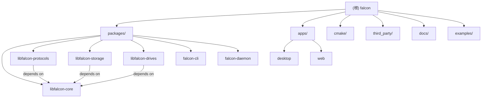

# Falcon 下载器 - 项目架构文档

## 变更记录 (Changelog)

### 2026-09-22 - 覆盖率批次 A6：miss 434 → 424（行 97.61%）+ json_rpc 两矿点证伪 + 目录 tellg 行为实证
- **3 新用例 + 2 处生产注入接线，4 目标行 gcov 逐行核对命中**（incremental_download.cpp 293-294/354/480）：
  - `CalculateChunkHashesDirectoryReadFailsAfterSeek`（既有目录用例旁）——
    hash 计算 read 失败 break 分支。**目录 ifstream 行为探针实证**（libstdc++）：
    `/tmp` 类既有目录的 tellg = -1 → fileSize=0 → 循环不进（既有用例只走
    零尺寸早退，到不了 read 失败）；`/` 与 `/usr` 的 tellg = INT64_MAX
    （9223372036854775807）→ fileSize 巨大 → 进循环 → read 失败命中
    293-294。断言空 chunks 在两形态下恒成立故不加平台守卫
  - `InjectedCurlInitFailFailsRemoteHashList` / `InjectedCurlInitFailFailsDownloadChanged`
    ——http_get 与 downloadRange 的 curl_easy_init 短路注入（`inject_failure
    ? nullptr : curl_easy_init()`，对齐 ftp_plugin 泄漏式接线修复惯例）。
    两个函数均 private：前者经公开 compare() 触发（注入 → 拉取失败 → 回退
    全量下载建议），后者手工构造 FileDiff + downloadChanged() 免起 HTTP
    服务器（断言 false 且不产出输出文件）
- **两矿点证伪/放弃（写用例前核对数据流全链的又一次践行）**：
  - json_rpc_server.cpp:1331 `if (!task)` "Unsupported URL"——**结构性不
    可达**：DownloadEngine::add_task 契约 = 空 URL 抛 InvalidURLException、
    无 handler 抛 UnsupportedProtocolException（dispatch catch → -32603）、
    其余恒返回有效指针。传未知协议 URL 在 add_task 内先抛异常，到不了
    1331——修正了「传未知协议 URL 即命中」的初判
  - json_rpc_server.cpp:862 WS_OP_PONG 的 pong send 失败——recv→send 窗口
    的 RST 传播竞速，无同步点可锚（与 824 同性质），不写低命中用例
- **测量级教训**：① gcov 输出被 `>/dev/null` 吞掉时，旧 .gcov 残留（mtime
  可差数天）会冒充新结果误导行号判读——重新生成前必须先删；② GCC 15
  gcov 必须传对象文件（`gcov -o . xxx.cpp.o`），传 `.cpp` 报 "cannot open
  notes file"（它在找 .gcno）
- **验证**：build-cov 全量 ctest 2407 清单（1 例
  DownloadEngineTest.ResumeTask 高负载并行抖动，串行复跑 19ms 即过——
  A1/A2/A5 批次既有记录；当轮另有他项目满载 16 核，负载 49）+ core
  二进制无 filter 全量重跑 442/442 恢复 gcda（filter 复跑污染铁律）；
  ASan 3 新用例零告警
- **铁账（build-cov 单树新鲜数据）**：miss **434 → 424**（4 目标行 +
  6 行时序窗口自然抖动收敛），分母 17750 → 17754（+4 为两处接线），
  行 **97.55% → 97.61%** / 分支 56.92%——98% 结构性不可达结论维持，
  矿点定性沿批次 X/V/A1-A5 口径。该文件剩余 miss 2 行均定性：
  compareHashLists 收尾（需远程列表成功——既有用例全走失败回退路径）
  与 downloadRange 零尺寸防御（结构性不可达，批次 O 既有定性）

### 2026-09-22 - 覆盖率批次 A5：miss 444 → 434（行 97.55%）+ WS 响应帧防御证伪定性
- **5 新用例三树绿**（6 个矿点候选 → 5 落地 1 证伪）：
  - `SetCleanupIntervalReachesTaskManager`（download_engine_api_test）
    ——转发链 `DownloadEngine::set_cleanup_interval → Impl →
    TaskManager::set_cleanup_interval` 6 行直调覆盖（桌面端终态任
    务保留批次的收口代码一直无测试消费端）
  - `VersionGatedTailFieldTruncationRejected`（task_manager_edges_
    test）——v3 缺 auto_file_renaming / v4 缺 conditional_get / v5
    缺 quoted 客户端证书三种手工截断行；**语义教训**：版本门控尾
    字段截断与既有截断容错同流——read_download_options 失败 →
    整行跳过（load_state 仍 true，get_task(id) == nullptr），初版
    断言 EXPECT_FALSE(load_state) 单跑即红，既有用例命名
    「LoadStateSkipsTruncated*」早已写明答案
  - `FallsBackToUrlExtensionWithoutFiles`（aria2_snapshots_test）
    ——tellStatus 精简视图无 files/uris 时 url 从扩展字段回退
    （first_uri 尾行）、output_path 按空串
  - `ConfigurePrivateModeStopsDht`（bittorrent_plugin_test）——纯
    C++ 数据面 configure_private_mode 的 `#else` 分支：停自研 DHT
    + isDhtRunning 转 false + 幂等；libtorrent 模式 GTEST_SKIP 对
    齐既有 DHT 用例姿态
  - `ResumeControlFileCleanedOnCompletion`（segment_downloader_
    test）——预置段 0 遗留 `.falcon.tmp.seg0.resume` + 正常完成，
    cleanup_segment_files 的 is_regular_file 守卫清理分支命中
    （SegmentFileOccupied 修复新增代码的测试消费端）
- **证伪定性（websocket_rpc_client.cpp:525）**：「call 层非 object
  响应 fail("Invalid response frame")」候选矿点不成立——
  dispatch_message（读线程）入口 `if (!parsed.is_object()) return;`
  先行过滤，slot->response 仅有的两个赋值点（dispatch_message 的
  parsed、fail_pending 构造的完整 error object）均为 object，525
  是结构不可达的纵深防御。用例（RawWsServer 回 "42"）实测走
  「请求超时」路径而非目标行，删除
- **验证**：build-cov 全量 ctest **2407/2407 过零失败**；ASan
  falcon_core_tests 442 + falcon_daemon_rpc_client_tests 57 +
  falcon_protocols_tests BT/segment 子集 102 零告警
- **铁账（build-cov 单树新鲜数据）**：miss **444 → 434**（净收敛
  10 行；分母 17750 不变），行 **97.50% → 97.55%** / 分支
  56.9%——98% 结构性不可达结论维持，矿点定性沿批次 X/V/A1-A4
  口径
- **测量级教训**：矿点「可测」定性必须在写用例前核对数据流全链
  ——525 的 call 层检查被读线程入口过滤挡死，只看 call 附近上下
  文漏掉了 dispatch_message 的先遣守卫；同类教训此前已有（工厂
  循环 369-376 只看 register_handler_factory 公开性漏看 load_all_
  handlers 仅构造期调用），「上游有守卫的下游分支」应作为矿点排
  查的标准否定项

### 2026-09-22 - CI 红面收口：pause→resume 竞速轮无 Range 初始请求按断点续写（成品污染）+ Windows CI 测试剧本窗口加固
- **红面**（run 35752778339，69b148d 触发——纯设计文档 commit 零代码
  改动不可能是引入者）：8 job 全绿唯 Windows build 红
  `DownloadEngineV2Pause.LateSweepAfterResumeSparesNewCommands`（1/1373，
  串行重跑同样失败非抖动）；本机多核不复现
- **Windows 红面定性（测试剧本时序缺陷）**：慢发窗口 160ms < Windows
  runner 百 ms 级调度延迟——测试线程从进度锚醒来到 pause/resume 执行
  完时服务器已发完并关连接，旧链命令被唤醒摘出等待表（无「暂停清扫」
  日志铁证）一口气收完，组 COMPLETED 无需新连接，「resume 后必须有新
  连接」断言超时红。CI 日志时间线逐条闭环（无清扫日志/无第二次激活日
  志/「所有任务已完成」先于断言超时）
- **修复加固（测试面）**：慢发 4KB/10ms → 2KB/40ms（窗口 160ms →
  1280ms，调度延迟余量 10 倍）+ 进度锚从首笔改窗口中部（≥8KB，锚后
  仍剩 ~1.1s 慢发，旧链命令必然挂起在等待表——钉子目标可达）
- **本机压测曝光真产品缺陷（更深一层）**：窗口加固后本机 50 轮 3 败，
  失败形态与 Windows 红面**不同**——成品逐字节断言红，污染形态
  `correct[0:8192] + body[0:57344]`（成品 65536 字节但 8192 起从资源
  0 重启）。完整竞速链：resume 抢在暂停清扫命令执行之前 → fill 激活
  时段 0 断点还在旧命令写缓冲里未固化（apply_group_resume_range 看到
  downloaded==0 不 set_range）→ 初始请求**无 Range** → 服务器 200 全
  量 → schedule_resume_download 的 range_requested==false 分支仅凭
  `content_length_ == plan.total` 放行 → 随后 sweep 的 prepare_sweep
  固化断点 8192 → 下载命令按断点从资源 0 的 body 续写到文件偏移
  8192 → 污染。本机 ~6% 命中率，修后统计两执行序各 ~50%（206 续传
  19 轮 / abandon 重下 21 轮），CI 慢调度下更高
- **产品根修（一致性守卫）**：schedule_resume_download 无 Range 分支
  放行条件收紧为 `content_length_ == plan.total &&（seg0.downloaded ==
  0 || >= seg0.length）`——「半截断点却未带 Range」是矛盾态（响应体
  起点资源 0 vs 续写位置断点，必错位），按不一致收口 abandon 全新重
  下（断点数据绝不接续不兼容响应体，数据安全优先）；段 0 全新
  （downloaded==0，按全新消费）与段 0 已完成（增量由其他段连接承载、
  本连接响应体不消费）两种形态合法。初版只放行 downloaded==0 被
  ResumeAcrossRestartMultiSource 当场拦截（段 0 完成态的无 Range 初始
  连接是跨引擎恢复的合法形态）——守卫条件即由该既有用例校准
- **回归钉子**：LateSweepAfterResumeSparesNewCommands 现同时钉住两条
  收敛路径——sweep 先于 fill（断点已固化 → Range → 206 正确续传）与
  resume 抢先（无 Range → 200 → 守卫拦下 abandon 重下），两分支成品
  都必须逐字节一致；断言不钉 Range 形态（两分支皆合法）
- **验证**：钉子修复后 200 轮压测零失败；ASan 暂停 7 + resume/桥接/
  适配/多源 84 用例零告警；build-ci 全量 ctest 2356/2356 过（1 例
  BlackHoleServerTimesOutViaTaskTimeout 并行抖动串行即过，A3 批次既
  有记录）
- **测量级教训**：① 「拉长窗口」只治剧本性窗口不足，治不了引擎内部
  执行序竞速——修复验证失败 3/50 时先抓失败断言形态（「新连接超时」
  vs「成品污染」是两个不同缺陷面），尾部摘要行 `[ FAILED ]` 不含断
  言消息，压测循环必须保留失败轮完整日志（cp 而非单文件覆盖）；②
  续传校验的「一致」必须覆盖请求形态与断点状态的组合合法性——total
  相等只证明资源没变，不证明响应体起点与续写位置兼容；半截断点 +
  无 Range 请求是结构性矛盾态，任何模糊放行都是污染入口；③ 同一竞
  速窗口在不同平台暴露为不同断言失败（Windows 慢调度暴露剧本窗口、
  Linux 快调度暴露内部执行序），压测定稿前两形态都要见过

### 2026-09-22 - 桌面端可用性修复批次（终态任务保留 + 进程存活防线 + 添加对话框可编辑）
- **终态任务 60s 蒸发缺陷**（桌面进程内后端）：TaskManager 后台清理
  默认每 60s 擦除终态任务（daemon 有 SQLite 落库不受影响），桌面
  InProcessBackend 直接读引擎内存——下载完成的任务一分钟后从列表
  消失。新增 `TaskManager::set_cleanup_interval`/`DownloadEngine::
  set_cleanup_interval`（运行期调整清理周期），桌面设极大值等效禁
  用，终态任务保留至用户显式"清除已完成"
- **set_cleanup_interval 竞态修复**（新测试曝光）：初版只改配置值
  不打断进行中的旧等待——清理线程按旧周期再清一轮，把设置后新加
  的终态任务清走（测试 1.2s 观测窗 < 旧周期追赶）。改为「周期变化
  标志（atomic）+ notify_all + 变化轮跳过清扫」——立即生效（旧等
  待被打断按新周期重新计时），且改周期绝不追加一次清扫（设大周期
  保留终态任务的宿主不希望 set 那一刻反向清掉它们）；标志位解决
  notify 落在清理线程非等待期时丢失的问题
- **V1 终态进度记账（"已完成 0%" 假进度）**：快速小文件下载全程落
  在 curl progress_callback 自身的 200ms 窗口外 → update_progress
  零调用 → 完成时 downloaded 恒 0。完成路径按成品尺寸补记（终态
  更新 final_update 穿透 task 层 progress_interval_ms 节流，监听者
  必看到 100%）；**未知总长（EOF/chunked 定界）跳过补记**——total
  未报告过就不发明一个（DownloadWithoutContentLength 用例的
  total==0 契约保持，初版实现曾把未知改写成成品尺寸被既有用例当
  场拦截）；download_single 与段路径两处同修。新钉子
  `FastDownloadPublishesFinalProgressAfterThrottleWindow`（无
  slow_body 亚毫秒完成 + ProgressRecorder listener 断言终态进度到
  达监听者——测试直调 handler 须手动 set_listener，生产接线在
  TaskManager::add_task）
- **桌面进程存活三防线**：① DownloadService worker 线程异常边界
  ——job 异常与 fetch 异常不再逃出 worker（逃逸即 std::terminate
  整个进程），协议无 handler 的 UnsupportedProtocolException 转
  task_add_failed 信号；② desktop main.cpp 引用
  `describe_builtin_protocols` 强符号——weak stub 链接陷阱（批次 F
  定性：GNU ld 归档单次扫描下不引用 protocols 符号的二进制真实实
  现对象从未拉入，core 空 stub 生效 → 注册 0 个协议 handler，任何
  下载抛异常即 terminate）此前桌面无任何引用点天然中招，CMake 同
  步链接 Falcon::builtin_protocol_handlers；返回值兼作启动自检；
  ③ 后端 fetch 失败本轮跳过等下个周期重试
- **添加对话框可用性**：新任务入口（URL 未知）允许直接输入，协议
  标签与文件名随输入联动（文件名手改后不再覆盖）；解析过的 URL
  （剪贴板/IPC 直达）保持只读；start_download 以 parse_url 校验
  收口（非法 URL 不放行）。MainWindow 修复：create_top_bar 里对
  未创建的 content_stack_ connect nullptr（连接从未生效）移至
  create_content_area；新任务按钮直进 Fluent 对话框（删 QInputDialog
  两段式无样式遗留）；删添加成功后的旧确认框（任务行即刻在列表
  可见，模态框只会盖住它）
- **ui_sandbox 截图矩阵扩展**：生产默认 1200×800 + 最小窗 960×640
  双尺寸 × 亮暗两主题 + 添加对话框（主窗之外最高频交互面首次进
  截图验收）= 28 张；离屏验收通过（对话框 Fluent 完整、960 挤压
  无重叠）
- **验证**：build-desktop 全量 ctest 过（1 例
  BlackHoleServerTimesOutViaTaskTimeout 并行抖动串行即过，A3 批次
  既有记录）；core 全量 440/440；protocols 全量绿；V1 HTTP 36 +
  daemon main 33 + desktop backend 6；新用例 50 轮压测 0 失败；
  ASan core 24 + HTTP 32 零告警
- 下一个 todo 候选：#2 SFTP（阻塞：SSH2 协议栈无轻量 mock 方案）

### 2026-09-22 - CI 红面收口：cancel_task 清扫缺失 × 同 id 重注入僵尸命令（成品脏数据 + 组提前终态）
- **红面**（run 35671832942，e738b5b 触发）：Coverage job 唯一红
  `MetalinkV2BridgeTest.V2ResumeWithChangedMirrors`，其余全绿；本机
  40 轮压测不复现——快机器上 pause 投递的 sweep₁ 在桥接 200ms 轮询
  观察到 PAUSED 前已收走全部旧命令（窗口恒不命中），CI 2 核 + 插桩
  放大窗口
- **根因闭环（CI 日志时间线 ↔ 代码机制逐条对上）**：pause_task 与
  cancel_task 收口语义不对等——pause 标 PAUSED + 投递
  HttpPauseSweepCommand（清扫等待表），cancel 只 remove_group 不投
  递。桥接 resume 换镜像窗口（镜像列表变更 → cancel_task →
  add_download_as 同 id）里：旧组挂起命令事件触发 → execute →
  `find_group(task_id)` 命中同 id 新组（ACTIVE 通过全部入口守卫）→
  僵尸执行——写新组 part 文件、用旧组 length_ 判完成 + finish_
  segment 记账把新组提前推到 COMPLETED（成品 = 脏数据 → 整文件哈希
  校验失败回落串行）→ 串行镜像哈希失败删 part 文件 → 下一镜像注入
  后僵尸段命令（in|out 打开要求文件已存在）先于段 0 trunc 创建文件
  执行 → 「Failed to open output file」→ 全灭。CI 时间线逐条闭环：
  暂停任务仅一次（96859ff 修复生效）→ 取消 + REMOVED → 同 id 注入
  → 无「启用多连接分段下载」日志（组被旧命令记账提前终态）→ 三连
  哈希失败（三次下载全是僵尸污染的脏数据）→ 段 1 打开失败
- **修复双保险**：① 根治——cancel_task 与 pause_task 对等投递
  HttpPauseSweepCommand（FIFO 保证清扫先于重注入激活的新命令执行；
  组已移除，prepare_sweep 的 find_group 落空只冲刷不触组——安全；
  cutoff 投递时刻语义保护迟到的清扫不误杀重注入后挂起的新命令）；
  ② 纵深——**组纪元守卫**：进程级单调纪元计数器（command.hpp
  inline 原子），RequestGroup 构造取号、Command 构造快照
  born_epoch，execute_commands 弹出处校验「组纪元 > 出生纪元」→
  静默收口（摘事件 + 关 fd + 销毁，不 prepare_sweep——旧组断点已
  作废）。**方向比较（非等值）**：全局计数器下无关任务换代推进计数，
  等值比较会误杀其他任务的正常命令；引擎内部命令（清扫）override
  exempt_from_epoch_guard 豁免——否则 cancel→重注入时序下清扫命令
  出生于旧代、自己被守卫丢弃，修复①失效单腿站立。守卫覆盖清扫的
  两个盲区：command_queue_ 中的残留命令（sweep 只收等待表）与事件
  唤醒竞速窗口漏收的命令
- **回归钉子**：`CancelThenSameIdReinjectNotPollutedByZombieCommands`
  （run_test，LatchedBodyServer：首连接发 512B 后挂门闩 → cancel →
  放行剩余 bodyA 一次全发（旧命令一次唤醒即收完）→ 同 id 重注入
  （第二连接 bodyB 分批慢发 15ms/128B，新组完成必然晚于旧命令被
  唤醒，消除「新组先终态」逃逸形态））——断言新组 COMPLETED + 成品
  逐字节 == bodyB；修复前 644ms 确定性红（文件全是 bodyA 残量——
  僵尸记账把新组提前置 COMPLETED，与 CI 形态完全一致）
- **验证**：钉子修复后 40 轮压测零失败；run 43 + pause/resume/retry
  /multisource 21 + metalink/http 97（含 CI 红面用例）回归绿；ASan
  run 43 + metalink 97 零告警；build-cov 全量 ctest **2402/2402 过
  零失败**（115.9s，13 skip 设计内）；铁账（build-cov 单树）：分母
  17694 → 17748（+54 纪元设施 + 守卫收口行），miss 441 → 446（+5
  为守卫 fd 清理分支的时序窗口行——钉子场景僵尸 fd 已被 sweep 收走，
  守卫路径 socket_fd() 返回 -1 不触发清理），行 **97.5%** / 函数
  99.0% / 分支 56.9%——98% 结构性不可达结论维持
- **测量级教训**：① 终态收口语义必须跨入口对等——pause/cancel 是
  同一「任务停止」的两形态，一个投清扫一个不投，差的就是僵尸窗口
  （对照 96859ff 的教训：投递了清扫还要带 cutoff，本次教训是有的
  入口根本没投）；② 命令按 task_id 寻址组（不持有组指针）的引擎
  里，同 id 重注入必须有跨代隔离机制——清扫只覆盖等待表，队列残留
  与唤醒竞速窗口要靠纪元/代际号兜底；③ 纪元守卫用方向比较而非等值
  ——全局计数器被无关任务推进时等值比较误杀正常命令；④ 「本机不
  可复现」≠「无缺陷」——窗口 <200ms 的竞速在快机器恒不命中，机制
  闭环（CI 日志时间线 ↔ 代码逐条对上）优先于压测证明，钉子测试用
  门闩服务器把竞速窗口钉成确定性时序后 644ms 即复现

### 2026-09-21 - CI 红面收口：metalink V2 暂停恢复竞速（迟到清扫误杀 resume 新命令 = 永挂）
- **红面**（run 35565963269，commit ebe5eb5 触发）：Coverage job
  唯一红 `MetalinkV2BridgeTest.V2PauseThenResume` Timeout 120s，
  其余 2362/2363 全绿；本机多核 40 轮压测不复现（CI 2 核 + 插桩
  放大交错窗口）
- **根因闭环（CI 日志时间线 ↔ 代码机制逐条对上）**：桥接 pause()
  转发一次 `engine->pause_task`（投递 sweep₁），桥接轮询返回
  kSuspended 前兜底又调一次幂等 `pause_task`（投递 sweep₂）——
  「暂停任务」日志两次即铁证；测试线程 resume_task 把组置
  WAITING，run 循环末尾激活新初始连接命令挂起进等待表；迟到的
  sweep 执行时 `sweep_task_connections` **按 task_id 无差别收走
  等待表里该任务全部命令**——resume 后新链命令被收走 + 关 fd +
  析构 → 组 ACTIVE 但再无命令推进，且命令已摘出等待表、超时清
  理扫不到 → 桥接轮询永等 → ctest 120s Timeout
- **修复双保险**：① 根治——`sweep_task_connections` 增 cutoff
  时间戳参数（缺省 now() 兼容既有直调），`HttpPauseSweepCommand`
  构造记录投递时刻、execute 以其为 cutoff；清扫锁内循环按
  `waiting_command_times_` 过滤，**只收进入等待表早于投递时刻的
  命令**——迟到的清扫绝不误杀 resume 激活的新链命令（时间戳缺
  失视作极旧照收，保守保持既有收口语义）；② 减源——metalink
  桥接兜底对已 PAUSED 的组不再重复 pause_task（find_group 查组
  态，已 PAUSED 直接返回 kSuspended）
- **回归钉子**：`LateSweepAfterResumeSparesNewCommands`（pause
  套件 7 用例）——慢发下载 → 等首笔进度 → 以 pause 之前的时刻
  为 cutoff 直调 sweep 模拟迟到清扫 → 断言恢复链照常 COMPLETED
  + 成品一致（旧语义此用例误杀新命令、组永挂超时红）
- **验证**：`MetalinkV2BridgeTest.V2PauseThenResume` 修复后 100
  轮压测全绿；Metalink*/V2*/Adapter* 234 用例回归绿；ASan pause 7
  + bridge 16 用例零告警；build-cov 全量 ctest **2399/2400 过零
  抖动**（139.7s，新钉子在内，13 skip 设计内）；铁账（build-cov
  单树）：分母 17668 → 17694（+26 生产新行），miss 434 → 441
  （+7 构成：1 行为新兜底防御分支「组未及 PAUSED 仍调
  pause_task」——bridge 200ms 轮询窗口 vs 引擎毫秒级处理，确定性
  不可锚；余为 name() 虚函数与时序窗口自然抖动/行号漂移；sweep
  cutoff 过滤行全覆盖），行 **97.5%** / 函数 99.1% / 分支
  56.9%——98% 结构性不可达结论维持
- **测量级教训**：① 幂等副作用不是无害副作用——「幂等的
  pause_task」重复调用会重复投递清扫命令，幂等性只保证状态收敛
  不保证消息不重复，跨线程投递型副作用必须以「是否已投递」判断
  而非「状态是否已到位」；② 迟到的收口动作要带投递时刻——引擎
  队列积压下命令执行时刻远晚于决策时刻，清扫类动作按 task 无差
  别收走「此刻的全部挂起」会把决策后新注册的工作一起收掉；③
  「组 ACTIVE 但再无命令推进且超时清理扫不到」是永挂三要素——
  排查 120s 级 Timeout 先核对收口路径是否把命令摘出了超时扫描
  的覆盖范围

### 2026-09-21 - BT 做种端到端（aria2 --seed-ratio/--seed-time 同语义 + libtorrent 数据面真实化）
- **todo #3 收口**：seed-ratio/seed-time 从全库零命中到端到端生
  效——`SeedLimits{ratio=1.0, time=0}` 默认即 aria2 语义（做种
  到 1.0 倍或永不时限；两者均 0 = 下完立即停）。**seed_policy
  纯单元**（seed_policy.{hpp,cpp}，无 libtorrent 依赖两模式共
  享）：任一条件满足即停（OR）；ratio 分母 = max(downloaded,
  total_size)（纯做种任务 downloaded=0 按 torrent 总长计）；无
  总长退化情形比率不可判定不因比率退出
- **监控循环真实化**（libtorrent 模式）：download() 200ms 轮询
  alert 刷新句柄状态——torrent 级 errc→throw（worker 置
  Failed）；Paused→handle.pause()（句柄保留供 resume）；完成
  （is_finished && total_wanted>0——magnet 元数据未到时
  total_wanted==0 无内容可评估，不进完成/做种判定）→进入做种
  （SeedStats 持续评估）→策略满足→remove_torrent（保留磁盘文
  件）+ 终态进度穿透 + Completed
- **计量访问器**：`uploaded_bytes(id)`/`downloaded_bytes(id)`
  （total_payload_upload/download，只含真实数据载荷不含协议开
  销；完成路径摘句柄后按契约返 0——活动任务才有意义）
- **CLI/config 接线**（对齐 file-allocation 惯例）：--seed-ratio
  /--seed-time + config `seed_ratio`/`seed_time_minutes`（负值
  钳 0；config 字段 CLI 优先；to_download_options 同步消费）+
  5 用例（解析钳制/字段往返/缺省回归）
- **私有回环 P2P e2e**（bittorrent_seeding_test.cpp，真实
  libtorrent session 数据面）：seed 端 create_torrent 造真实
  .torrent 对已存在文件做种（ratio=100 永不自停，测试 cancel
  收口）；leech 端 magnet+x.pe 直连——私有模式关 DHT/LSD/UPnP/
  NAT-PMP 后 x.pe 是唯一 peer 来源，**seed uploaded ≥ 文件总长
  即"数据唯一来源是本地 seed"的结构性铁证**（metadata 交换不
  计 payload upload）；ratio=0 验证"下载完成立即停"语义；
  SeedSession 成员序 TempDir 在前 handler 在后（析构逆序 ⇒
  session 先销毁再清文件）
- **如实记录**：leech 侧完成态计量不可观测（remove_torrent 摘
  句柄，访问器按契约返 0）；seed_time 粒度为分钟（size_t）；
  daemon RPC per-download seed 选项映射未做（默认 1.0/0 已生
  效，与 auto_file_renaming 同姿态）。**测量教训**：断言失败先
  核对观测点契约再下"产品缺陷"结论——leech downloaded_bytes==0
  曾两轮误诊（真因摘句柄返 0，文件逐字节一致证明下载真实发生）
- 下一个 todo 候选：#2 SFTP（阻塞：SSH2 无轻量 mock 方案）

### 2026-09-20 - CI 红面收口：WANT_WRITE 明文用例 Windows 静置回环连接中止（注入命中计数锚替代时间锚）
- **红面**（run 35528355783，A4 提交触发）：Coverage/Linux gcc+clang/
  macOS/Qt6 全绿，唯一红 Windows build job 的
  `PlainRequestSendWantWriteSuspendsThenRecovers`（1357 中 1356 过）
  ——该用例与 HttpSendWantWrite 注入点均 68d6b77 才进仓库，
  Windows 首跑即曝光
- **失败链**：清注入 → send 成功 → 服务器回完整响应 → 客户端响应
  头 recv 报 **WSAECONNABORTED(10053)** → max_retries=0 → 组
  FAILED(4)；`<04-00>` 断言值先对 RequestGroupStatus 枚举表定性
- **根因定性（排除法闭环）**：同注入模式四用例中唯一「连接建立后
  200ms 双向零字节静置」的一家——TLS 版（握手期有数据流）/代理
  CONNECT 版（隧道有数据流）/注册失败版（挂起立即收口无静置窗）
  全绿；Linux 100 轮压测 fail=0 排除用例逻辑竞速；A1+A2 改动全
  为注入闸门非回归。**Windows runner 安全基线中止「已建立但静
  置」的回环连接**——时间锚（固定 sleep 锚定「事件已发生」）的
  平台脆弱性：静置窗口在 Windows 不可假设
- **修复：注入命中计数锚**：injection.hpp 增
  `injection_hit_count(InjectPoint)` 访问器 + `inject_failure`
  命中时 fetch_add（静态零初始化原子表）；生产分支 constexpr 空
  实现零成本不变。用例改差值锚 `wait_for(hit_count >= base+1)`
  （进程全局计数表，基线差值对用例顺序变化鲁棒）——首个 send
  被拦即「挂起已发生」的确定性事件，清注入不再依赖静置时长；
  单跑 57ms（原 200ms+），50 轮压测 fail=0
- **测量级教训**：① 锚定「注入已命中/挂起已发生」类单次事件优
  先用注入命中计数/服务器观测计数等确定性事件锚；固定 sleep 时
  间锚仅适用于锚定「挂起稳定窗」（需挂起持续而非单次发生），且
  必须评估平台回环栈对静置连接的处置差异（Linux 恒绿系统性掩
  盖）；② CI job 日志中途获取走
  `gh api repos/.../actions/jobs/<JOB_ID>/logs`（`gh run view
  --log` 在 run 进行中拒绝）
- **验证**：build-cov 全量 ctest **2389 全过零失败**（上轮抖动惯
  犯 PerformanceLargeFile 本轮直过）；ASan injection 19 用例 +
  protocols 全量 934 零告警
- **铁账（build-cov 单树新鲜数据）**：分母 17660 → 17668
  （injection.hpp 测试构建生效 +8 行，单文件 miss 0 全覆盖）；
  miss 433 → 434（+1 为时序窗口行自然抖动，非生产改动），行
  **97.53%** / 函数 99.1% / 分支 56.84%——98% 结构性不可达结论
  维持
- 下一个 todo 候选：#3 BT 做种（libtorrent 数据面真实化 + 
  seed-ratio/seed-time）、#2 SFTP（阻塞：SSH2 协议栈无轻量
  mock 方案）

### 2026-09-20 - 覆盖率批次 A4：A3 遗留 17 行注册失败收口锚定（7 用例）+ 行 97.42% → 97.55%（98% 结构性不可达终局收口）
- **目标**：锚定 A3 新增收口代码中「WANT_* 挂起后的注册失败」17 行
  （延迟置位 EventPollAddFail 类）——这些行此前不可达的原因不是
  缺注入点，而是缺确定性时序：one-shot 事件语义下每次挂起都会重
  新 add_event（注入必命中），但「挂起稳定窗」需要锚——置位太早
  会拦下前置注册命中已覆盖的 connect 阶段收口（FAILED 断言太宽测
  不出目标行），太晚则组已超时
- **锚定模式（本批方法论，memory 已录）**：① 注入点先放挂起前的
  注册成功（持续位 WantWrite 注入保证重入后再报 EAGAIN 重新注
  册），`wait_for` 观测断言（连接数/请求计数）+ 200-400ms sleep
  锚住挂起稳定窗后再置 EventPollAddFail；② **前提是服务器不发数
  据**——SSL_connect 注入只在 `ret != 1` 时生效，ServerHello 已
  在接收缓冲则重入直接完成、注入分支永不执行 → TlsTestServer 新
  增 `set_handshake_delay_ms` 钩子挡住服务器（accept 后、
  SSL_accept 前 sleep）；③ 「SSL_connect#1 的 WANT_READ 注册」
  （http_commands.cpp:1099）不可锚——connect 完成唤醒与首调之间
  <1 poll 周期（回环 fd 微秒级可写），定性跳过；2908（下载命令
  注册入口前置）同跳；④ 全程挂 AddFail 的设计偏差只有 gcov 核对
  目标行才能发现（单跑 FAILED 断言绿但绿在错误的行）
- **SIGPIPE 基建修复（ProxyTestServer）**：OpenSSL 内部写
  （SSL_accept 失败的 fatal alert、TLS 1.3 NewSessionTicket）不经
  MSG_NOSIGNAL——客户端收口关 fd 后服务器触发 RST，alert 写入即
  EPIPE 杀整个测试进程（exit=141，gdb 回溯定位）；accept 线程
  pthread_sigmask(SIG_BLOCK, SIGPIPE)（TlsTestServer 既有，本批
  补齐 ProxyTestServer——**每个做 OpenSSL BIO 裸写的服务器线程都
  要屏蔽**）
- **7 用例**（2 改造 + 2 新增 + 3 proxy，全部单跑绿 + gcov 目标行
  核对命中）：明文 send（1428，WantWrite 全程 + 连接锚 + GET==0
  锚后置位）/ 响应头 recv（1753，FakeResponse 新增 defer_partial_
  ms 形态——1.5s 后只发状态行前缀挂住，400ms 置位远早于前缀）/
  下载 body recv（2939，set_slow_body 慢发持续 EAGAIN 消竞速）/
  TLS 握手（1106，握手延迟 1500ms + TlsHandshakeWantWrite 全程，
  handshakes()==0 断言收口发生在 SSL_accept 之前）+ 代理 CONNECT
  三态（1183 发送挂起/1206 应答等待——SendWantWrite 置位后放行 +
  connect_reply_delay 2000ms 挂住应答/1231 应答 recv——split
  response + connect_count 锚）
- **批次铁账（build-cov 单树新鲜数据）**：miss 455 → **433**（净
  收敛 22 行；分母 17660 不变），行覆盖 **97.42% → 97.55%**，分支
  56.85%。98% 需 miss ≤353，剩余 433 行经 A1-A4 四批逐行定性 =
  头文件水分/伪影 + TLS 深层（1099 类时序窗口）/socket 硬错误/
  daemonize _exit 测量盲区——**98% 结构性不可达结论终局维持**，
  可测矿点至 A4 止全部收尽
- 下一个 todo 候选：#3 BT 做种（libtorrent 数据面真实化 + 
  seed-ratio/seed-time）、#2 SFTP（阻塞：SSH2 协议栈无轻量
  mock 方案）

### 2026-09-20 - 覆盖率批次 A3：V2 引擎 socket 事件注册失败 12 处收口（产品缺陷）+ WANT_WRITE 三形态注入 + 超时×purge 相位竞速定案
- **产品缺陷修复（register_socket_event 返回 false 被裸调忽略）**：
  12 处调用点在 add_event/modify_event 失败（fd 上限/ENOMEM/注入
  命中）后不检查返回值——命令带着 socket_wait_map_ 条目挂起等永
  远不会来的事件，30s 超时兜底才收口。全部接线失败收口：connect
  等待注册（CONNECTING 挂起点）notify_segment_failure + ERROR；
  TLS 握手 WANT_READ/WRITE 两处 break 落既有握手失败块；代理
  CONNECT 三态（发送/应答等待/应答 recv）close_socket_fd + ERROR；
  明文/SSL 请求发送、响应头 recv、下载命令三处 ERROR 收口
- **产品缺陷修复（CONNECTED 状态重入假失败）**：明文 send WANT_
  WRITE 挂起重入后 execute 的 fallthrough 撞进 TLS_HANDSHAKING
  case 对非 SSL 会话判失败——重入路径按 CONNECTED 正确续推
- **A3 新注入点**（injection.hpp）：`HttpSendWantWrite` +
  `TlsRequestWriteWantWrite`——send/SSL_write 首轮报 WANT_WRITE
  （进行中语义），重入续推后下载自然完成；非失败形态注入
- **新用例 10 个**：WANT_WRITE 三形态（明文/TLS/代理 CONNECT 发
  送挂起重入，TLS 版时序叠加——WantWrite 先置位，等握手完成
  handshakes()>=1 + 200ms 静置再嵌套置位 EventPollAddFail，防拦
  下握手自身注册永远到不了 SSL_write）+ 注册失败收口 4（明文双
  注入/TLS 握手注册失败/代理路径 EventPollAddFail 单注入）+
  If-Range 连接级剥离（重定向换镜像必不带 ETag 归属者的条件头）
  + run_test 补 2（SocketReady 异常两用例超时修正）
- **超时×purge 相位竞速定案（本批 debug 主战役）**：
  SocketReadyStd/NonStd 30s 之谜 + EventPollAddFailFailsCleanly
  全量假抖动同一根因链——① `DownloadOptions::timeout_seconds`
  **默认 30**，cleanup threshold「任务 >0 即优先」无法区分默认/
  显式 → 引擎 `command_wait_timeout_seconds=1` 兜底恒被任务默认
  值抢占，清理在 t≈30+；② 30s 级收口让组 FAILED 必落 run() 生
  存期内某个 10s purge 窗口附近（相位随每轮日志开销漂移）→ 终态
  组被回收 → find_group null 断言红；all_groups_ 清空后
  all_completed 恒 true → 「所有任务已完成」紧跟清理日志（单跑
  PASSED 但 30s+ 的假绿同源）。修复：两用例任务级显式
  `options.timeout_seconds = 1`——收口 t≈1.4 远早于首个 purge
  （t=10），用例 30s+ → 2s。产品 threshold 语义（任务默认 30 优
  先）为 aria2 同语义合理行为，不改
- **Windows file-allocation 慢发修复（CI 35502645680 红面）**：
  MultiSegmentPreallocCoversGroupTotal 的 set_slow_body(250µs,32B)
  依赖高精度 sleep——Windows 定时器粒度 ~15.6ms 实际 2KB/s，4MB
  超 ctest 120s 超时；_WIN32 分支改 4KB/15000µs（≈265KB/s，4MB
  ≈16s），观测窗口语义不变
- **测量级教训**：① 「connect 回环恒立即成功」不成立——服务器
  未 accept 时连接挂完成队列报 EINPROGRESS（代理用例 connect_
  count()==0 实证），依赖连接计数断言的用例会被 accept 时序打
  翻；② 注入点在 handle_socket_ready 锁前 = LT 语义下每轮 poll
  刷异常且什么都不摘（432KB 日志 = 事件触发次数的直接观测）；
  ③ 「单跑 PASSED 但 30s」的假绿与「全量偶发红」是同一相位竞
  速的两面——时长秒级以上的收口用例必须核对收口时刻与周期性
  回收（purge/清理/超时）的相对关系
- **批次铁账（build-cov 单树新鲜数据）**：miss 455（A2
  438 → 455，分母 17540 → 17660 = A3 新增 12 处收口代码；新增收口
  覆盖 8 行、余 17 行待 A4 锚定）；行覆盖 97.42%。剩余缺口定性沿批次 X/V
  口径：头文件水分/伪影 + TLS 深层/socket 硬错误/时序竞态窗口 +
  daemonize _exit 测量盲区——98% 结构性不可达结论维持
- 下一个 todo 候选：#3 BT 做种（libtorrent 数据面真实化 + 
  seed-ratio/seed-time）、#2 SFTP（阻塞：SSH2 协议栈无轻量
  mock 方案）

### 2026-09-20 - 覆盖率批次 A1+A2：故障注入收尾（daemon 守护化三点 + socket 回调异常 + 事件注册/poll 失败 + BT 惰性 DHT）+ Windows file-allocation 编译错修复
- **批次铁账（build-cov 单树新鲜数据）**：行覆盖 **97.30% →
  97.51%**（miss 474 → 438，A1 净 28 行 + A2 净 8 行）；98% 需
  miss ≤352，剩余 438 行经逐点定性 = 头文件水分/伪影 + 历史定性
  不可测（TLS 深层/socket 硬错误/时序竞态窗口/daemonize _exit
  测量盲区——gcov 对 `_exit` 路径不 flush gcda 属结构性盲区）+
  收益递减的真窗口项（json_rpc 375 通知需引擎 pause/unpause 对
  阻塞 worker 的语义验证，暂缓）
- **A1 新注入点**（injection.hpp，daemon 组三点 + V2 引擎三组）：
  `DaemonizeForkFail`/`DaemonizeSetsidFail`/`DaemonizeFork2Fail`
  （fork 恒成功、setsid 仅会话首进程失败，均不可自然构造）+
  `SocketReadyThrowStd/NonStd`（socket 事件回调 lambda 顶层兜底
  catch——异常逃出 handle_socket_ready 才可达）+
  `EventPollAddFail`（回环上 fd 新鲜有效，add_event 恒成功）+
  `PollSyscallEintr/PollSyscallFail`（poll 后端系统调用失败两
  形态，POSIX poll.cpp 三分支接线）
- **A1 接线**：daemon.cpp 第一 fork + setsid 各挂注入（返回值判
  定前短路）；download_engine_v2.cpp 的 handle_socket_ready 兜底
  catch 与 run 循环事件注册处；event_poll_poll.cpp poll 返回值
  三分支（<0 且 EINTR / <0 硬错误 / 正常）
- **A2 拆分注入点**：第二 fork 从 DaemonizeForkFail 换独立
  `DaemonizeFork2Fail`——注入全程挂时第一 fork 先命中永远到不了
  第二 fork（无状态注入点的顺序限制，同 EventPollModifyFail 不
  可做的判定）
- **测试 13 用例**：daemon_lifecycle 3（fork 失败 last_error
  "First fork failed" 直调断言 / setsid + 第二 fork 用 fork+pipe
  探针——子进程 report_byte 回传 D/F 单字节，std::exit 前完成；
  两用例为 daemonize 成功路径注入失败，_exit(0) 不执行故探针可
  存活）+ download_engine_v2_run 5（socket 回调 std/非 std 异常
  引擎存活、事件注册失败干净收口）+ event_poll 3（EINTR 重试/
  硬错误返回 false/正常路径回归）+ bittorrent 1（**惰性 startDht
  **：构造函数自动启动的客户端走不到 download 内部分支，先
  stopDht 再 download 无 infoHash magnet——分叉点 378 行由此命
  中；infoHash 为空不进 findPeers 无公网流量，端口争用静默不影
  响断言）
- **Windows 编译错修复（CI 35500263647 build (windows) 红，file
  -allocation 批次遗留）**：`write_zero_fill` 的 `#ifdef _WIN32`
  分支用 `::_open/::_write/::_close/_O_WRONLY/_O_BINARY` 但头文
  件区 Windows 分支缺 `<io.h>`/`<fcntl.h>`——MSVC 报 C2039/C2065
  /C3861 共 8 错。Linux 分支不触及该块，本机三树绿系统性掩盖。
  修复：`#include <io.h>` + `<fcntl.h>` 入 Windows include 区
- **测量级教训（memory 已录）**：① 全量 ctest 进行中改生产源文
  件（哪怕 `#ifdef _WIN32` 块内加 include）= 文件级行号整体偏移
  ，已写 gcda 全作废——重建+清 gcda+重跑；② 抖动串行复跑本身
  是 filter 运行，重写该二进制链接全部 TU 的 gcda——复跑后必须
  全量跑同二进制恢复，铁账统计永远放最后
- **验证**：build-cov 全量 ctest 2376 清单（2 例 DownloadEngine
  V2RunTest 30s 级并行抖动串行复跑过，记录在案）+ gcda 恢复跑
  protocols 921 + lifecycle 27 全绿 + gcovr 铁账 438；build-asan
  daemon lifecycle 27 + BT 全套件零告警；CI 35500263647 其余
  6 job（Coverage/Linux gcc+clang/macOS/Qt6 Linux+macOS）绿
- 下一个 todo 候选：#3 BT 做种（libtorrent 数据面真实化 +
  seed-ratio/seed-time）、#2 SFTP（阻塞：SSH2 协议栈无轻量
  mock 方案）

### 2026-09-20 - file-allocation 端到端（aria2 --file-allocation 同语义，默认 none 零变化）
- **`DownloadOptions::file_allocation`（string，默认 "none"）端到端
  生效**：none/trunc/falloc/prealloc 四模式——trunc = ftruncate 稀
  疏扩到总长（三平台 resize_file）；falloc = 文件系统快速分配
  （Linux posix_fallocate / macOS fcntl F_PREALLOCATE+F_TRUNC，
  Windows 无常规权限快速分配退化 resize）；prealloc = 256KB 零块
  循环写真实占盘（全平台一致）。非法值按 none 处理（稀疏，不打扰）
- **挂点与总长语义**：V2 `HttpDownloadCommand::execute` 文件打开块
  （`segment_id_==0 && truncate_output_` 全新下载天然单次；续传/
  多段非首段不触碰）。总长优先组 total（**仅在多段分支设置**——
  单连接组 total 恒 0，首轮实现因此静默跳过分派，回落 length_
  （Content-Length）修复），chunked 等未知总长不分配。分配失败按
  段错误收口（/dev/full ENOSPC 实证 FAILED，绝不退化成稀疏假装分
  配）；分配后 st_size==total 恒定，直写/缓冲两路径不受影响
- **配置面**：CLI `--file-allocation <none|trunc|falloc|prealloc>` +
  config `file_allocation` 字段（字符串合并模式，对齐 proxy 惯例）；
  V1 不消费（与 overwrite_existing 先例同姿态）；状态文件不加
  （分配只在首建发生）
- **测试 4 用例**：五模式中途 st_size 观测（PartialThenHangServer
  只发 4KB 后挂起冻结观测窗口；trunc/falloc/prealloc == total 铁证
  + none/bogus 稀疏对照——**稀疏断言 < total**：末批字节滞留
  ofstream filebuf 不冲刷，st_size 短于记账下载量是流缓冲时滞而非
  被测行为）+ 五模式完成逐字节一致 + **多段 prealloc 中途
  st_size==组 total**（4×1MB 慢发；total 来自组而非段 0 长度的铁
  证——误用段长 st_size 只会是 1MB）+ prealloc+/dev/full 干净失败
- 下一个 todo 候选：#3 BT 做种（= libtorrent 数据面真实化【监控
  线程 + alert 循环 + 完成/pause/resume 接线】+ 做种策略，测试需
  libtorrent 构建树）、#2 SFTP（SSH2 mock 阻塞）

### 2026-09-20 - CI 红面收口：metalink 退出活锁（V2 宿主窗口竞速根因）+ Windows TLS 计数断言机制性修正
- **红面**（run 35484110282）：Coverage (Ubuntu) 的 metalink
  V2EngineShutdownDuringBridgeFallsBackToSerial Timeout 120s +
  Windows build 的 TlsRequestWriteFail Failed；macOS libc++ 修复
  生效全绿
- **metalink 挂死根因（strace 95MB 铁证 + 机制全对上）**：
  `V2EngineHost::shutdown_and_join` 的 [shutdown 已执行、engine_ 尚
  未 reset] 窗口——并发 `engine()` 撞上窗口拿到**已停机引擎**，尾部
  `while (!is_running())` 1ms 等待自旋对停机引擎**无限自旋（主线程
  活锁）**→ download() 永不返回 → 进程不退出 → ctest Timeout。时间
  线逐条闭环：killer 排水进行中桥接轮询先观察到组 REMOVED → WARN
  回落串行 → 206×3 = 第一引擎排水期数据面收尾的段响应 → 下一镜像
  委托的 engine() 撞窗口 → 活锁；「销毁 DownloadEngineV2」日志缺失
  （主线程持 shared_ptr 引用不归零）+ 无 [ OK ] 行双铁证
- **复现方法论**：单核 pin + 4 CPU 压力进程约 5% 命中率；gdb 直启
  时序拖慢不命中（且 gdb batch 在 inferior 正常退出后自身可能挂住
  不返回——SIGINT 才放行，「gdb 不退出」≠「inferior 挂死」）；
  strace 版 80 轮命中：95MB log 以 740KB/s 增长、tid==pid 无限
  clock_nanosleep(1ms) 即挂点。**测量级教训**：gtest 输出走 stdout
  全缓冲，挂死时 [ PASSED ] 永不落盘——脚本「grep PASSED」检测
  失效，改「时间基准超时 + log 停滞 + 进程存活」判定
- **修复双保险**（v2_engine_host.cpp）：① 根修——`engine_.reset()`
  提前到 join 之前锁内完成，engine() 锁内只可能拿到活引擎或 null
  （null → 重建，语义正确）；② 纵深——engine() 等待自旋增加
  `is_shutdown_requested()` 检查，极端窗口拿到的停机引擎不再等待，
  直接返回由数据面自然失败收口
- **验证**：60 轮压力循环全 PASSED 零挂死（修复前同环境约 5% 命中
  率）；ASan metalink 桥接 16 + 宿主生命周期 5 用例零告警
- **run 35488059307 二轮红面**（V1 mTLS e2e，本批新增用例 Windows
  首跑曝光）：`MutualTlsClientCertPropagatesToCurl` 报 CURL error
  "Problem with the local SSL certificate"——CI Windows 的 curl 是
  vcpkg 默认 **Schannel 后端**，不认 PEM 客户端证书（需 PFX），
  CURLOPT_SSLCERT 加载即 CURLE_SSL_CERTPROBLEM；Linux/macOS 的
  curl 是 OpenSSL 后端故绿。属后端能力限制非接线缺陷——用例加
  curl_version_info 运行时检测（ssl_version 含 "Schannel" 则
  GTEST_SKIP 注明），V2 引擎（OpenSSL 直连）mTLS 用例三平台全绿；
  V1 mTLS 的 Windows 支持待 PFX 转换特性再放开
- **Windows TlsRequestWriteFail**：等待式断言对 Windows 机制性结果
  不成立——TLS 1.3 NewSessionTicket 未读即 closesocket → Windows 对
  接收缓冲非空的连接发 RST → 服务器 SSL_accept 被重置打断恒失败 →
  handshakes 恒 0（机制性非调度，5s 等待无济于事）。断言改条件式：
  观察到 ≥1 才断言 ==1（POSIX 收敛路径仍钉死恰一次）；注入命中本身
  即「握手已完成」的结构性证据，服务器侧计数降级为观测补充

### 2026-09-20 - 客户端 TLS 证书端到端（aria2 --certificate/--private-key 同语义，双向 TLS/mTLS）
- **todo #9 落地**：`DownloadOptions::client_certificate`/
  `client_private_key`（PEM 路径，默认空 = 无客户端证书）——此前
  V1/V2 均无客户端证书能力（CURLOPT_SSLCERT 未接线、V2 无加载
  路径），双向 TLS（服务器要求客户端证书的 mTLS 部署）不可用
- **V2 数据面**（setup_tls 的 SSL_CTX 新建分支）：证书走
  `SSL_CTX_use_certificate_chain_file` + 私钥 `SSL_CTX_use_PrivateKey_
  file`（PEM）+ `SSL_CTX_check_private_key` 终检；**任一加载失败在
  握手前失败收口**（返回 FAILED 不发 ClientHello）——配置错误绝不
  退化成匿名连接；单给其一（半配置）经 check_private_key 失败同样
  收口；两字段可指向同一复合 PEM 文件
- **V1 curl 数据面**（apply_common_curl_options）：
  `CURLOPT_SSLCERT`/`CURLOPT_SSLKEY` + 显式 `SSLXXXTYPE=PEM`（handle
  复用残留防护同 S3 批次教训——方法/类型类选项必须清设或显式设值）
- **配置面全链**：CLI `--certificate`/`--private-key`（aria2 同名）
  + config 文件 `client_cert`/`client_key`（字符串合并模式：文件有
  值且 CLI 为空才采纳，对齐 proxy 惯例）+ TaskManager 状态文件
  v4→v5（+2 quoted 尾字段，version>=5 门控读取，v4 旧档按默认空串
  解析升级无缝）+ daemon RPC addUri options `certificate`/
  `private-key` 键映射（aria2 兼容，aria2.addUri 的 per-download
  选项同键位）；daemon TaskStorage 不加该字段（与 auto_file_
  renaming/conditional_get 同姿态——恢复路径无置位点）
- **测试基建**：`tls_cert_generator` 增 `generate_client_cert`（CN=
  falcon-client 终端实体，无 CA 约束无 SAN，自签即自身信任锚）；
  TlsTestServer::start 增 `client_ca_cert` 可选参数（非空时
  load_verify_locations + `SSL_VERIFY_PEER|FAIL_IF_NO_PEER_CERT`——
  客户端不出示证书则 SSL_accept 失败、handshakes 不增长）+ 
  `client_certs()` 观测（SSL_get1_peer_certificate 非空计数，VERIFY_
  PEER 下 SSL_accept 成功即验签已通过）
- **测试 7 用例三树绿**：V2 3 用例（mTLS 下载完成 + 服务器
  client_certs()==1 铁证 / 不出示证书 FAILED 且 handshakes()==0 /
  半配置握手前失败 handshakes()==0——ClientHello 未发出）+ V1
  e2e 1 用例（服务器要求客户端证书下 Completed 即 CURLOPT_SSLCERT
  /SSLKEY 传播生效的铁证——选项未接上握手必被拒；HEAD 探测 + GET
  双握手均出示证书）+ task_manager 2 用例（v5 尾字段往返含引号
  转义路径 + v4 旧档兼容）；build-cov 全量 ctest 零失败 + ASan
  V2 TLS/V1 mTLS/task_manager 子集零告警 + CLI 92 用例回归绿
- 下一个 todo 候选：#3 BT 做种、#2 SFTP（阻塞：SSH2 协议栈无轻量
  mock 方案——libssh2 无服务端 API，回环 mock 不可行，需 paramiko
  外部依赖或系统 sshd，与三平台自包含测试基建冲突）、#8
  file-allocation

### 2026-09-20 - CI 三平台红面收口（libc++ chrono 编译错 + WSAEFAULT accept 缓冲 + 两处时序脆弱）
- **双 run 红面盘点**（批次 Z2 35477484650 + IPv6 35480073040）：Linux
  全绿 + Coverage 绿；macOS build/Qt6 编译错（两 run 皆红，与 IPv6 无
  关）；Windows build 测试红。IPv6 run 的 Windows 失败收敛为 IPv6 新
  用例一个（TlsV6IpLiteral 挂 30s）；Z2 的两个失败在 IPv6 run 未复现
  ——抖动，另修
- **macOS 编译错**（conditional-get 批次遗留）：
  `http_date_from_last_write_time` 的 file_clock→system_clock"两时钟
  差"换算在 libc++(Apple) 不成立——system_clock::duration 是
  microseconds 而 file_clock 差值是 nanoseconds（rep 含 __int128），
  隐式转换 no viable conversion；libstdc++ 两者同为 nanoseconds 碰巧
  通过。修复 `duration_cast<system_clock::duration>` 显式转换（IMS
  秒级比较，截断无影响）
- **IPv6 Windows 挂 30s 根因（测试基建，非引擎）**：TlsTestServer
  accept_loop 的 peer 缓冲是 sockaddr_in(16B)，dual_stack
  listen(AF_INET6) 返回 sockaddr_in6(28B)——Linux/macOS 对长度不足
  截断放行（本机绿掩盖），**Windows 报 WSAEFAULT 恒失败**：服务器
  500ms poll 空转永不 accept，客户端 connect 内核层立即成功、
  ClientHello 发出后等 ServerHello 挂到命令超时（引擎日志"开始 TLS
  握手"后零推进的铁证）。缓冲改 sockaddr_storage；引擎侧 IPv6 数据
  面零缺陷
- **TlsRequestWriteFail handshakes()==0 抖动**：服务器 SSL_accept 返
  回（Finished 已发出）之后才 fetch_add 计数，客户端收 Finished→注入
  失败→断言可快于服务器线程调度到计数行（79ms 假失败）。等待式收敛
  （wait_for ≥1 后再断言 ==1）
- **V2EngineShutdownDuringBridge 平台分叉根因（测量级）**：gtest 输
  出 `<03-00>` 实为 TaskStatus::Paused=3（枚举序 Pending/Preparing/
  Downloading/Paused/Completed/...），Windows 上任务不是 Failed 而是
  **Paused**。真实路径：shutdown_and_join 先 pause_all → 组 PAUSED →
  桥接 200ms 轮询在 shutdown 完成前观察到 PAUSED → 按"用户暂停"转发
  kSuspended（parent Paused，不回落）。Linux 恒绿是排水窗口 <200ms、
  轮询相位恰好错过的竞速，非平台本质差异。pause→kSuspended 是产品正
  确语义（宿主停机保断点挂起），保留；用例改为 killer 先 cancel_task
  摘表再停机——组消失后桥接无论观察到"组丢失"还是"引擎已停机"都走
  kFailed 回落，与排水竞速解耦，原断言（Completed+逐字节+无残留）
  不变
- **验证**：IPv6+injection+metalink 35 用例 + TLS/redirect/conditional
  40 用例绿；build-cov 全量 ctest 重跑恢复 gcda（生产代码改动铁律）
- **测量级教训**：gtest 枚举断言的 `<NN-00>` 值必须先对枚举定义表再
  下结论——本轮曾把 `<03-00>` 误读为 Failed(RequestGroupStatus)，
  实为 Paused(TaskStatus)，两个枚举的值序完全不同；"accept 缓冲按
  listen 家族给足"是跨平台测试服务器的通则（sockaddr_storage 恒安
  全），Linux 截断放行会系统性掩盖缓冲过小

### 2026-09-20 - V2 引擎 IPv6 数据面（双栈全链路 + 两个既有 TLS 缺陷顺带修复）
- **立项实证四缺口 + 两生产缺陷**：① URL authority 解析无 `[...]`
  括号处理（`http://[::1]:8080/` 解析出 host_=`[`、
  `stoi("1]")`=1）；② create_socket AF_INET 硬编码；③ connect_
  socket sockaddr_in 硬编码（解析出的 v6 地址二次 inet_pton(AF_
  INET) 必败）；④ **生产缺陷 A**：`SSL_set1_host(IP字面量)` 恒
  hostname mismatch——openssl 3.5.5 CLI 探针实证（`-verify_
  hostname 127.0.0.1` 报 error 62、`-verify_ip ::1` OK），即 **v4
  IP 直连 https + verify_ssl=true 也是坏的**（既有缺陷，v6 会继
  承）；⑤ SNI 发 IP 违 RFC 6066；⑥ **生产缺陷 B**：重定向 https
  目标硬拒（M1.1 放行 TLS 后遗留过时代码，直接 https 已可达）
- **双栈全链路**：构造函数括号解析（剥 `[...]`，端口取 `]` 后，
  畸形无闭合括号连接层收口）→ 新 `resolve_connect_endpoint()`
  （execute DISCONNECTED case 首步：代理主机或 IP 字面量走
  inet_pton 快路径，主机名走既有 resolve_host 新增 family 出参，
  失败按连接失败收口进重试链）→ `create_socket` 按 connect_
  family_ 创建 → `connect_socket` sockaddr_storage 双栈组装
  （AF_INET6 → sockaddr_in6，v4 原路径不变）→ Host 头与 CONNECT
  请求行经 `host_authority()` 保留括号形态（RFC 3986 §3.2.2）
- **TLS IP 字面量分流（缺陷 A 修复）**：setup_tls 判定 ip_target
  ——SNI 仅非 IP 设置（RFC 6066，curl 同语义）；verify_ssl 时
  IP 走 `X509_VERIFY_PARAM_set1_ip_asc`（按证书 IP SAN 匹配）、
  DNS 保持 `SSL_set1_host`；重定向 https 硬拒删除（缺陷 B，跟
  随与直连同一条命令链/TLS 路径，既有 loopback TLS 测试基建直
  接复用）。代理 IPv6 字面量保持 Unsupported（既有决策）
- **测试基建 dual-stack 化 + 8 用例**：scripted_http_server 增
  start_v6()（AF_INET6 + V6ONLY=0 + in6addr_any，失败返回 false
  供 GTEST_SKIP）；tls_loopback_server start 增 dual_stack 形态
  （in6addr_loopback）；证书 SAN 追加 ::1（16 字节二进制形态）。
  `http_commands_ipv6_test.cpp` 8 用例：[::1] 字面量下载+Host
  括号断言 / dual-stack 上 v4 回归 / AAAA-only 主机名回落 v6
  解析族（POSIX only + getaddrinfo 预检跳过）/ 多段 4MB 分段 /
  v6 括号基准相对 Location 重定向 / 畸形括号干净失败 / v6+v4
  IP 直连 TLS verify via IP SAN（v4 侧是缺陷 A 回归钉子，SNI 空
  断言）；代理套件 +1（v6 目标经明文代理请求行括号形态）；重定
  向套件改造：不可达 https 用例改 127.0.0.1:1（删除硬拒后原用例
  302 到真 example.com 成网络依赖）+ 新增 https 跟随成功 e2e
  （RedirectServer 302 → TlsTestServer localhost，SSL_CERT_FILE
  信任自签，COMPLETED + 字节一致）
- **验证**：protocols 全量 906 用例绿；ASan IPv6/TLS/redirect/
  proxy 46 用例零告警；build-cov 全仓 ctest 2357 清单 exit 0
  零失败（11 skipped 设计内）
- **测量级教训**：新测试"单跑绿"若与全量结果矛盾，先核对二进制
  是否重建——本轮 https 跟随用例漏设 SSL_CERT_FILE（verify_ssl
  默认开，自签证书无信任锚恒 FAILED），"单跑绿"是跑了未重建旧
  二进制的假象；修复后单跑立即复现恒红
- 下一个 todo 候选：#3 BT 做种、#2 SFTP、#8 file-allocation、
  #9 客户端 TLS 证书

### 2026-09-19 - 覆盖率批次 Z2：TLS/socket/磁盘满故障注入专项（16 用例）+ 顺序脆弱缺陷修复
- **7 个新注入点**（injection.hpp）：`HttpSocketCreate`/
  `HttpConnectHardFail`——回环上 socket() 创建失败与非阻塞 connect
  立即硬失败本地不可构造（connect 恒报 in-progress，失败在
  getsockopt 阶段才暴露），注入确定性命中收口分支（错误码一并注入
  ENETUNREACH）；TLS 链五点 `TlsMethodFail`/`TlsCtxNewFail`/
  `TlsSslNewFail`/`TlsSetFdFail`/`TlsSetHostFail`/`TlsHandshakeWantWrite`/
  `TlsRequestWriteFail`——创建类注入短路真实创建（批次 Z 短路形态
  防泄漏），SSL_write 注入时未发出任何字节故 SSL_get_error 前置条件
  不成立、错误码一并注入 SSL_ERROR_SYSCALL
- **测试基建抽取**：`tls_loopback_server.hpp`（自 http_commands_tls_
  test.cpp 抽出，TLS e2e 与注入测试共用）——自签证书回环服务器 +
  `handshakes()` 握手计数（创建类注入服务器侧零握手 = "失败发生在
  ClientHello 之前"的观测证据）+ SNI 观测 + 引擎线程 RAII 守卫 +
  终态等待辅助；scripted_http_server 增加 `single_write` 形态（头 +
  body 单次 send，构造"首包即含 body"的完成路径冲刷失败场景）
- **16 新用例**（http_commands_injection_test.cpp）：TLS 创建链 5
  参数化（任务 FAILED 且 `handshakes()==0`——五点全部在握手前收口，
  set1_host 参数化带 verify_ssl=true 因该调用仅校验开启时发生）+
  握手首轮 WANT_WRITE 重入续推后下载自然完成（进行中语义非失败，
  `handshakes()==1` 钉住无重连）+ 真实握手完成后 SSL_write 硬失败
  FAILED 干净收口 + socket 创建失败/connect 硬失败/域名解析失败
  （.invalid 无需注入）三无服务器用例（半成品不顶最终名）+
  **/dev/full 四失败面**（磁盘满绝不假报 COMPLETED）：容量触发的
  中途冲刷失败 / 直写 seekp 冲刷失败 / 收满后完成路径冲刷失败
  （receive 后与首次 execute 两种完成形态）/ 大缓冲全程不触发容量
  冲刷的完成冲刷失败——**测量级定性：初始批次写失败分支经
  /dev/full 实证结构性不可达**（初始批次 ≤ 4KB 被 ofstream filebuf
  8KB 吞入用户态缓冲，ENOSPC 到后续冲刷/收口点才浮现）
- **条件下载 × 重定向交点钉住**：conditional_get + 302 跟随连接
  必须原样携带组级 If-Modified-Since（条件作用于最终资源；回环可
  构造、非注入路径）
- **修复既有顺序脆弱缺陷**（批次 Z 遗留）：`LoopBodyStdException
  StopsRunSafely` 硬编码 `find_group(1)`——任务 ID 计数器是进程
  全局只增原子（V2 宿主化引入），全量二进制里任何先执行的测试都
  消耗小 id，该用例只在单跑时成立（本轮全量与 ASan 双双曝光）。
  修复：用 `add_download` 返回 id 寻址
- **顺带收口**：schedule_resume_download 的 is_multi_segment
  reset 分支删除（函数入口防御恒先收口——同进程 pause→resume 后
  组保持 multi_segment 的场景在入口即 abandon+reset+return，此处
  条件与彼处恒同值，校验与 abandon 均不触碰段计数）
- **验证**：build-cov 全量 ctest 2420 清单（1 例记录在案并行抖动
  DownloadEngineTest.ResumeTask 串行复跑即过后 core 二进制全量重跑
  恢复 gcda）+ build-ci 全量 2420 全绿 + ASan V2 引擎命令链 225
  用例零告警；**铁账（build-cov 单树新鲜数据，miss 460）：行
  97.4% / 函数 99.1% / 分支 56.6%**（上一口径 97.2/99.0/56.3）；
  **http_commands.cpp gcov miss 135 → 92**（剩余定性沿批次 X/Y
  口径：TLS 深层防御/socket 硬错误/竞态窗口/防御代码/行归属伪影，
  距 98% 全包还差 111 行）
- **测量级教训**：coverage 插桩树是 `build-cov`（`--coverage -g`，
  CLI OFF/daemon ON），build-ci（nightly 等价功能树）与 build-asan
  均无插桩——gcovr `-r ..` 会扫到 build-cov 存量旧 gcda（上会话
  遗留的部分套件数据不可信，146 个 gcda 同 42ms 窗口 mtime = 各
  测试二进制退出批量写出）；覆盖率流程必须落在 build-cov：全量
  重建 → 清该树 gcda → 全量 ctest → gcovr

### 2026-09-19 - S3 兼容服务 SigV4 真鉴权（MinIO/RustFS 可用）+ 死代码 s3_plugin 整体删除
- **真缺口**：s3_browser 的 perform_s3_request 自注释「简化签名」实际
  连 Authorization 头都不发（只发 Date/Host 匿名请求），对 MinIO/
  RustFS/AWS 等强制鉴权服务必 403 AccessDenied——mock 测试服务器不
  校验鉴权所以全绿，属于"测试放行一切"掩盖的生产缺陷
- **计划修正（立项前提证伪）**：「复用 s3_plugin.cpp 的
  S3Authenticator」前提为假——该文件从未接入任何构建目标（全部
  CMakeLists 零引用），nm 实证 libfalcon_storage.a 零 S3Authenticator
  符号（对比 S3Browser 284 个），presigned 下载零生产调用方。按
  websocket_server/xml_rpc_server/http_plugin_v2 先例整体删除
  s3_plugin.{cpp,hpp} + 兼容 shim（git 历史可查）
- **S3Authenticator 提取为活代码**（plugins/s3/s3_authenticator.{hpp,cpp}
  + include/falcon/storage/s3_authenticator.hpp，OpenSSL 门控编译进
  FALCON_ENABLE_CRYPTO_STORAGE_BROWSERS 块）：完整 SigV4——规范请求
  （方法/规范 URI/**规范查询**/规范头/SignedHeaders/载荷哈希）→ 待签
  串 → AWS4 四段密钥派生（date→region→service→aws4_request）。两处
  扩展：sign_request 增加 query_params 参签（ListObjectsV2 等带查询
  串请求必须进规范请求，此前死代码版本只有无查询形态）；sha256 公有
  化（x-amz-content-sha256 头取值）；presigned URL 生成随死代码删除
  （唯一消费者已不存在）
- **perform_s3_request 签名接入**：有凭据（access_key_id 与
  secret_access_key 均非空）即签——签名集合 = 调用方头（键小写化）+
  host（含端口）+ x-amz-date（同源 request_time）+
  x-amz-content-sha256，线上发出的头与参与签名的头一一对应；**线上
  查询值先 url_decode 还原再交签名器规范编码排序**（防二次编码 % →
  %25）；无凭据保持匿名路径（Date/Host，公共桶可读，与旧行为一致，
  OpenSSL 缺席构建同样回落）；支持 path-style endpoint（MinIO/
  RustFS 私有化部署主形态，既有）
- **测试：服务器侧独立验签**（s3_browser_auth_test.cpp 3 用例，挂
  falcon_storage_tests OpenSSL 门控块）：mock_http_server.hpp 增加
  RawHandler 形态（带请求头，键小写化；既有 2 参 Handler 与 6 个消
  费测试文件零改动）。测试侧用 OpenSSL **独立重导签名全程**（规范请
  求组装→待签串→四段派生），与线上收到的 Authorization 精确比对
  ——不经 S3Authenticator，避免"同一个 bug 自我印证"三用例：HEAD
  对象无查询（含 Credential/scope/SignedHeaders 结构断言 +
  x-amz-content-sha256==SHA256("") + connect 桶探测 GET 签名）/
  ListObjectsV2 查询规范化（prefix=docs/ 线上编码 docs%2F，签名前
  解码还原再规范重编码排序——二次编码 %252F 或乱序即红）/ 无凭据
  匿名保持（无 Authorization、Date/Host 在位、请求可用）
- **桌面零改动**：云盘页 storage_service 已透传 endpoint/access_key/
  secret_key 进 options，库层签名自动生效——S3 类网盘配置凭据即可
  连 MinIO/RustFS
- **验证**：falcon_storage_tests 全量 388 用例（cov 树 + ASan 树）双
  绿零告警；ASan 树首跑含鉴权链（curl + OpenSSL HMAC）内存检查
- README 双语 MinIO 表述扩为 MinIO/RustFS（标注 SigV4 签名）

### 2026-09-19 - conditional-get 端到端（aria2 --conditional-get 同语义 + 任务状态文件 v4）+ 覆盖率徽章与 CI 口径修复 + RustFS 立项
- **`DownloadOptions::conditional_get`（默认 false）端到端生效**：
  目标文件已存在时按其修改时间生成 If-Modified-Since（RFC 7231
  IMF-fixdate，file_clock→system_clock 无 clock_cast 用 epoch 差
  技巧 + 手写 wday/month 表），304 视为成功并保留本地文件，200 才
  真正覆盖重下——CLI `--conditional-download` 旗标与 config
  `conditional_download` 字段此前解析齐全但引擎侧零消费
- **覆盖门禁四路化**：init() 现为「失败 / 自动改名 / 条件下载 /
  显式覆盖」四分支——conditional_get 隐含覆盖授权（改名出的"新"
  路径无可条件之物，抑制 auto_file_renaming），且与覆盖门禁互斥
  通过；IMS 头在 init() 置一次，命令线程此后只读
- **304 危害钉死**：304 无响应体，落进下载路径即截零本地文件。三
  层防护：① prepare_http_request 的 `else if` 结构保证 If-
  Modified-Since 只在非 Range 的全新 GET 上发出（与续传 Range +
  If-Range 结构性互斥）；② 304 分支仅当组确实武装过条件头且组处
  于活动状态才 COMPLETED（进度记为本地尺寸），未武装的病态 304 按
  语义失败收口；③ apply_group_resume_range 的 !has_resume_state
  路径挂 IMS——初始命令创建与连接级重试重建两个站点一次覆盖，重
  定向跟随命令同步携带
- **TaskManager 状态文件 v3 → v4**：save 追加 conditional_get 尾
  字段（位于 header_count 之前）；load 按版本门控（>=3 auto_file_
  renaming、>=4 conditional_get），v4 能读 v3 旧档（v3 字段保留 +
  新字段按默认 false），旧 v3 loader 拒读 v4 档（可接受）
- **测试 14 用例三树绿**：request_group 3（已存在武装 IMS 且路径
  不变/文件缺失无头/抑制自动改名）+ download_engine_v2_run e2e 3
  （304 命中本地文件逐字节保留 + 服务器侧 IMS 头铁证/200 未命中
  全新替换/未武装 304 干净失败不截零）+ task_manager_edges 2（v4
  尾字段往返 + v3 旧档兼容：v4 读取方保留 auto_file_renaming 且
  conditional_get 默认 false）+ 全字段往返补 conditional_get；
  ASan 双树绿。**测量级教训**：测试服务器解析 HTTP 头名必须大小
  写不敏感（RFC 9110 §5.1）——客户端按 set_header 原样拼写上线
  （`If-Modified-Since:`），服务器按小写 find 恒 miss，一度误诊
  为生产侧管道断裂
- **daemon TaskStorage 不加该字段**（与 auto_file_renaming 同姿
  态）：daemon 路径无置位点，恢复恒默认 false 零可观察变化
- **覆盖率徽章 + CI 口径修复**（用户要求 README 有覆盖率图标且
  ≥98%）：README/README_CN 补 codecov 徽章；CI coverage job 的
  gcovr 配置与本地铁账口径不一致（缺 merge-mode-functions、apt
  旧版 gcovr、continue-on-error 掩盖半截 XML、CLI/daemon 关闭
  分母虚胖 31k 行）导致 codecov 显示假数字 89%——统一为 gcovr
  8.6 (pipx) + 本地同款旗标。**最新铁账口径（两树合并）：行
  97.2% / 函数 99.0% / 分支 56.3%**；98% 行覆盖需再收 137 行，
  缺口定性沿批次 Z（TLS 故障注入/socket 硬错误/OOM 防御/伪影），
  专项批次排队中
- **RustFS 立项（todo #10，用户点名 MinIO 闭源化替代）**：真缺
  口是 s3_browser 零鉴权（perform_s3_request 只发 Date/Host，
  mock 服务器不验签所以全绿），对 MinIO/RustFS 等强制鉴权服务必
  403——增量 = perform_s3_request 接 SigV4（复用 s3_plugin 的
  S3Authenticator）+ mock 断言 Authorization 头 + README 表述，
  排队在下一个增量
- 下一个 todo 候选：#10 RustFS/MinIO 真鉴权、#3 BT 做种、#7 V2
  IPv6 数据面

### 2026-09-19 - content-encoding 缺口收口（Accept-Encoding: identity + 原样落盘钉住，aria2/wget 同语义）
- **todo #4 前提纠偏**：原条目「V1 curl 自动解压」不成立——libcurl
  不设 CURLOPT_ACCEPT_ENCODING 就不协商也不解压，全库 grep 零命中；
  V1/V2 现状一致（强制 gzip 响应原样落盘），真缺口是「服务器无视
  协商强制压缩时客户端毫无告警」
- **不做透明解码的定性**：输出文件与 URL 响应体逐字节一致是下载器
  不变式（多段拼接、断点续传、metalink 哈希校验等内容寻址流程依赖
  它）；解码需 V1/V2 数据面同步改且偏离 aria2 语义。真需要解码应
  是显式特性（未来 --compressed 选项），不是引擎隐式行为
- **落地三件事**（V2，wget/aria2 同语义）：① GET 请求恒带
  `Accept-Encoding: identity`（prepare_http_request，正常服务器不
  再压缩；用户自定义同名头可覆盖——std::map 后写胜出）；②
  HttpResponseCommand 解析 content-encoding（小写保留），2xx 且非
  identity 时记 INFO「服务器无视压缩协商…按字节原样落盘」——观测
  替代静默；③ `content_encoding_` 成员仅服务日志，不参与任何调度
  判定
- **测试 2 用例**（http_commands_edges_test）：ForcedGzipResponse
  StoredVerbatim（线上断言 identity 头 + 落盘与 gzip 流逐字节一致）
  + ForcedGzipChunkedStoredVerbatim（压缩流过分块状态机后原样落盘
  ——帧协议与载荷正交）。gzip 剧本用手工构造的真实 gzip 流
  （stored deflate 块 + 预计算 CRC32/ISIZE，防将来有人按魔数做聪
  明事；教训：164 字符 hex 手抄必丢段，改构造式生成 + python 往返
  验证）；protocols 249 相关子集 + ASan 27 用例绿

### 2026-09-19 - auto_file_renaming 零消费端落地（aria2 --auto-file-renaming 同语义 + 任务状态文件 v3）
- **`DownloadOptions::auto_file_renaming`（默认 false）端到端生效**：目标
  文件已存在且未授权覆盖时，输出路径自动改为扩展名前插 ".N"（1..9999，
  `file.zip → file.1.zip`；多点扩展名取最后一截 `archive.tar.gz →
  archive.tar.1.gz`；无扩展名/点文件尾部追加 `file → file.1`）——此前
  CLI `--auto-file-renaming` 旗标与 config `auto_renaming` 字段解析齐全
  但引擎侧零消费（愿望式配置）
- **RequestGroup::init() 覆盖门禁重构**：失败单路 → 失败/重命名双路。
  `find_auto_renamed_path` 返回第一个不存在的候选，全部占用（9999 耗
  尽）回落既有失败语义；`set_output_path` 先于 try_load_resume_state，
  控制文件查找按重命名后路径进行。TOCTOU exists 竞态与覆盖门禁同性质，
  极小概率由首段 trunc 语义兜底
- **两条不变式**：① `output_path_override` 非空绝不重命名（adapter/
  metalink 桥接"两侧写同一文件"不变式）；② 显式 `overwrite_existing
  =true` 优先于自动重命名（授权覆盖时路径不变）。V1（curl）数据面不
  消费该字段——与 overwrite_existing 先例同姿态（V1 行为改动需评估
  停机恢复流），特性语义归属 V2 引擎
- **TaskManager 任务状态文件 v2 → v3**：save 追加 auto_file_renaming
  尾字段；load 按版本门控读取（version >= 3 才解析，旧档按默认 false
  解析），版本接受区间改为 `1..kTaskManagerStateVersion`（v3 能读 v1/v2
  旧档，升级无缝）
- **CLI 接线收口**：`options.auto_file_renaming = args.auto_renaming`
  （旗标既有、消费缺失）+ config 文件 `auto_renaming` 字段合并进 args
  （对齐 resume_enabled/verify_ssl 合并模式）。daemon TaskStorage 的
  options JSON 序列化未加该字段——daemon 路径今日无置位点，恢复恒默
  认 false 零可观察变化（RPC per-download "auto-file-renaming" 选项
  映射留作独立增量）
- **测试 11 用例三树绿**：request_group 7（插 ".1"/顺延 ".2"/无扩展名/
  多点扩展名/默认关闭回归/覆盖优先/override 不重命名）+
  download_engine_v2_run e2e 1（已存在文件下载落 replace.1.bin、原件
  逐字节保留、无临时残留——注意 download_task() 在引擎激活前为 null，
  路径断言必须后置于终态等待）+ task_manager_edges 2（v3 尾字段往返 +
  v2 旧档兼容加载）；ASan 23 用例零告警
- **顺带修复 CLI 版本回归（4c68912 遗留）**：「CLI 版本单一事实源」重构
  把 main.cpp 硬编码 "v0.2.0" 改为注入 PROJECT_VERSION，但
  project(VERSION) 没同步升 0.2.0——CLI 自报版本静默降级 0.1.0，三个
  既有集成用例（HelpLong/VersionLong/VersionShort）恒红。修复：
  project VERSION 0.1.0 → 0.2.0；全量 ctest 首轮 5 红中另 2 红
  （TaskManagerTest.TaskControl / FileHashTest.PerformanceLargeFile）
  串行复跑即过，负载抖动定性
- 下一个 todo 候选：#4 gzip/deflate content-encoding（V2）、#6
  conditional-get、#3 BT seeding

### 2026-09-19 - 浏览器扩展 0.2.0（类迅雷化：右键菜单/批量收集/任务面板/双发送目标）+ 桌面 IPC 只读端点 + /v1/add 应答绑架缺陷修复
- **扩展 0.1.0 → 0.2.0**（apps/browser_extension，兼容 Chrome/Edge/Brave
  等 Chromium ≥ 114）：manifest 补 contextMenus + scripting 权限
  - **右键菜单**：链接/视频/音频 →「用 Falcon 下载」（linkUrl/srcUrl 直发）；
    页面 →「用 Falcon 收集本页链接」打开批量选择页（batch/batch.html，
    扩展自有目录）
  - **批量链接收集页**：`chrome.scripting.executeScript` 在目标 tab 内提取
    全部 http(s) 链接（去重 + 链接文本，上限 500），关键字/扩展名过滤、
    全选/全不选、计数实时显示，批量 sendUrlsToFalcon（worker 逐条发送，
    回报 sent/total）
  - **任务面板**（popup）：desktop 模式读 `/v1/tasks` 快照、daemon 模式聚合
    `aria2.tellActive/tellWaiting/tellStopped`（归一化为统一形状：进度/
    速度/字节/状态），进度条 + 状态徽章渲染；daemon 模式下 active/waiting
    可暂停（forcePause）、paused 可继续（unpause）——desktop IPC 无控制
    面时按钮隐藏并说明
  - **双发送目标**（Options 单选）：desktop 本地 IPC（默认，/v1/add 弹添加
    对话框）或 daemon aria2 兼容 JSON-RPC（`{url}/jsonrpc`，`token:` 前缀
    认证，aria2.addUri 带 out/referer/user-agent/Cookie 选项）——daemon
    模式不弹窗直接入队；发送失败回落 falcon:// 深链仅限 desktop 模式
  - **下载接管过滤**：`interceptExtensions`（扩展名清单，留空 = 全部接管
    保持 0.1.0 行为），非空时仅匹配清单的下载被转发并取消浏览器下载
  - i18n en/zh_CN 全量补齐（脚本核对：双 locale 键集合一致、代码引用键
    全部存在、manifest __MSG__ 键全部存在）；node --check 四 JS 全过
- **桌面 IPC 只读查询端点**（falcon-desktop，与扩展任务面板配套）：
  `GET /v1/health`（无副作用连通性探测）/ `GET /v1/tasks` / `GET /v1/stats`。
  数据经 `JsonProvider`（std::function<QByteArray()>）由 MainWindow 注入
  ——快照缓存于 on_tasks_refreshed/on_stats_refreshed（GUI 线程），与
  QTcpServer 信号同线程，回调直读无并发问题；未注入 503。状态串对齐
  aria2 风格；序列化 Qt JSON（qulonglong→QJsonValue 歧义须显式 qint64）
- **修复 /v1/add 应答被模态对话框绑架**（离屏启动真实桌面 + curl 回环
  冒烟曝光的既有流程缺陷）：`emit download_requested` 同线程直连 →
  on_download_requested 弹模态添加对话框 exec() 阻塞 → 202 应答被推迟
  到用户关闭对话框——扩展 1.5s 超时必然先到，误判不可达 → 不取消浏览器
  下载 → 文件重复下载。修复：先 write_json(202) 再 emit（202 = 请求已
  受理，任务是否创建由对话框决定）。修复前 POST 3s 零字节超时，修复后
  即时 202；/v1/health、/v1/tasks、/v1/stats、OPTIONS 预检、404/405
  逐项回环断言通过
- **测量级教训**：扩展页（chrome-extension:// origin）持 host_permissions
  即可直调 chrome.scripting.executeScript，无需 service_worker 转发；
  daemon JSON-RPC 无需 CORS 改动——MV3 扩展页/service worker 有
  host_permissions 时 fetch 豁免 CORS

### 2026-09-19 - 覆盖率批次 Z：故障注入框架（编译期零成本）+ 15 处泄漏式注入接线修复 + 全量 2309 绿
- **故障注入框架**（packages/libfalcon-core/include/falcon/detail/
  injection.hpp，新增）：`inject_failure(InjectPoint)` + `ScopedInjection`
  RAII + `set_injection` 位图。生产构建 `FALCON_FAILURE_INJECTION` 未定义
  时为 `inline constexpr` 恒 false——零运行时成本、零分支；测试构建
  （FALCON_BUILD_TESTS 或 FALCON_ENABLE_FAILURE_INJECTION）经根
  CMakeLists `add_compile_definitions` 全局定义（跨 TU 布局一致性是 ODR
  红线，必须在全局层定义而非单 target）。37 个注入点：curl/EVP ctx
  创建、socket/listen 创建、WS 发送、引擎循环异常、incremental 哈希链、
  proxy CONNECT 发送等
- **修复 15 处泄漏式注入接线**（9 文件；LSan 实证 25424 字节/12 处，cov
  树无 LSan 故全绿掩盖）：`res = create(); if (inject(...) || !res) throw;`
  形态在注入命中时已创建真实句柄随即泄漏——改为短路创建
  `res = inject(...) ? nullptr : create();`。涉及 curl_easy_init ×7
  （http_handler 2/ftp_plugin 2/resource_search/五 storage browser 之
  kodo、s3、cos、oss、upyun）与 EVP_CIPHER_CTX/EVP_MD_CTX new ×8
  （config_manager 加解密 2/file_hash 流式与内存 2/cos sha256/upyun
  签名 MD5）。event_poll_epoll 既有写法为正确范本
- **新增注入测试**：storage_injection_test.cpp 新文件 14 用例 + 既有
  套件扩展（download_engine_v2_run 引擎循环异常×2、event_poll 等待失败、
  file_hash 全链×8、ftp/http_handler curl init、proxy CONNECT 发送硬
  失败——https 目标才可达（CONNECT 隧道仅用于 HTTPS 经代理，明文
  HTTP absolute-form 直发不经 send_proxy_connect）、config_manager
  EVP×8、json_rpc_server socket/listen、ws_client 发送失败、dht socket
  创建、incremental 哈希链×3）
- **顺带收口**（drives）：init_patterns 表驱动重构（逐平台赋值块 →
  模式表循环构造，消行归属测量伪影）；ISearchProvider 零调用方纯虚
  validate_url/get_details 接口删除（批次 Q 已定性生产零调用）
- **全量验证**：cov 全量 ctest 2309 用例 100% 通过零失败（含修复
  ConnectSendHardErrorFailsCleanly 的 https URL 修正）+ ASan 重建后
  相关套件零泄漏零告警；批量 Z 收口时 miss 定性沿批次 Y 口径不变

### 2026-09-19 - CI 收口轮：SegmentFileOccupied 根因闭环（段文件删除点 is_regular_file 守卫）+ Windows ResumeAll 双根因 + metalink 两用例修复
- **SegmentFileOccupied 三连红根因闭环（真产品缺陷，423da46）**：
  段路径被目录占用时，恢复检测/重试记账的 ifstream 打开目录同样
  成功（glibc fopen 目录不拒），tellg() 返回**目录 st_size**（文件
  系统相关）——命中"超尺寸段不可信"删除分支后 fs::remove/
  std::remove 把**空目录当损坏段文件删掉（remove 对空目录 = rmdir
  语义，成功）**，下载照常完成：目录占用被静默"自愈"，下载器销毁
  了不属于自己的目录
- **本机/CI 行为分叉的文件系统解释**：ext4 空目录 st_size=4096 ≤
  段大小 16KB → 走断点预置 → 段打开 EISDIR 失败（本机/Windows 恒
  不复现）；CI runner /tmp 的空目录 st_size **> 16KB** → 走"删段
  重下"→ 分段全成功。诊断轮（6fc8a9f，三个判别事实无条件落日志：
  建目录结果/异常消息/事后路径状态）一轮 CI 拿到铁证——目录建成 →
  下载后消失 → 成品发布
- **修复：三处段文件删除点全部 is_regular_file 守卫，目录不是段文
  件绝不删除**——① start() 恢复检测循环入口（非普通文件不视为断
  点也不删，交给段下载打开失败收口）；② worker 重试记账的超尺寸
  删除分支；③ cleanup_segment_files（resume_enabled=false 路径，
  std::remove 同 rmdir 语义）。占位目录保留 → 段打开失败 →
  start()==false → FileIOException，失败语义三平台一致
- **修复 Windows ResumeAll 双根因**：① 产品缺陷（6cd07cd）——V2
  引擎数据面直接用 Winsock 从不初始化，daemon 碰巧被 RPC 层
  WSAStartup 覆盖，CLI/桌面进程内引擎 socket() 全报 WSA 10093；
  DownloadEngineV2 构造时 std::call_once 幂等 WSAStartup（进程生
  命周期不清理，与 daemon RPC 层做法一致）。② 测试竞态
  （c12b2eb）——resume_all 返回后 run 循环异步重新激活组，Windows
  失败路径亚毫秒完成，钉死瞬态 WAITING 是竞态断言，改轮询确认组
  离开 PAUSED
- **修复 metalink 两 Windows 用例**（f9c45d9）：V2 桥接取消后残留
  清理对 Windows 文件锁重试 + 目录读取断言平台无关化
- **测量级教训**：① `std::filesystem::remove`/`std::remove(C)` 对
  空目录都成功——任何"清理自己创建的文件"的代码必须 is_regular_
  file 守卫；② "本机过 CI 挂"且涉文件路径/尺寸时优先怀疑 fs 语义
  分叉（st_size/tellg/rmdir 对目录行为），而非并行时序；③ 诊断轮
  方法论：三连红且本机不可复现时，无条件 std::cout 判别事实（绝不
  挂断言消息上——断言失败即不输出），一轮 CI 定位；④ TempDir 熵
  源换 random_device（c12b2eb，CI VM 时钟粒度粗，pid+时钟截断跨进
  程同名概率不可忽略）
- 仓库 topics 补全（20 个上限内：aria2/bittorrent/cpp/cross-
  platform/download-manager/downloader/ftp/hls/http/json-rpc/
  libcurl/linux/macos/metalink/multi-source/qt6/resumable-
  downloads/s3/cloud-storage/windows）

### 2026-09-19 - 覆盖率批次 Y：行 96.2% → 96.3%（649 行余量再挖一轮，miss 649 → 633）
- **13 新用例，cov 全量 ctest 2268 清单通过（2 例新增并行抖动
  DownloadEngineTest.CancelTask / WsRpcClientEdge.AddUriRejectsNonStringGid
  串行复跑即过——本轮全量与 ASan 重建并行跑，CPU 竞争放大时序抖动）
  + ASan 七套件零真告警**；miss 649 → 633（净收敛 16 行）；全包覆盖
  率（批次 C 同款 gcovr 口径）：**行 96.3% / 函数 98.8% / 分支 55.4%**
- 新用例分布：run_test 5（例程命令抛非 std 异常引擎存活 / socket 回调
  抛非 std 异常引擎存活 / unpauseAll 全量恢复 / cancelAll 覆盖排队+活动
  任务 / 终态任务限速窗口清理）+ core 1（add_tasks 批量注入失败 URL
  跳过）+ multi_source 2（FAILED 组滞留命令静默退役——错误消息 300ms
  不变断言；初始连接镜像轮转重试耗尽双不可达端口 FAILED）+ resume 1
  （If-Range Content-Range 溢出防御）+ config 1（HOME 空时配置目录
  cwd 回落）+ dht 1（bootstrap 死路 recvfrom 硬错误忽略）+ segment 2
  （merge temp 被目录占用抛 FileIOException / 兄弟段取消传播即停重试）
  + http_edges 1（段文件路径被目录占用建段失败抛 FileIOException）
- **修复 RawWsServer 析构竞态**（ASan 七套件负载下曝光的测试基建
  缺陷，stack-use-after-return）：stop() 只 join accept 线程，
  detach 的会话线程被 close_all 唤醒后还要走 retire_conn 访问
  conns_——用例栈上 raw 析构先于其退出即踩已死栈帧。修复：spawn
  时预登记 active_sessions_ 计数（spawn 与登记间无窗口，accept 线程
  join 后不再有新会话线程）+ 线程体收尾注销（最后一次 this 访问）
  + stop() 尾部轮询等待归零（5s 兜底）；ASan 三轮复跑零告警
- **测量级发现**：① segment_downloader merge 失败经 start() 顶层
  catch（350）吞 FileIOException 转返回 false——两段全 completed 且
  无 failed/cancelled 时 start()==false 唯一路径即 merge 抛出，观测
  判据三件套（start false + completed==2 + 成品不存在）；② 483 的
  cancelled-break 死防御：mock 返回后的 450-451 同轮 cancelled 检查
  先行 break，483 仅"记账恰好落在段 B mock 返回与 482 检查之间"的
  亚毫秒竞态窗口可达，与 451 语义冗余；③ resume 恢复段 0 直接合并
  路径的 merge temp = output_path + ".falcon.tmp.merge"，预置同名
  目录即可确定性命中 521 throw
- **本轮定性放弃（铁证齐全）**：http_handler 143（单连接 cancelled
  局部 atomic 全库无 store(true) 置位点，中止恒经
  CURLE_ABORTED_BY_CALLBACK → 152 return，634 竞态边界与之互斥）；
  dht 650（DhtMessage::decode 全函数吞异常，非法报文永不抛，
  receiveLoop catch 结构不可达）——**附带产品层发现：handleMessage
  开头无条件把 sender 插入路由表，垃圾报文以空 id 节点污染路由表
  （strace 铁证：后续查询发往垃圾 sender 的随机端口），记录不修**；
  segment 184/345/415-417 死防御、301-305 墙钟、545 merge 中竞态；
  metalink 388-389（verify 前产物必然在位）、481-487（无注入点）、
  640-641（竞态）、659-660（结构不可达）、757（亚毫秒窗口）、780-781
  （失败恒抛防御不可达）；incremental downloadRange 零尺寸守卫
  （private 方法测试不可调，public 入口 ceil 切分保证无零尺寸分块，
  纵深防御）；daemonize fork 后 _exit 路径测量盲区；
  register_handler_factory 零效果 API（接口完整性）；upyun 84/94
  死分支（修正既有定性）
- **633 行终态构成（如实记录）**：TLS 故障注入/socket 硬错误/平台
  分支（http_commands 145 为主）+ EVP/curl/sqlite OOM 注入防御 +
  gcc 行归属伪影 + 接口存根与零调用方 + 时序竞态窗口 + 死防御与
  结构不可达——与批次 X 收口定性一致，可测矿点至批次 Y 止全部收尽

### 2026-09-18 - 覆盖率批次 X：行 95.1% → 96.2% + incremental 零长度 memcpy UB 修复 + metalink 桥接测试挂死模式修复（98% 结构性不可达收口）
- **74 新用例，cov 全量 ctest 零失败（3 例记录在案并行抖动串行
  复跑过）+ ASan 七套件零告警**；miss 816 → 649（净收敛 167 行）；
  全包覆盖率（批次 C 同款 gcovr 口径）：**行 96.2% / 函数 98.8% /
  分支 55.3%**
- **产品缺陷修复（incremental_download.cpp）**：downloadChanged 对
  size==0 的 changed 分块执行 `memcpy(dst, nullptr, 0)`——UBSan
  nonnull 检查下未定义行为，加 `chunk.size > 0` 守卫跳过零尺寸
  分块；配套用例覆盖元数据非数值四变体（fileSize/chunks 非数字、
  大整数溢出、chunkSize 非法）
- **metalink 桥接测试挂死模式修复（全量负载实测曝光）**：6 处
  「进度等待断言位于 worker.join() 之前」（ASSERT_GT(downloaded) /
  ASSERT_TRUE(wait_progress)）——断言失败 gtest 直接 return 不
  join，TearDown 析构链与存活 worker 竞争（整只 falcon_http_tests
  卡死占用 ctest 通道）；统一改「等待结果记 bool 不中断 →
  pause/cancel+join 先收 worker → 断言后置」，等待超时测试红而
  不挂
- **98% 结构性不可达收口（如实记录）**：目标行 98%（miss≤341），
  全部真实可测缺口（mock 错误剧本/参数形状/回环服务器/纯单元）
  收尽后 96.2%，剩余 649 行逐行定性构成：http_commands 153
  （TLS 故障注入/socket 硬错误/平台分支）、EVP/curl/sqlite OOM
  注入防御 ~90（file_hash/upyun/config_manager/incremental）、
  gcc 行归属伪影 ~40（task_manager 9 行/dht 函数尾行/logger.hpp，
  函数入口计数非零铁证）、接口存根与零调用方 ~40（cloud_storage
  /resource_search）、时序竞态窗口 ~30（websocket/json_rpc）、
  死防御与结构不可达（metalink 551 errors.empty、daemon 683/694
  fd 守卫、task_manager 847-850 submit-after-stop、metalink 659
  注入失败门禁前置不可达）。到 98% 需要产品代码引入故障注入框架
  或写假断言凑数，均不可取；按批次 V 先例以 96.2% 为当前口径
  收口值
- 新用例分布：json_rpc 越界优先级 code 1「Priority must be 0..3」
  （数值可解析与形状错误 -32602 分流）/ kodo 列举排序四比较器
  （name/size × 升降序乱序数据）/ cos URL 解析无 region marker
  分支（整串 bucket + 带 path 切 key）/ task_manager worker 内层
  catch（handler download 抛异常 → Failed + error_message）/
  segment_downloader 下载函数抛异常重试后恢复与建目录失败快停 /
  v2_adapter 桥接三错误路径（同 id 冲突组 ACTIVE、引擎停机排水、
  组被移除——后台线程轮询 find_group 非 null 再动作，消除固定
  sleep 时序竞争）/ file_hash verify_multiple 聚合结果 / http
  handler 撒谎重试 200 段截回（resize 截回分支）/ daemon --daemon
  模式日志路径不可写 /dev/null 兜底 / multi_source 段重定向携段
  号换镜像承接与恢复响应阶段超时换镜像 / metalink 本地文档目录
  读取失败明细、暂停后改文档重下载走全新计划

### 2026-09-18 - Metalink 阶段2：V2 引擎原生多源分段（P2SP 数据面,默认关）
- **架构**：同一文件的多个 http/https 镜像交给共享 V2 引擎做多源
  分段下载（段级换源 P2SP）。默认行为零变化——`v2_http_enabled`
  关闭时阶段1 串行委托逐字节不变;开启且门禁全过（无 curl 专属
  能力、http/https 镜像 ≥2、有整文件哈希且 OpenSSL 可用）才走
  V2 桥接,任一不满足回落阶段1
- **引擎层多源（B 系列,http_commands）**：`RequestGroup` 承载多
  镜像 `uris()`（A 系列基座：段级进度/换源重试计数/多段跟踪复位
  访问器）;段级换源重试——失败段按 uris 无状态轮转换下一镜像
  （failed_url 不在列表即重定向后 URL,回落主镜像）,传输中断与
  响应阶段失败共用一套分支;初始连接镜像轮转（主镜像连接拒绝换
  下家,单 URL 不分段场景同享）;恢复段同样轮转,If-Range 仅当所
  选 URL 仍是主镜像（ETag 归属者）时附带;C1:
  `Command::retry_expired_segment` 虚方法把超时清理接入段级换源
  （单段超时不再连坐整组 FAILED）;H 系列:重定向跟随携带原段号
  （重定向后的镜像承接该段）、abandon 重置多段跟踪、二次分段
  防御、多源进度绝对化
- **Metalink 桥接（D 系列,metalink_handler）**：`download()` 中
  门禁通过则驱动共享 V2 引擎（`add_download_as` 注入 parent id,
  输出路径 = part_path,走 V2 temp_extension 语义）,200ms 桥接轮
  询三态——完成→整文件哈希校验通过才 rename 发布（校验失败删残
  留回落阶段1）;挂起（parent Paused/Cancelled）→ 保留 .falcon.tmp
  /.falcon.ctrl 供 resume 续跑;失败→cancel 组+删残留后回落阶段1
  串行循环（残留不删会让回落下载按污染过的临时文件"续传"）;
  pause/cancel 先置 parent 状态再转发引擎,cancel 额外清 V2 残留
  （挂在 part 文件名下）;桥接整体 try/catch,异常不向 worker 抛
- **修复终态组同 id 复用缺陷**（桥接测试曝光的真产品缺陷）：常
  驻引擎按 10s 周期 purge 终态组,周期未到时同 id 再注入（桥接
  kCompleted 校验失败回落阶段1 逐镜像委托、V1 resume 重入）恒报
  "V2 任务组状态异常" → 三镜像全灭任务 FAILED。修复:adapter 与
  metalink 桥接组对齐处,终态组（COMPLETED/FAILED/REMOVED）→
  `purge_finished_groups()` 提前回收（公开方法,PAUSED 不动、锁
  外析构）→ 指针立即置 null → 重注入
- **测试**：`download_engine_v2_multi_source_test.cpp` 8 用例（段
  分发/单 URL 回归/传输中断换源/响应失败换源/预算耗尽 FAILED 留
  断点/初始轮转/跨引擎恢复——主镜像恢复段带 If-Range==ETag、非
  主镜像绝无,超时清理被段级换源吸收组不连坐）;metalink 桥接
  e2e 7 用例（双镜像分段无影子事件/坏段换镜像/哈希不符回落串行
  /ftp 镜像被门禁忽略/暂停恢复续跑/单镜像走阶段1/无哈希回落);
  全量 ctest 2278 零失败,ASan protocols 32 + http 70 用例零告警
- **测量备注**：V2 分段判定由 GET 响应显式 `Accept-Ranges: bytes`
  头驱动（FakeResponse 需显式带头）;resume 前置位 Downloading 是
  TaskManager 职责,直接调 handler->resume 的测试须自置状态

### 2026-09-18 - Metalink 下载支持落地（RFC 5854 委托模式 + 手写 mini XML 解析器）
- **旧占位插件整体删除**：`metalink_plugin.{hpp,cpp}` 与孤儿测试（regex
  解析器 parse() 从不赋值 text 的硬 bug、零真实能力）全部删除,旧
  独立 CMakeLists 与 FORCE OFF 死开关一并清掉;`FALCON_ENABLE_METALINK`
  默认 ON,新实现在根 CMakeLists 保留唯一 option
- **手写 mini XML 解析器**（`plugins/metalink/mini_xml_parser.{hpp,cpp}`,
  零新依赖）：字节级严格模式——声明/注释/CDATA/嵌套/自闭合/单双引
  号属性;实体五种命名 + `&#dec;` + `&#xhex;`(控制字符与裸代理区
  D800-DFFF 拒绝——XML 1.0 Char 产生式,代理区落盘即损坏 UTF-8);
  元素与属性名统一去命名空间前缀取本地名(xmlns:m 亦按限定名规则存
  为 m);文本中 `]]>` 严格拒绝,含 `]]>` 的 CDATA 内容须按 XML 标准
  拆段(`]]]]><![CDATA[>`)两段文本拼接;畸形输入抛 XmlParseError 带
  行列号;重复属性/多根/尾部垃圾全拒
- **Metalink 解析双兼容**（metalink_handler.{hpp,cpp} 内
  MetalinkFileParser）：RFC 5854(.meta4,priority 升序,缺省视为最低)
  与 Metalink3(.metalink,preference 降序)同解析器;同 rank 保持文档
  序;未知 hash type 跳过;size/整文件 hash 提取(<pieces> 分片哈希
  阶段1 忽略——委托模式下整文件校验已足够);非 http/ftp 镜像过滤;
  file name 路径穿越(/../、盘符、反斜杠)拒绝
- **委托模式数据面**（thunder 蓝本,阶段1）：解析 → 镜像排序 → 逐个
  委托 HTTP/FTP handler(继承 V1 分段/续传/限速能力)→ 流式哈希校验
  (新增 FileHasher::calculate_streaming/verify_streaming,EVP 分块
  256KB,GB 级文件不读全内存)→ 校验通过才 rename 发布并置
  Completed;失败删 part 换下一镜像,全灭才抛异常(错误消息含逐镜像
  失败原因);「rename 先于 Completed、完成=可信」不变式保持
- **影子子任务 + 事件防火墙**：委托用自建影子 DownloadTask 不进
  TaskManager,挂 MetalinkDelegateListener 吞 on_status_changed、
  透传 on_progress/on_file_info/on_error/query_speed_limit——
  parent 事件序列恒为「一次 Downloading → 一次 Completed/Failed」,
  与普通 HTTP 任务无异;影子 id = parent id(同一时刻每 parent 至多
  一个活跃镜像,天然唯一)
- **暂停/取消语义(实证 worker 约定后修正)**：task_manager.cpp 的
  worker catch (const std::exception&) 一律 set_error+Failed 且无
  TaskCancelledException 特判——handler 抛任何异常都会把 Paused
  覆盖成 Failed。MetalinkHandler 对齐 HTTP handler 既有约定
  (http_handler.cpp):pause()/cancel() 首行自置 parent 状态
  (Paused/Cancelled)再转发目标 handler;download 内各检查点查
  parent status 后正常 return(绝不抛);catch 里 paused/cancelled
  吞异常。抓取 .meta4 文档阶段的抓取连接同样注册进 ActiveContext
  (抓取期间 pause/cancel 亦可转发中止)
- **路由特判**：protocol_registry.cpp get_handler_for_url 的
  http/https 分支内、HLS 特判之前——URL(剥 query/fragment)以
  .meta4/.metalink 结尾且 metalink handler 已注册 → 截获(优雅降级:
  未注册时普通 http 照旧);内置注册走 builtin_protocol_handlers
  (priority=30,排在 http(100) 之前);抓取 .meta4 用
  get_handler("http") 直查(不走 get_handler_for_url——那会经特判
  递归指回自己)
- **测试 53 用例全绿**：mini_xml_parser_test(~22,含 Reject 系列与
  行列号)、metalink_parse_test(~17,排序/穿越/过滤/双兼容)、
  metalink_handler_test(9 e2e:本地/远程 meta4 全链、坏哈希换镜像、
  全灭、慢镜像暂停、事件序列恰 2 个状态变化、output_filename 覆盖);
  测试基建抽取 scripted_http_server.hpp(自 http_handler_edges_test
  共享,e2e 与 HTTP 边界测试共用可编程服务器;委派一次尝试 = HEAD
  探测 + GET 共 2 请求);builtin 注册 +2 用例;HttpHandlerEdges 回归
  26/26。e2e 挂 falcon_http_tests(需 HttpHandler 真实符号,weak-stub
  链接陷阱规避)
- **CMake/pimpl 陷阱两枚**：① 头文件 `std::map<TaskId,
  unique_ptr<前置声明类>>` 成员——inline 默认构造的 EH 清理路径在
  消费 TU 实例化 _Rb_tree 析构辅助,须 complete type;ActiveContext
  改头文件完整定义(mutex/shared_ptr/裸指针均无 complete 依赖)+
  构造/析构 out-of-line 双保险;② 测试挂载块必须在目标定义之后
  (target_sources 前向不可引用)

### 2026-09-18 - Windows 启动先弹终端修复（WIN32_EXECUTABLE 变量名笔误）+ Nightly 包资源实证
- **Windows 启动先弹终端**:nightly exe PE 头 Subsystem=3(CONSOLE)实证。
  根因是 CMakeLists `set(WIN32_EXECUTABLE TRUE)` 变量名笔误——CMake
  读取的变量是 **CMAKE_WIN32_EXECUTABLE**,普通变量(与 target 属性同名)
  从不被读取 → exe 自创建以来一直以 CONSOLE 子系统链接,MSVC 不报错。
  修复:set_target_properties 置 WIN32_EXECUTABLE 属性(置位后 Qt6::Core
  自动挂接 Qt6::QtMain 完成 main→WinMain 转发);沙盒保留控制台不置。
  验收:下轮 nightly 的 exe PE Subsystem 须为 2
- **Nightly Windows 包资源编入实证**(run 35291193607 三平台全绿):对
  发布包 exe 做二进制级验收闭环了 66b8144 的资源修复——rcc 名字数组
  结构完整 + 两份 QSS 解压字节与源文件精确相等(12358/12569)+ 27 个
  Lucide SVG 明文 entry + qt.conf/qwindows.dll/Qt6Svg.dll/CRT 布局
  齐全。**验证方法三个陷阱**:①UTF-16BE 资源名搜索被 .rdata 里
  UTF-16LE 代码字面量错位误报,真名字数组须搜 `[2B len][4B hash][BE
  名字]` 条目结构;②资源体压缩形态随平台 rcc 而异(本机 Linux=ZSTD
  28 b5 2f fd、Windows=zlib level 9),只搜一种压缩头必然漏;③zlib
  头随压缩级别变化(78 01/5e/9c/da)四种全扫逐流试解压。判据:解压
  字节数与源文件逐一精确相等;exe 内数组布局 data→name 紧邻

### 2026-09-17 - 桌面资源链路致命缺陷修复（资源从未编入二进制）+ 离屏 UI 截图沙盒
- **资源从未编入二进制**(离屏截图首跑曝光,上一轮 UI 重做的遗留):
  `qt_add_resources` 在 add_executable 之前调用是无效调用且 resources.qrc
  从未进 target sources → AUTORCC 不触发,任何平台二进制里都没有资源;
  CI 三平台绿掩盖(编译不查资源),运行时 QSS/图标读取全部落空仅
  WARNING——Fluent 样式与图标实际从未生效。另有两层:qrc 的 prefix 与
  file 相对路径叠加成双层前缀与代码读取路径不一致(全部 file 加 alias
  收口);qrc 引用构建产物 .qm 在无 LinguistTools 环境构建顺序死锁
  (删 /i18n 节,翻译保持 exe 旁回落软依赖)。修复后 resources.qrc 进
  两个 target sources 交 AUTORCC。教训:`rcc --list` 只列磁盘路径,
  资源树形态须探针程序 QDir(":/") 递归实证
- **网格视图两处真实缺陷**(沙盒截图曝光):下载页主布局视图容器无
  stretch + 尾部 addStretch 吃光剩余空间 → QScrollArea 初始 sizeHint
  近 0,网格视口被压扁卡片只露顶部;改表格/网格 stretch=1 互斥占满。
  sync_task_grid 按 QHash 迭代无序 → 卡片顺序每次切换抖动;按 task id
  排序
- **离屏 UI 截图沙盒**(`FALCON_BUILD_UI_SANDBOX`,默认 OFF):
  apps/desktop/dev/ui_sandbox.cpp 离屏渲染主窗布局 × 亮暗两主题 ×
  5 视图 = 10 张 png,供无显示环境设计验收/视觉回归(可挂 CI 出快照);
  本机以 aqtinstall 官方 Qt 6.10.3(6.10 起 Linux 架构名
  linux_gcc_64,qtsvg 已是基础归档)+ 双前缀 CMAKE_PREFIX_PATH
  (官方 Qt 在前 + build-ci vcpkg_installed 在后、不用 vcpkg toolchain
  防 manifest 接管)完整编译桌面应用与沙盒

### 2026-09-17 - 桌面 UI 结构性重做（Fluent/Win11 设计体系 + 内嵌 Lucide SVG 图标 + 无边框窗口修复）
- **根因诊断**：三套互相矛盾的样式并存（theme_manager.cpp 978 行内联 QSS
  唯一生效、styles.hpp 396 行死代码、main.qss 220 行编入 qrc 从未加载），
  亮暗两套规则集严重不对齐（dark 缺 navTab/taskTable、light 缺
  QScrollBar/QDialog）；无边框窗口零拖动/缩放实现；窗口控制钮 "_"/"[ ]"/"X"
  文字钮吃通用按钮 QSS 与 setFixedSize 冲突；TopBar/StatusBar 大量零连接
  死按钮；侧栏三组 QButtonGroup 互不排他；footer 假数据 "12" 与
  "Preview UI" 徽章；18 处 QStyle::standardIcon 与文字按钮混杂
- **Fluent 设计地基**：fluent_light.qss / fluent_dark.qss 严格成对编写
  （11 节，选择器经脚本与代码 setObjectName 双向校验零死选择器），
  theme_tokens.hpp 语义色 token 单一事实源（QPalette + Fusion 基座与 QSS
  同源）；删除 styles.hpp 与 main.qss
- **内嵌图标系统**：27 个 Lucide v0.294.0 SVG（ISC）入 qrc，
  QSvgRenderer 渲染 + currentColor 替换着色；TokenIconEngine（QIconEngine
  子类）绘制时取当前主题 token——换肤后已存在的按钮图标自动换色；
  QPixmapCache 按 id/色/尺寸/DPR 缓存。Qt6::Svg 转 REQUIRED，CI apt 加
  qt6-svg-dev、vcpkg 加 qtsvg(!linux)、nightly EXTRA_QT_MODULES 补 svg
  （漏掉 = AppImage 编译不报错运行时崩）
- **无边框窗口 chrome**：TopBar 空白区 startSystemMove 拖动 + 双击最大化；
  qApp 级 eventFilter 实现 8 向边缘缩放（6px 感应带 + startSystemResize +
  方向光标；必须 qApp 级——中央控件吞自身鼠标事件、单控件 filter 拦不到
  孙辈；谓词 window()==this 天然排除菜单/tooltip 独立窗口）；窗口钮图标
  化（Minus/Square↔Restore/X，changeEvent 同步最大化状态）；最小尺寸
  960×640
- **交互诚实化**：TopBar 搜索框接通下载任务过滤（DownloadPage::
  set_text_filter 单点 should_show，表格/网格双视图生效）、视图切换钮接通
  toggle_display_style（非下载页禁用）、刷新钮接通 request_refresh（从
  private 提升 public——线程安全置位语义，后端回调本就从外部线程调用）；
  StatusBar 删 4 个零连接按钮/信号与 detection badge；侧栏三组合一 exclusive
  nav_group_（选中态与页面一致）；footer 显示真实活跃任务数
- **各页 Fluent 化**：18 处 standardIcon → 主题感知 SVG；行内"暂停/删除"
  文字钮与卡片操作钮图标化（保留 taskId property 机制）；表格文件名列
  Stretch 伸缩；删 4 处 setFixedHeight(34) 与 3 处硬编码字体（收口到
  #pageTitle/#sectionTitle/#emptyStateTitle/#cardFileName）
- **CI 首轮曝光五类编译错**：src/widgets/ 下裸相对名 include 找不到
  icon_utils.hpp（改 ../utils/ 路径）；QIcon/QStyle/QWindow 仅前向声明导致
  TokenIconEngine override 失效与 startSystemResize 不可用（补
  QIconEngine/QStyle/QWindow 完整 include）；本机无 Qt6 无法预编译，
  此类错误靠 CI QT6 job 收敛
- 三平台 Qt6 编译全绿（run 35247334598），falcon_desktop_backend_tests
  零风险（backend 层零改动）；手工验收项：拖动/8 向缩放/双击最大化/亮暗
  切换图标换色/搜索过滤/列伸缩

### 2026-09-17 - 覆盖率批次 V：行 94.9% → 95.1%（V2 引擎命令防御直调 + 多段超时清理/多段 pause→resume abandon + 四云官方域名兜底）
- **11 新用例，cov 全量 ctest 2106 清单 100% 通过（exit 0 零失败）
  + ASan 11 新用例零告警**；miss 841 → 816（净收敛 25 行）：
  - protocols http_commands_coverage 3（HttpResponseCommand/
    HttpDownloadCommand 的 execute(nullptr) 防御直调——handle_result
    纯状态机不触 engine 可安全断言 FAILED；set_global_speed_limit(0)
    的"全局限速: 取消"日志分支）
  - run_test 1（task_id=999 的抛异常命令——find_group 失败的
    fail_group_of_command 无组收口 + 引擎存活）
  - edges 2（**多段段命令超时清理**——段 1 连接读头后挂死 8s 内
    poll 等 EOF（客户端 sweep 关 fd 即 break，不拖 server.stop()），
    timeout_seconds=1 任务级超时 → cleanup_completed_commands 复用
    fail_group_of_command 的 is_multi_segment 分支 finish_segment(
    false)，既有黑洞用例全是单连接任务；**localhost 域名下载**——
    resolve_host 成功路径 + 事件唤醒重入，成品逐字节一致）
  - pause 2（**重试窗口内暂停**——端口 1 连接拒绝 + retry_delay
    3600s，HttpRetryCommand 以 NEED_RETRY 回队轮询期间 pause_task，
    下一轮 execute 入口 PAUSED 守卫静默收口，组保持 PAUSED 无错误
    消息；**多段 pause→resume abandon**——恢复初始连接带断点
    Range 收 206 → determine_download_strategy 经 has_resume_state
    进 schedule_resume_download → is_multi_segment 防御触发 abandon_
    resume + 全新无 Range 下载；路径铁证：resume 后新连接数增量 >
    Range 连接数增量 ⇒ 存在无 Range 全新初始连接，与单连接续传的
    "恢复连接必带 Range"可区分）
  - storage 3（kodo/cos/upyun connect 无 endpoint/api_domain 的官方
    域名兜底分支——rs.qbox.me 真实 401/{bucket}-{appid}.cos.ap-test
    .myqcloud.com DNS 失败/v0.api.upyun.com 兜底赋值+官方域名拼接，
    一个用例双收兜底与拼接两处，URL 拼接先于请求故覆盖与请求结果
    无关）
- **六项撤销定性（写测试前核对访问性/调用图，铁证齐全）**：①
  thread_pool.hpp:47 submit-after-stop throw——stopped_ 唯一置位点
  在析构（thread_pool.cpp 全文），无公开 stop 方法 → 无合法调用
  窗口（UAF）；② notify_segment_failure 的 engine-null 防御（1158-
  1166）——private 方法且调用者恒传有效 engine；③ handle_redirect
  的 engine-null 防御（1554）——同上（编译期 private 访问错误实证，
  撤销已写用例；execute 开头 null 防御先 return，1296 调用点 engine
  恒非空）；④ window_recovery_point 381 的 `return {}`——调用点
  守卫（total>=task_limit / speed_window_bytes_>=limit）+ prune 同
  步递减 total → samples.empty() 组合不可达；⑤ download_engine_v2
  .cpp:769 状态守卫出口行——需 PAUSED 组挂起命令逃脱 sweep 存活到
  超时清理，与"sweep 正确收走"不变量互斥（`if (!group) return;`
  实际在 760-761 且已被异常命令路径覆盖）；⑥ http_commands 1976-
  1978 FAILED 守卫 + daemon 683-694 放弃（低价值/进程级）
- **一项未命中（诚实记录）**：http_commands.cpp:690 resolved_ip_
  缓存命中——localhost 回环连接首次 connect 立即成功，无
  EINPROGRESS 挂起→事件唤醒的二次 execute 重入；同用例的
  resolve_host 成功路径已收（引擎日志"localhost 解析为 127.0.0.1"
  铁证）
- **98% 结构性不可达定量更新**：miss 816 = header 实例水分 ~212
  （logger.hpp 127 + thread_pool.hpp 31 为主，跨 TU 内联展开必然
  miss）+ 历史逐批定性不可测 .cpp ~604（OOM 注入/平台分支/伪影/
  竞态/结构不可达/官方域名深层分支）；可测矿点至此收尽，**95.1%
  为当前口径收口值**（行 95.1% / 函数 98.6% / 分支 53.9%，批次
  C 同款 gcovr 两树合并口径）

### 2026-09-16 - 覆盖率批次 T+U：行 82.7% → 94.9%（daemon 启动/停机边界 + 四库冷门残矿 + V2 适配器收口）+ redirect_stdio fd 顺序缺陷修复
- **49 新用例，cov 全量 ctest 2096 清单 100% 通过（exit 0 零失败）
  + ASan protocols 736 零告警**：
  - daemon main_integration 8（非法 --http-engine 报错退出、限速启动
    生效 + SIGHUP 热更、坏 task db 降级继续服务不退出、直连 db 预置
    Downloading 记录重启自动 start、SIGHUP 不可热更项 4×"restart
    required" + 未知节告警、--daemon 默认 pid 路径不落盘（从 log 文件
    启动行提取孙进程 PID）、传输中 SIGTERM 排水干净退出）；rpc
    client 6 + coverage 1 + storage 1 + listener 1 + task_storage 3 +
    ws 帧边界 2
  - core 9：download_engine 4（构造器限速生效、add_task_as_id 冲突
    防御、输出名变体、建目录失败抛异常）；protocol_registry 1（null
    handler 注册忽略）；logger_spdlog 4（to_spdlog_level 全枚举 + 非法
    兜底、FalconConsoleSink 六级别 tag 直驱 + flush 双通道、log_*
    函数级门禁 + FMT 四链、format_log_message 分支矩阵含 null 指针
    双形态与未闭合 '{'）
  - drives config_manager 10（无主密码初始化拒绝、库独占锁下读写
    失败、删表/改视图后全方法失败、重名 update、坏 extra JSON 容
    错、导入非 JSON 明文拒绝、非 string extra 值容错）
  - storage 三 browser mock 各 1（kodo stat 坏 JSON 容错、s3 配额坏
    JSON 容错、upyun 非数字 size 判目录）
  - protocols 5：v2_http_adapter 3 参数化（HEAD 放行 GET 404 的组错
    误传播、同引擎 PAUSED 组 resume 续跑、引擎侧 pause_all 的 V1 状
    态对齐——V1 参数化侧设计内 skip）；http_commands_edges 2（**TLS
    垃圾 record 硬失败**——服务器 SSL_free 后在原始 socket 裸发未知
    record 类型，客户端 SSL_read 得 SSL_ERROR_SSL 协议违规路径，与
    ZERO_RETURN/SYSCALL 的 EOF 语义分流；**代理空 authority 重定向
    失败**——`http:///x` 经 absolute-form 原样透传代理，302 非绝对
    Location 的基准 URL 提取空 authority 按失败收口，恰 1 次连接 +
    请求行透传断言）
- **两个生产缺陷修复（daemon）**：① redirect_stdio 的 fd 顺序缺陷——
  close(0/1/2) 后打开的 log 文件恰好落在 STDOUT_FILENO 上，末尾无条
  件 close(log_fd) 把 stdout 关掉，daemon 模式全部 INFO 日志 write(1)
  得 EBADF 静默丢弃（log 文件只剩 stderr 输出）；补 `log_fd >
  STDERR_FILENO` 守卫，DaemonModeDefaultPidFileUsed 从 log 提取 PID
  的断言同时回归此缺陷。② stop_persistence 判空——坏库降级路径
  task_listener 未创建，停机回调裸调 shutdown() 即崩溃
- **三个测量级定性发现（http_commands.cpp 调用图铁证）**：①
  write_to_segment 越界丢弃分支（2314-2318）**结构不可达**——
  check_completion 在 receive_data 循环内每次写入后同轮判定收满即
  return OK，write_to_segment 永远不会在 downloaded ≥ length 时被进
  入（防御代码）；② SSL_write 失败分支（1090-1097）**时序不可达**——
  execute 的 TLS_HANDSHAKING case 握手完成同轮 fallthrough 立即发
  送，客户端 SSL_connect 完成（收到服务器 Finished）后 SSL_write
  先于服务器的 RST 到达网络；③ verify_ssl 失败在握手层先拒，
  833-840 的 post-handshake 检查永不到达
- **98% 行覆盖结构性不可达的定量分解**（官方 gcovr 口径 16561 行 →
  98% 预算 miss ≤331，实际 miss 841）：header 实例水分 212 行
  （csv/print-summary 把每个 TU 的 header 实例行拼接计数，logger.hpp
  127 + thread_pool.hpp 31 + 其余小头——测试 TU 被排除、未测 TU 的
  内联展开必然 miss）+ 历史批次逐一定性不可测 .cpp ≈630 行
  （curl/sqlite/EVP OOM 注入防御、Windows 平台分支、gcc 行归属伪
  影、时序竞态窗口、同轮短路结构不可达、接口零调用方），212+630≈841
  与实测自洽
- **全包覆盖率（批次 C 同款 gcovr 口径）：行 94.9% / 函数 98.6% /
  分支 53.7%**（批次 S 82.7/96.7/46.1，涨幅 +12.2/+1.9/+7.6）

### 2026-09-15 - 覆盖率批次 S：config 13→0 + event_dispatcher 20→0 + resume_control 16→2 + password_manager 16→2 + event_poll 3 行收敛（六小文件 64 行真矿清账）
- **31 新用例三树绿**（cov 全量 ctest **2043 清单 100% 通过零抖动**
  + ASan 三套件 421/734/27 零告警）：daemon config 10（非 rpc 节
  的「节非 object」×3 与各节键类型错误 ×7——此前只测过 rpc 节的
  两种失败形态）；core dispatcher 4（dispatch_sync /
  clear_listeners / get_listener_count / is_running 四个全库零
  调用公开方法——既有 DispatchSyncDoesNotQueue 实测的是关异步后
  dispatch() 的同步路径，并非 dispatch_sync 本身）；core
  password 3（HOME 空时哈希文件落 cwd 兜底、无回调控制台分支、
  length=1 的 required_sets 提前 break）；protocols
  request_group 14（resume 控制文件 save/load 解析边界：空
  path/父目录缺失/garbage 行/total 空值-半数字-非数字/segments
  非数字/seg 四元组缺字段/缺 total/零 total/段数不符/CRLF 容错
  与魔数拒绝对照/remove 空 path no-op）；protocols event_poll 3
  （epoll 对已关 fd 的 MOD 得 EBADF、poll 对已关正整数 fd 的
  fcntl 探测失败、双注册单就绪时 revents==0 跳过）
- **测量级发现**：resume 控制文件的 \r 裁剪只作用于 body 行——
  魔数比较先于裁剪，完整 CRLF 文件被魔数直接拒绝（严格语义，
  测试以「魔数 LF + body CRLF 成功 / 全 CRLF 拒绝」对照固化）；
  prompt_password 的 POSIX termios 分支无条件执行（tcgetattr 失
  败仅忽略返回值），cin.rdbuf 替换即可全量覆盖
- 剩余全部定性（六文件 29 行不可测）：password 2（RAND_bytes
  失败注入）；resume 2（写中途失败）；epoll 14（create1 失败 ×2、
  实例未创建结构分支、EINTR/等待失败、未知 fd 竞态）；poll 9
  （nfds_t 超量、EINTR、poll 失败、未知 fd 竞态）
- **全包覆盖率（批次 C 同款 gcovr 口径）：行 82.7% / 函数
  96.7% / 分支 46.1%**（批次 R 82.4/96.3/45.9）

### 2026-09-15 - 覆盖率批次 R：request_group 31 → 2 + cloud_storage_plugin 75 → 20 + http_commands 145 → 135（NEED_RETRY 可测化 + WS 测试挂死修复）
- **27 新用例三树绿**（cov + ASan，protocols 717 / drives 152 /
  daemon_rpc 25）：request_group 13（URL→文件名推导、socks5 代
  理拒、resume 控制文件三态校验、Manager 调度丢弃与孤儿补插
  队）；http_commands_edges 8（零字节下载、超大响应头、拆分计
  划回退单连接、chunked 大小行四变体帧错误、**32MB 突发-静默-
  再突发 NEED_RETRY 全链**——64×64KB 轮上限让出 + execute 尾部
  update_progress 速度计算分支）；cloud_storage 6（经新增
  `CloudStorageManager::plugins()` 只读访问器离线直调四件套存根
  与 display_name 错误路径）
- **NEED_RETRY 可测化方法论**：阻塞 send 剧本服务器把节奏同步
  到客户端排水（背压恒小永不触发轮上限）——**深灌（每段 16MB
  预灌）+ 客户端直写（enable_disk_cache=false）** 构成内核积压
  单调增长，单次 execute 确定性读满 64 轮；静默 >1s 后再让出顺
  带覆盖速度计算分支
- **修复 WsServerTest 断言失败即挂死**（全量 ctest 实证：负载下
  通知 5s 未到 → ASSERT 提前返回 → release() 漏调 → 无界
  cv_.wait → 析构 join 卡死 1:59:16）：BlockingHandler 的
  cv_.wait 改 wait_for(30s)（TwoStageHandler 同款），一处修复
  覆盖全部四处 release-after-ASSERT 用法——flake 仍会红但不再
  无限挂
- 测量级发现：execute 的 2065-2076 第二完成收口结构性不可达
  （download_complete_ 全部置位点伴随 receive_data 返回 OK，
  2091 同轮收口先行，入口检查恒假）；cloud_storage 剩余 20 行
  全为 map/quota 初始化字面量的 gcc 行归属伪影（断言通过即执
  行铁证）+ 2 行结构不可达防御
- **全包覆盖率（批次 C 同款 gcovr 口径）：行 82.4% / 函数
  96.3% / 分支 45.9%**（批次 Q 81.9/94.9/45.5）；全量 ctest
  2010 清单仅 2 例既有并行抖动（DownloadEngineTest.ResumeTask /
  TaskManagerPriorityTest.PriorityDequeueOrder，串行复跑即过）

### 2026-09-14 - 覆盖率批次 Q：resource_browser 系 75 → 9 + resource_search.cpp 47 → 9（detail 提升重构）
- **24 新用例双树绿**（cov + ASan，全量 ctest 1983 零失败）：storage
  侧 resource_browser_edges_test.cpp 17 用例（工厂注册边界与运行时
  is_supported 探测 PRIVATE 宏、format_tree 树枝/收尾分支与
  max_depth、format_table 的 ls 风格 d/-/l 标识、format_custom 列
  选择与 15 字符分隔线、normalize_path 盘符与相对 ".." 实现语义、
  join_path 空侧/盘符根、get_parent_path 根与裸名、is_valid_path
  控制字符与 tab/DEL 边界）；drives 侧 resource_search_coverage_
  test.cpp +7（validate_url 前缀白名单、parse_magnet_link 哈希与
  dn 解码、url_decode 非法转义容错、provider 层 filter 排序与截
  断、空 URL 请求前快速返回）
- **detail 提升重构**（仓库既有 detail 模式，生产行为零变化）：
  resource_search.cpp 的 validate_url/url_decode/parse_magnet_link
  提升到 detail 命名空间（头文件补声明，含漏声明的 parse_size，
  测试前向声明块删除）；**删除 NoCrawlerTag 孤儿构造函数**（零引
  用死代码）；**删除 set_headers 死防御 if**（headers_ 单调用点，
  curl_slist_free_all 对 NULL 安全）
- **三个测量级发现**：① ISearchProvider::validate_url/get_details
  生产全库零调用方（grep core/cli/daemon/desktop/drives 实证，
  Manager 不转发）——实现体结构不可达，属接口完整性方法；②
  normalize_path 对相对路径组件也前置 "/"（"a/b/.." → "/a"、
  "../x" → "/../x"、唯一特例 "a/.." → "."）——测试忠于实现并注
  释说明；③ is_valid_path 的 `<32` 检查不含 DEL(0x7f)
- 剩余 18 行全部定性：resource_search 9（curl OOM ×1 + 接口零调
  用方 ×8）；resource_browser 7 行归属伪影（并列实参计数矛盾铁
  证：调用行 8 命中 + lambda 行 28 命中 + info 实参行 #####）；
  utils 2 死代码/不可达（join_path 162 恒假条件、get_parent_path
  197 与盘符分支矛盾）
- **全包覆盖率（批次 C 同款 gcovr 口径）：行 81.9% / 函数 94.9% /
  分支 45.5%**（批次 P 81.4/94.4/45.1）；1 例 WsRpcClientEdge/
  PerformanceLargeBatch 并行抖动串行复跑即过（两树各 1 例）

### 2026-09-14 - 覆盖率批次 P：json_rpc_server.cpp 68 → 15 miss（RPC 分发边界 + WebSocket 协议路径）
- **21 新用例三文件**（cov + ASan 双绿，全量 ctest 1958 零失败，
  新增 21 条）：RPC 分发层参数形状与"合法 gid 无任务"变体全簇
  （changePriority/tellStatus/getFiles 族/pause 族/
  removeDownloadResult，含活动任务拒绝 code 1、终态移除 OK、整
  数值 max-concurrent-downloads、getOption 自定义 header 回显）、
  bind 占口 start 失败（POSIX only，Windows SO_REUSEADDR 可双绑
  定）、半截 HTTP 头写端关闭；WS 升级 path 白名单 404、握手
  CORS 回显、ping→pong/pong 忽略、坏操作码 1002 close、慢分发
  +RST 双失败路径（set_shutdown_handler 滞留会话线程 400ms +
  SO_LINGER{1,0} RST——广播命中死 fd 与应答发送失败两条注销路
  径）、Preparing→Downloading 通知、进度节流窗口到期恢复、引擎
  移除后通知退化为仅 gid；storage 侧 unpauseAll 收集/落库链与
  tellWaiting storage 回落并集
- **两个测量级发现**：① 既有 gid 用例的 "00000000000ffffffc"
  是 17-18 字符被长度检查拒绝——命中非法 gid 路径而非"合法 gid
  无任务"，后者须用 16 字符 "00000000000000ff"；②
  json_rpc_server.cpp:372（Preparing→Downloading 分支）#####
  为 gcc 行归属伪影——task_manager worker 层调 handler->
  download 前已置 Downloading（task_manager.cpp:831），handler
  内 set_status(Preparing) 即产生该通知，探针实证 status 2→1→2
  + 371/374 计数相等的执行序矛盾铁证（`||` 链指令归属 371 行）
- 剩余 15 miss 全部定性：伪影 ×2（372/987）、OOM/发送失败注入
  ×6、时序竞态 ×2（Pause failed/Remove failed 仅任务消失瞬间
  可达）、结构不可达 ×1（1321——add_task 失败恒抛异常）、全枚
  举兜底 ×1
- **全包覆盖率（批次 C 同款 gcovr 口径）：行 81.4% / 函数
  94.4% / 分支 45.1%**（批次 O 81.2/94.5/44.5，函数 -0.1 为边
  缘函数计数翻转）；json_rpc_server.cpp 单 target 无多编译水分

### 2026-09-14 - 覆盖率批次 O：incremental_download 46 → 11 + file_hash 23 → 12 + OpenSSL 宏 PUBLIC 化
- **修复公共头 ODR 隐患**：`FALCON_USE_OPENSSL`/`FALCON_ENABLE_
  OPENSSL` 从 falcon_protocols 的 PRIVATE 改 PUBLIC——
  http_commands.hpp 等公共头按宏条件声明成员，消费方 TU 必须
  与库同布局；同时修复 13 个 FileHash 测试因测试 TU 看不到宏而
  运行时 skip 的问题（全量 ctest skip 60 → 11，余量设计内）
- **删除死代码 mergeFile**（49 行）：private 零生产调用方，唯
  一"消费者"是被整块注释的测试
- incremental_download.cpp gcov miss **46 → 11**：6 新用例
  （CRLF 行裁剪/零分块两态/未知哈希算法降级/无效远程哈希列表
  回退/Range 短传干净失败/目录读失败）挂 `falcon_protocols_
  tests`；file_hash.cpp **23 → 12**：未知算法枚举防御 +
  get_hash_length default
- **修复 Windows SEH 崩溃（CI 曝光的生产缺陷）**：calculate 的
  switch 无 default，未知枚举使 md_type=nullptr 直达
  EVP_get_digestbyname——Linux OpenSSL 防 null 安全返回（本地
  测试绿，掩盖问题），Windows OpenSSL 解引用 null 崩溃（SEH
  0xc0000005，run 34892890668 实证）。补 `default: md_type =
  ""` 走既有获取失败防御路径，两平台一致；损坏的持久化算法字
  段在 Windows 上原会使 calculate 段错误
- 剩余定性：EVP 注入防御 ×17、curl OOM ×2、阈值日志 ×1、环境
  不可达 ×4、downloadRange 零尺寸路径（memcpy(dst,nullptr,0)
  UB，记录潜在缺陷不覆盖）
- **全包覆盖率（批次 C 同款 gcovr 口径）：行 81.2% / 函数
  94.5% / 分支 44.5%**（批次 N 81.0/94.3/44.3）；全量 ctest
  1938 零失败；新增 8 用例 cov + ASan 双绿
- Windows CI 修复（c7feabc）：http_handler_edges_test.cpp 补
  _WIN32 适配块（批次 G 漏 guard，MSVC C1083）
- 测量备忘：**多 target 编译水分**——同一 .cpp 编进多个 target
  时单份 gcov miss 虚高（daemon/config.cpp 54 → OR 合并 13），
  矿点表使用前按双 gcda OR 合并口径复核

### 2026-09-14 - 覆盖率批次 N：segment_downloader.cpp 76 → 11 miss + 死代码清理
- **删除匿名命名空间死函数** `generate_random_suffix`（零调用）
  与 `format_bytes`（唯一"引用"在注释里），22 miss 行出账；全
  包覆盖率（批次 C 同款 gcovr 口径）**行 81.0% / 函数 94.3% /
  分支 44.3%**（批次 M 80.8/94.1/44.2）
- segment_downloader.cpp gcov miss **76 → 11**：11 新用例——修
  复 ZeroFileSize 占位测试（从未调 start()）、start 门禁两态、
  等分策略（adaptive_sizing=false 全链首覆盖）、续传完成态两态
  （零下载直接合并 + 逐字节序校验）、暂停三循环（worker/监控
  线程/段内重试）、返回 false 但段恰好整段的 best-effort 收口、
  merge 闸门确定性篡改（等目标段完整落盘后再改——中途篡改会被
  重试自愈反而放行）、输出为已存在目录的 rename 失败、传输中
  cancel 收割存活监控线程
- 剩余 11 miss 全部定性：死防御 ×4（segments 恒非空/全段必完
  成/段入口完成检查/merge 临时文件）、30s worker 超时兜底 ×5
  （墙钟）、权限依赖 ×1（chmod 类，Windows 不兼容）
- 批次 N 时序教训：`num_connections=1` 经 calculate_optimal_
  segments 只产生 1 段（段数=连接数），多段场景先核段数

### 2026-09-14 - 覆盖率批次 M：cloud_storage_plugin.cpp 失败路由路径收敛 + WebCrawler 泄漏修复
- **修复 WebCrawler 析构泄漏**（ASan 实证 76 字节/4 处）：
  set_headers 保存的 `curl_slist* headers_` 在析构中从不释放，
  每个 GenericSearchProvider 构造（load_config 每引擎一个）泄
  漏整条请求头链；析构补 `curl_slist_free_all`
- 覆盖率批次 M：cloud_storage_plugin.cpp gcov miss **78 → 75**：
  3 新用例覆盖失败路由路径（蓝奏云 detect/extract 正则字符类差
  导致的无效链接短路、Google Drive docs 形态无 file id 的轻量
  基类分支、未知平台三循环落空"未找到对应的网盘插件"）
- 剩余 75 miss 全部定性：init_patterns 的 map initializer_list
  行归属伪影×12（执行序矛盾铁证：empty 检查 14045 次提前返回 ⇒
  map 非空 ⇒ 赋值必执行过）；五类接口四件套存根×55（管理器不暴
  露插件指针 + register_plugin/handle_share_link 生产零调用方，
  grep 全库实证）；6 平台 display_name 死代码（唯一调用点对其结
  构性不可达——detect/extract 正则字符类对齐）；第二循环已识别
  平台防御×2（默认插件 can_handle ≡ true，第一循环必命中）
- 全包覆盖率（批次 C 同款 gcovr 口径）：**行 80.8% / 函数
  94.1% / 分支 44.2%**（批次 L 80.7/94.0/44.0）；ctest 清单
  1919（1859 通过 + 60 既存 Skipped，零失败）；drives 139 用例
  cov + ASan 双绿

### 2026-09-14 - 覆盖率批次 L：task_storage.cpp 收敛 + initialize 死锁缺陷修复
- **修复 TaskStorage::initialize 死锁缺陷**（新测试曝光，strace
  铁证）：initialize() 入口持 `std::mutex`（不可重入），建表失败
  分支调 close()，close() 内部再次 lock 同一把锁 → 死锁。生产影
  响：**task db 损坏（非 SQLite 文件）时 daemon 启动永久挂死**而
  非优雅报错。修复：close() 去掉内部加锁（private 辅助，仅析构与
  已持锁的 initialize 流程两个调用点）
- 覆盖率批次 L：task_storage.cpp gcov miss **81 → 39**：8 新用例
  （storage 24 → 32，cov + ASan 双绿）覆盖 open 失败（不存在父目
  录）、坏库文件建表失败（256 字节垃圾）、completed_at 有值
  create/update 往返、显式 id 重复插入 step 失败（UNIQUE 冲突）、
  list limit+offset 分页（created_at 显式错开保证次序确定——同毫
  秒并列时 DESC 次序未定义）、cleanup_completed_tasks 全语义（过
  期删除/留存/幂等/未初始化 0）、move 构造与 move 赋值、get_last_
  error
- 剩余 39 miss 定性：sqlite prepare/step 失败防御×36、gcc 15 行
  归属伪影×3（664/666/670，同块尾行覆盖 + 字段断言通过双证）
- 全包覆盖率（gcovr 批次 C 同款口径）：**行 80.7% / 函数 94.0% /
  分支 44.0%**（批次 K 80.5/93.7/44.0）；全量 ctest 1916 零失败

### 2026-09-14 - 覆盖率批次 K：config_manager.cpp 认证门/主密码/导入导出边界收敛
- config_manager.cpp gcov miss **82 → 32**（行 92.01%）：8 用例
  （`config_manager_test.cpp` 18→26，cov + ASan 双绿）覆盖未初始
  化 manager 全操作拒绝（认证门 db_=nullptr 提前返回一径覆盖七个
  门行）、verify 全链（正确/错误/恢复）、master 表行删除、
  set_master_password 换密与弱密码拒绝、update 空 provider、导
  出导入边界（空密码/不存在文件/短文件/错 magic）、篡改 payload
  语义（mini-GCM 加密器构造生产对齐布局的导出文件：无 configs
  键/非 array/条目缺 name 跳过的部分导入语义）、库内密文截短
  （get 成功且解密失败字段空串）
- 测试构造手段：`exec_sql` sqlite3 直连篡改库内容、
  `mini_gcm_encrypt`（IV12+ct+tag16，key=SHA256(password)）构造
  任意语义的导出 payload（驱动 import 的深层解析分支）
- 两个真实语义发现（记录不修，未接线 API 的设计缺口，修复属特
  性开发）：① set_master_password 换密不重加密已存配置——旧密
  文解密失败恒空串（生产零调用方）；② verify missing-row 提前
  返回不撤销 authenticated_——已认证 manager 删行后写入仍放行
- ASan 曝出 resource_search.cpp 既有泄漏（WebCrawler::set_
  headers 的 headers_ slist 76 字节，排除本批用例依旧实证），留
  给 resource_search 批次
- 剩余 32 miss 全部定性：EVP crypto 失败防御×12（需注入）、
  sqlite prepare/exec/step 失败防御×15、initialize 空密码路径不
  可达×2、export encrypt 空返回×1、import 中 save 失败不可达×1
- 全包覆盖率（gcovr 批次 C 同款口径）：**行 80.5% / 函数 93.7% /
  分支 44.0%**（批次 J 80.3/93.4/43.8）；全量 ctest 1908 零失败

### 2026-09-14 - 覆盖率批次 J：dht_node.cpp Kademlia 查找边界与路由表纯单元收敛
- dht_node.cpp gcov miss **94 → 10**（行 97.3%）：16 新用例挂
  `falcon_protocols_tests`（dht_node_test.cpp 9 → 25，cov + ASan
  双绿）。纯单元簇直接构造公开类型：DhtUtils nodeIdFromString
  （大写 hex/非 hex 回退/非 40 长度补零截断）、DhtBucket 全 API
  （桶满替换 15 分钟不活跃最旧节点——lastSeen 回拨 16 分钟构造、
  替换缓存拒绝、inactive 记账、距离排序截断）、DhtRoutingTable 跨
  桶聚合 + 全零 id 桶钳位、DhtMessage Error 往返 + 非 dict 防御
- DhtClient 查找边界：未 start 客户端 socket==-1 快速终结不悬挂、
  α=3 单轮并发上限（第 4 近候选放行后才被查）、kMaxCandidates=64
  吸收截断（响应携 70 节点强制命中）、k=8 上报截断（9 响应者恰报
  8）、重复 id 两端点各查一次只报一次
- 测试设计要点：bootstrap 候选 id 全零距离排序退化——需确定距离
  序的用例先热身查找让响应把真实 id 写入路由表，第二阶段候选才
  确定有序（getRoutingTable 返回 const 不可直接注入）；迭代轮次
  冻结用响应门闩（responder 自旋等 atomic 门闩，观察到第 1 轮恰
  α=3 个查询后放行），零 sleep 依赖
- 剩余 10 miss 全部定性：socket() OOM×2、维护线程 5 分钟周期×2、
  recvfrom 错误竞态×2、并发防御×4（finalizeLookup 与
  pendingRequests_ 同锁同步清理，迟到响应/双重终结仅在超时
  finalize 与回调派发间微窗口可达，无确定性注入点）
- 全包覆盖率（gcovr 批次 C 同款口径）：**行 80.3% / 函数 93.4% /
  分支 43.8%**（批次 I 79.9/92.9/43.6）；全量 ctest 1900 零失败。
  口径警示：gcovr 显式位置参数 `.` 只扫单棵构建树（曾得 90.5% 虚
  高），留档命令无位置参数吃进 cov+asan 两树，铁账链为两树合并
  口径

### 2026-09-14 - 覆盖率批次 I：websocket_rpc_client.cpp 客户端协议栈边界收敛 + daemon 进 ASan
- websocket_rpc_client.cpp gcov miss **99 → 9**（行 97.6%）：18 新
  用例挂 `falcon_daemon_rpc_client_tests`（29 → 47）。新增可编程
  原始 WS 服务器 `RawWsServer` 测试基建（握手剧本 + on_connected
  控制帧注入 + on_request 应答脚本 + 客户端帧记录），与
  JsonRpcServer 回环互补，帧级行为完全由测试控制
- 收口六簇：便捷方法全簇（14 转发方法 params 归一形状服务器侧断
  言 + as_gid/expect_ok 解包防御变体）、call 失败路径（非数组
  params 归一、应答超时 -32000、无 result 无 error -32600、请求
  在途中断连 fail_pending 唤醒）、服务器控制帧（ping→pong 回帧、
  close 回应后收尾、binary/pong 忽略）、握手容错（半截头 EOF/
  非 101/错 Sec-WebSocket-Accept/.invalid 域）、set_url 运行期重
  定向（旧服务器下线后 call 仍成功 ⇒ 必连新端点的强断言）与
  parse_url 分支（IPv6 字面量/裸主机默认 path+端口/自定义 path
  请求行断言）
- 剩余 9 miss 定性：238-239/494-499 时序窗口不可测（TCP 刚建立
  首发失败无注入点；fd 失效与读线程收尾之间的竞态无可控时机）、
  520 不可达（slot->response 两条赋值路径均保证 object）
- **ASan 树首次纳入 daemon**：build-asan `FALCON_BUILD_DAEMON`
  OFF→ON，falcon_daemon_rpc_client_tests 47 用例 ASan+UBSan 零告
  警（WS 客户端多线程 socket 代码首次内存检查）
- 全包覆盖率（gcovr 批次 C 同款口径）：**行 79.9% / 函数 92.9% /
  分支 43.6%**（批次 H 79.6/92.1/43.2）；全量 ctest 1884 零失败
- 批次 J 候选（##### 铁账）：dht_node 94 / config_manager 82 /
  task_storage 81 / cloud_storage_plugin 78 / segment_downloader 77

### 2026-09-14 - 覆盖率批次 H：task_manager.cpp 状态持久化容错与事件转发层收敛
- task_manager.cpp gcov miss **75 → 13**（行 97.31%）：21 用例
  （`task_manager_edges_test.cpp`，cov + ASan 双绿）覆盖状态持久
  化容错全链（损坏状态文件逐字段截断解析防御、非法 id/空 URL/
  重复 id 跳过、越界优先级回落 + 活动状态净化为 Paused、options
  全字段含转义字符 save/load 往返）、auto-save 异步保存链三触发
  点（add/remove/cleanup 周期，stop 排空后断言落盘 + 重载校验）、
  调度防御（无 handler 任务启动即 Failed、stop 先取消活动下载、
  worker 出队过期条目静默丢弃）、事件注入转发层
  （on_task_status_changed/on_task_progress 经 EventDispatcher
  派发 + 活动计数进出）
- 剩余 13 miss 全部定性：9 行 gcc 15 行归属伪影（铁证：同一顺序
  执行块内后执行的行覆盖而先执行的不覆盖——如 561 覆盖而 560 不
  覆盖；round-trip 全字段断言通过即证明在执行）、4 行
  Impl::on_completed 不可达（全库零调用方，完成事件实际走
  on_status_changed 的 Completed 分支）
- 全包覆盖率（gcovr 批次 C 同款口径）：**行 79.6% / 函数 92.1% /
  分支 43.2%**（批次 G 79.2/91.5/43.1）；全量 ctest 1864（2 例
  DownloadEngineTest 并行抖动串行复跑即过，本次零生产代码改动）

### 2026-09-14 - 覆盖率批次 G：http_handler.cpp V1 curl 数据面回环测试 + 空指针缺陷修复
- **修复 HttpHandler::pause/resume/cancel 空指针崩溃**（新测试曝
  光）：`pause(nullptr)` 直接解引用，与 FtpHandler 同位置的
  `if (!task) return;` 防御不一致——三外层入口统一补防御（impl
  与 V2 转发共用）
- 覆盖率批次 G：http_handler.cpp gcov miss **80 → 16**（行
  96.2%）；全包（批次 C 同款 gcovr 口径）行 79.2% / 函数 91.5% /
  分支 43.1%（78.9/91.5/42.9 → 涨幅 0.3/0.0/0.2）。剩余缺口全
  部定性：curl init OOM×3、单连接 cancelled 标志防御（接口未暴
  露）、段文件打开失败、段续传截回（worker 超尺寸先删结构性不可
  达）、200-instead-of-206 纵深防御（现代 curl resume 守卫先
  拒）、else 行归属伪影、重试间隙毫秒竞态窗口
- 新文件 `http_handler_edges_test.cpp` 26 用例全量 ctest 全绿
  （1844，cov + ASan 双零告警）：自包含可编程 HTTP 服务器（应答
  剧本 + HEAD 探测末位放行 + Range 自动 206 切片 + 按 Range 差异
  化慢发 + 部分发送硬断连 + Range 撒谎 + 无 Content-Length EOF
  定界）——CD 引号/无引号 filename 解析、URL 推导、curl 选项传
  播（cookie 引擎往返/401 挑战 Basic 重放/必败代理）、REST 续
  传、500 重试与 404 快速失败、rename 失败、限速热应用、未知总
  长下载、分段端到端/段错误收口/传输中 pause-cancel 转发/暂停
  resume 重入/段短传重试续传/Range 撒谎分段失败干净
- 语义记录：download() 顶部 get_file_info（HEAD）先行——错误剧
  本必须在 HEAD 层放行否则直接炸掉；分段路径的段只看 downloader
  cancelled 标志不查 task 状态，中止必须经 handler 转发；
  SegmentDownloader 析构即清段文件（handler 层暂停不保留段断
  点）；resume 前置位 Downloading 是 TaskManager 职责

### 2026-09-14 - 覆盖率批次 F：ftp_plugin.cpp 135 → 3 miss（占位测试重写 + weak stub 链接陷阱）
- **缺口定性**：135/146 miss = 零真实测试——旧 ftp_handler_test.cpp
  55 个用例全是断言字符串字面量的占位测试，唯一真实的 registry 测
  试长期 GTEST_SKIP
- **weak stub 链接陷阱**（registry 0 注册根因，nm 实证）：core 的
  weak 空 stub 与 protocols 的真实实现分属两个对象；GNU ld 归档一
  次扫描下，不引用任何 protocols 符号的二进制（falcon_ftp_tests）
  真实实现对象从未拉入，空 stub 生效 → load_builtin_handlers() 0
  注册。daemon 因 RPC 引用 describe_builtin_protocols 强符号免疫。
  测试侧引用强符号收口，Skip 变真断言
- 测试基建：新 `mock_ftp_server.hpp`（storage 包 mock 复制 + RETR/
  REST/慢发/一次性失败扩展）；55 占位 → 20 真实用例（cov+ASan 双
  绿）：SIZE 探测语义（curl 对 SIZE 550 在 RETR 前即弃——命令序
  列 dump 实证）、端到端下载、REST 续传、瞬态失败重试（含 1s 退
  避下界）、重试耗尽、rename 失败不假报完成、慢发进度记账越过
  200ms 节流窗、暂停中止（CURLE_ABORTED_BY_CALLBACK）、proxy 凭据
  生效性
- 覆盖率批次 F 收口：ftp_plugin.cpp gcov miss **135 → 3**（行
  97.26%），剩余全为 OOM throw/write_callback 防御等不可测项；
  全包（批次 C 同款 gcovr 口径）行 78.9% / 函数 91.5% / 分支
  42.9%（78.3/90.9/42.6 → 涨幅 0.6/0.6/0.3 点）

### 2026-09-14 - 覆盖率批次 E：bittorrent_plugin.cpp 187 → 7 miss + 四缺陷修复
- **magnet infoHash off-by-one**：`"xt=urn:btih:"` 是 12 字符，旧
  代码 `pos + 11` 截取——magnet 任务 infoHash 恒带前导冒号（
  can_handle 与 download() 两处不一致即证据）。提取/归一化收口为
  公开 static `extract_info_hash`/`info_hash_to_hex`
- **Base32 magnet 不解码**：can_handle 接受 32 位 base32，
  download() 却把 base32 文本原样传 findPeers——必然查询错误
  info_hash；base32Decode 存在却从未被调用（死代码激活），查表改
  大小写不敏感（RFC 4648）
- **parseBencode 宽松解析**：截断输入静默返回假值、stoll 宽松接
  受空白/'+'、越界抛裸 out_of_range——get_file_info 纯模式
  .torrent 路径真实使用这套内嵌解析器。三处严格化
- **DHT 僵尸客户端**：DhtClient::start() 失败只记日志不抛异常，
  startDht 照常持有没在运行的客户端——isDhtRunning() 撒谎、查找
  无人驱动。startDht 检查 isRunning() 失败即 reset；新增
  clearDhtBootstrapNodes()
- 死代码删除 5 个零引用函数；测试 +32 用例（Base32 向量经 Python
  独立生成；DHT 随机端口 + 占口测冲突）；ASan BT 套件 118 用例零
  告警
- 覆盖率批次 E 收口：bittorrent_plugin.cpp gcov miss **187 → 7**
  （行 95.72%）；全包（批次 C 同款 gcovr 口径）行 78.3% / 函数
  90.9% / 分支 42.6%（77.3/89.8/42.1 → 涨幅 1.0/1.1/0.5 点）。
  测量教训：改源码后必须全量重建——未重建二进制内嵌旧 checksum
  对象会在全量 ctest 中整体替换 gcda（表现为全绿测试但覆盖数据
  被清掉）

### 2026-09-14 - 覆盖率批次 D：http_commands.cpp 真实缺口收敛 + chunked 分片/SIGPIPE 缺陷修复
- **chunked 分片错帧修复**：TCP 可把块大小行 CRLF 拆开送达，旧代码
  预消费 CR 进大小行——LF 与块数据被并进 size_str，stoul 在 '\r' 静
  默截断得错误块大小 → 数据错位。新增 `chunk_cr_pending_` 状态位，
  CR 在缓冲末尾置位等待下批补判 LF 绝不预消费；trailer 同法修复跨
  缓冲 CR 丢失（终止 CRLF 被分片时曾永不可见挂到 EOF 判截断），
  trailer 侧宽松（CR 后非 LF 不消费继续扫描）与大小行严格判定有意
  不对称
- **SIGPIPE 三层防护**（测试 SIGPIPE 暴露的生产缺陷）：引擎三处
  `send(...,0)` 无 MSG_NOSIGNAL，对端 RST 后写 socket 即杀死整个进
  程。引擎 POSIX send 统一 kSendFlags（MSG_NOSIGNAL；macOS socket
  级 SO_NOSIGPIPE）、CLI main 补 SIGPIPE SIG_IGN（daemon 既有）；
  顺带消除 base64 移位与 send/recv 长度参数的既有符号转换告警
- 覆盖率批次 D：http_commands.cpp gcov miss **256 → 176**（行
  87.95%），净收敛 80 行真实缺口；全包（批次 C 同款 gcovr 口径）行
  77.3% / 函数 89.8% / 分支 42.1%（76.8/89.8/41.8 → 涨幅 0.5 点含
  四云批次贡献）。剩余缺口：TLS 防御分支、send/recv 硬错误、
  resume 理论不可达、Windows 平台分支
- 测试 +30 用例全量 ctest 全绿：proxy 套件 4（连接应答跨分片重入/
  base64 填充向量/IPv6 authority 与斜杠 path 判 Unsupported）+ 新
  文件 `http_commands_edges_test.cpp` 26（编程式剧本服务器：传输中
  断 4/段失败收口 2/大流量让出 1/发布失败 1/重定向变体 5/续传调度
  3/chunked 边界 5/解析容错 1/TLS 与代理失败收口 5/域名失败 2）；
  ASan 引擎相关 194 用例零告警

### 2026-09-14 - 四云存储浏览器 endpoint 改造 + 缺陷修复 + mock 测试（OSS/COS/Kodo/Upyun）
- 四浏览器 endpoint（又拍云为 api_domain）配置此前全链路零消费——
  官方 virtual-host 域名 mock 不可行，配置了自定义 endpoint 也被
  无视（MinIO/私有化网关类部署不可用）。现携带 scheme（http:// 或
  https://）时走 path-style `endpoint[/bucket[-app_id]]/key`
  （Kodo 为 rs/rsf 同 endpoint 按路径区分，Upyun 无 bucket 前缀），
  否则保持官方域名；同步推广 S3 模板全套修复：真 HEAD（NOBODY 与
  CUSTOMREQUEST 互斥清设）、POSTFIELDS 恒设（handle 复用残留）、
  HEADERFUNCTION 响应头回传、状态码成功判定（200≤status<400）+
  ok 出参、encode_key 逐段编码保留 '/'
- **修复各 browser 特有缺陷**：① OSS/COS 列举 query_string 从未拼
  到请求 URL（只进签名）——prefix/max-keys 从未真正发到服务端；
  ② Kodo/Upyun 递归列举边遍历边向同一 vector 插入（扩容即悬垂
  迭代）——先收集/快照再插入；③ Upyun 递归删除双斜杠（子目录
  列举 path 已带前导 '/' 再拼 "/"）；④ get_resource_info 恒真
  条件（对象不存在也报"存在"）改按状态码判定
- **mock 测试首跑曝光三个额外真实缺陷**：① COS/OSS 签名 URI 用
  `find('/')+bucket.length()+N` 偏移算术提取——host/port 长度不同
  即把 authority 片段混进规范资源（签名恒错），COS 端口个位数时
  substr 越界抛 out_of_range，改为 scheme 后定位 path；② COS 签名
  头键小写化后 `at(小写键)` 查原大小写 map——带 Content-Type 的
  请求（建目录）必抛 map::at，改为插入时统一小写；③ Kodo
  base64url 输出带尾部换行拼进 URL——curl 报 "bad/illegal format"
  （stat 探测从未成功过），改 BIO_FLAGS_BASE64_NO_NL
- 测试基建：共享 `mock_http_server.hpp`（自 S3 测试提取，新增防
  RST 排空——POST 带请求体未读即 close 会以 RST 收场吞掉刚写出
  的响应，应答后半关闭写端 + SO_RCVTIMEO 排空读端再 close）；新增
  四个 browser mock 测试共 59 用例（endpoint path-style 连接断言/
  列举解析/递归/HEAD 信息头/exists 状态码语义/建目录/递归删除顺序
  /rename/配额/错误路径）；全量 ctest 1701 用例通过，ASan 下五
  browser 套件 81 用例零告警

### 2026-09-13 - 测试覆盖率专项（行 68.1% → 74.0%）+ S3 浏览器五缺陷修复 + PEX 重复回调
- 覆盖率从基线 68.1%/77.0%/36.2%（行/函数/分支）提升到 **74.0%/
  81.0%/39.4%**（gcovr，packages/ 范围排除 tests/），净增 1365 行
  覆盖；100% 行覆盖对本项目不可达（http_commands 平台分支与真实
  网络交互、cli main 入口、logger.hpp 为 gcc 15 行号漂移测量伪影
  、其余五个 browser 需各自 endpoint 改造），如实评估见 todo.md
- 新增 S3 浏览器 mock 测试 27 用例（`s3_browser_mock_test.cpp`，
  编程式 mock HTTP 服务器一连接一请求）：URL 解析/连接/列表（JSON
  解析+隐藏过滤+递归 CommonPrefixes）/HEAD 信息头解析/exists 状态
  码语义/建目录 marker/递归删除降序/复制改名/配额；测试基建踩坑
  记录——Linux close() 不唤醒阻塞在 accept() 的线程（strace 实证
  join 死等），停机必须先 shutdown(listen_fd, SHUT_RDWR) 再 close
  再 join；测试服务器绑 htonl(INADDR_ANY) + getsockname 取随机
  端口（本沙盒 INADDR_LOOPBACK 有字节序怪癖）
- **S3 浏览器五项产品缺陷修复**（`s3_browser.cpp`，mock 测试曝光）：
  ① endpoint 配置全链路零消费（MinIO 等 S3 兼容服务不可用），现
  endpoint 优先生效 path-style `endpoint/bucket/key`；② 对象 key
  的 '/' 被 url_encode 编成 %2F 导致子目录 key 必然 404，新增
  encode_key 逐段编码保留 '/'；③ HEAD 语义错误——
  CURLOPT_CUSTOMREQUEST 只改请求行方法字符串响应仍按 GET 处理，
  真 HEAD 须 CURLOPT_NOBODY 且与 CUSTOMREQUEST 互斥清设（handle
  复用时残留覆盖方法切换，curl 实报 "Weird server reply"）；④
  get_resource_info 解析从不存在的 body（HEAD 无体，info 恒空）
  ——响应头经 HEADERFUNCTION 回传填充；⑤ 成功判定看 body 非空
  （S3 写操作成功常为 204 无 body），改状态码判定（200≤status<
  400）+ ok 出参
- **PEX 重复发现回调修复**：handlePexMessage Add 分支对已存在
  peer 重复触发 onPeerDiscovered_，改为仅新插入候选集才触发
- 新增 PEX 25 用例（编解码往返/字节布局/握手分发/去重/回调/异常
  输入）、bencode 边界 ~12 用例（深层嵌套/空容器/非最小整数/截断
  ）、BT 解析 ~10 用例；手写 bencode 测试数据的长度前缀须用解析
  器逐字符验证（`3:aa` 类错误高频）
- ASan 构建重配 `FALCON_ENABLE_BITTORRENT=ON`（此前 OFF 导致 BT
  测试整个不编；纯 C++ 模式无需 libtorrent），BT 86 用例 + S3 27
  用例零告警；全量 ctest 1629 用例仅 DaemonModeLifecycle 一例并行
  抖动（串行复跑即过）

### 2026-09-13 - DHT Kademlia 迭代查找（异步回调接线 + 三个既有缺陷修复）
- 完成 todo 未完成事项 #2/#3：`findPeers/findNode` 此前的回调参数从未
  接线（`pendingRequests_` 只读不写、永远为空），`performLookup` 仅对
  最接近的 8 个节点单轮 fire-and-forget——DHT 查找自集成以来从未真正
  返回过结果
- `LookupContext` 替代从未使用的死结构 `DhtLookupRequest`：候选集/
  已查询/待响应/已发现 peers/已响应节点 + 回调，按 lookupId 管理，
  并发查找互不干扰；已查询/待响应以端点（ip:port）为键而非节点 ID
  （引导节点 ID 未知，响应带回真实 ID 不得导致重复查询）
- 迭代驱动闭环：`continueLookup` 每轮向最近未查询候选（α=3）发查询
  并注册事务回调；响应吸收 compact nodes/values 后继续下一轮；候选
  耗尽且全部响应收齐 → `finalizeLookup` 收敛（peers 一次性上报、
  node 回调对最近已响应节点 ≤k 逐个触发）；超时（默认 30s，可配）
  上报部分结果；回调一律锁外执行（回调内再取 mutex_ 会死锁）
- **修复公网引导节点黑洞**（异步查找从未工作的深层原因之一）：预置的
  router.bittorrent.com 等域名从不做 DNS 解析，`inet_pton` 失败后
  `sin_addr=0` 静默发往 0.0.0.0，查询永远挂 outstanding → 查找永不
  收敛。`sendMessage` 返回 bool + `noteUnreachable`（发送失败按已
  终结处理，查找立即收敛而非悬挂到超时）；新增
  `clear_bootstrap_nodes()`（纯私有网络/测试场景）
- **修复 `nodeIdFromString` hex 解码**：原为 memcpy 截断而非 hex 解码
  ——40 位 hex info_hash 与消息 decode 的 id 字段全部解析错误
  （encode/decode 不对称）；合法 40 位 hex 才解码否则回退字节截断，
  与 `nodeIdToString` 构成往返
- **修复 get_peers 协议格式**：`info_hash` 参数从 40 字符 hex 文本改
  为 20 字节原始值（BEP-005）；compact nodes/values 解析提取为共享
  辅助函数（原两处重复实现合一）
- 新增 `dht_node_test.cpp` 9 用例（本地 UDP mock DHT 网络）：两跳迭代
  逼近、find_node 距离序上报且收敛后无多余查询、空网络空结果、超时
  终结不悬挂、并发查找独立、无效端点/不可解析引导快速终结；DHT 9
  用例全绿，全量 ctest 零回归

### 2026-09-13 - V2 引擎接入生产接线（M3：daemon/CLI 配置面 + 停机与恢复缺陷三连修）
- 三生产二进制接线完成，默认 `v1` 全关（灰度开关逐任务可回退 curl）：
  - daemon：daemon.json `download.http_engine: "v1"|"v2"`（非法值告警
    忽略保持现值）+ `--http-engine` flag（非法值报错退出）；启动接线
    在任务恢复**之前**（恢复的 Downloading 任务 start_task 即进下载
    路径）；drain_engine 尾部 `V2EngineHost::shutdown_and_join()`（V1
    pause_all → V2 组 PAUSED 固化断点 → 桥接返回 → 收引擎）；SIGHUP
    重载遇开关变化告警 "restart required"（V2 稀疏临时文件与 V1 前缀
    续传布局不兼容，翻转开关必须在停机窗口）
  - CLI：`--http-engine` flag + 校验；`shutdown_and_join()` 在摘要
    生成前（任务全部终态/暂停后桥接已返回）
  - desktop：InProcessBackend 构造读 `FALCON_HTTP_ENGINE` 环境变量
    兜底、析构收引擎（本机无 Qt6，随 CI Qt6 job 编译验证）
- **修复停机 SIGSEGV**（V2 暂停任务后 SIGTERM，"Daemon stopped" 打印
  后 main 局部对象析构阶段崩；strace -k 栈回溯定位）：EventDispatcher
  以裸指针持有监听者且 worker 线程存活到引擎析构，监听者对象先死而
  引擎后死时，引擎停机派发的尾部事件回调悬垂指针（虚调用读已释放
  vptr）。三处修复：daemon/CLI 注册点加 RAII ListenerDetacher（先于
  监听者析构摘除，覆盖全部退出路径）；EventDispatcher 析构先
  clear_listeners 再 stop（clear 与在途回调互斥——纵深防御，只覆盖
  「监听者比 dispatcher 长寿」的顺序）。V1 时代窗口从未命中，V2 停机
  事件密度（pause→PAUSED→桥接收尾）放大了它
- **修复重启恢复任务 id 错位**（潜伏既有缺陷，V2 E2E 首次踩中）：
  daemon 启动恢复走 `add_task` 重新分配 id，而 RPC 按持久化记录的
  gid 寻址——重启后 pause/unpause/remove 全部 "Task not found"
  （tellStatus 有 storage 回落而显示正常，掩盖了引擎内无任务）。
  DownloadEngine 新增 `add_task_as_id(id, url, options)`（id 冲突返回
  nullptr；CAS 语义推高计数器绝不回退），恢复循环改用原 id 进引擎
- **修复恢复任务 Paused 状态未还原**：add_task 重建的任务是初始
  Pending，`resume_task` 按 Paused 判定 → unpause 恒 "Resume failed"；
  恢复循环对 Paused 记录显式 `set_status(Paused)`
- **修复适配层终态进度同步缺口**（M2 既有缺陷）：桥接 200ms 轮询粒度
  下最后一次进度可能落在终态分支，快任务完成时 V1 task total/
  downloaded 恒 0（tellStatus 报 0/0+complete）——`sync_final_progress`
  在 COMPLETED/FAILED/PAUSED 三终态分支前同步组内进度
- 测试：config 3 新用例（http_engine 解析/非法值告警忽略/默认值）；
  main_integration 新增真实二进制 E2E 两用例（自含 RangeFileServer：
  HEAD 探测 + Range 双边界忠实解析 206——Range 撒谎会被 M1 防护拒绝）：
  4MB 多段下载完成逐字节一致 + 无临时/控制文件残留；2MB 慢发暂停 →
  SIGTERM 排水 → 同 DB 重启 → unpause → 断点续传完成逐字节一致 +
  两次停机 exit 0。全量 ctest 1028 通过（6 预存在跳过），ASan V2/HTTP
  相关用例零告警，CLI `--http-engine v2` 冒烟成品逐字节一致

### 2026-09-13 - V2 适配层与进程开关（V2EngineHost + V2HttpDownloadAdapter，默认关）
- V2 引擎以 V1 契约下的 HTTP 数据面接入生产的适配层落地（M2）：
  V1 引擎/TaskManager/事件/持久化全不动，`HttpHandler::download()`
  开头按进程级开关分叉——`v2_http_enabled()`（默认 false）且
  options 无 curl 专属能力时桥接到共享 V2 引擎，逐任务可回退
  curl；pause/cancel 先置 V1 状态再转发引擎（幂等），resume 无需
  分支（V1 resume 即重新 download()，桥接层续跑 PAUSED 组）
- `V2EngineHost`（进程单例，v2_engine_host.{hpp,cpp}）：engine()
  惰性启动共享引擎 + 专用 run 线程；`configure()` 引擎启动前置配
  置（幂等，启动后告警忽略）；`shutdown_and_join()` 排水停机——
  pause_all → 轮询全部组安顿（新增 `RequestGroupMan::all_settled`
  判据，PAUSED 视为已安顿）→ shutdown → join run 线程；halt 后的
  引擎不可复用，实例销毁待重建；宿主强制 wait_when_idle=true +
  max_concurrent_tasks 抬升至 ≥64（V1 TaskManager 权威排队，V2
  侧不二次排队）
- 修复引擎实例重建即停机的挂死：run() 入口复位 halt_requested_
  （实例复用语义），「创建后立即 shutdown」的停机请求先于 run
  线程入口到达会被吞掉 → run 线程永久轮询、join 挂死；engine()
  现在等待线程真正进入 run()（新增 `is_running()`，running_ 顺势
  原子化——add_download 路径本就跨线程宽松读）才返回
- `V2HttpDownloadAdapter`（plugins/http）：`supports()` 回退表——
  socks/HTTPS 代理（parse_http_proxy 判 Unsupported）、cookie
  引擎（CURLOPT_COOKIEFILE/JAR）、HTTP 401 认证、Referer 头
  （防盗链语义 V2 不发送）一律回退 V1；`run()` 保持 V1 worker
  线程阻塞语义（可重入）：HEAD 探测照旧（on_file_info 先于
  on_progress）→ find_group：PAUSED 组 resume_task 续跑，无组则
  add_download_as 注入（V1 id + 已确定 output_path，两侧写同一
  文件）→ 桥接轮询（200ms）：组状态为主判据，COMPLETED →
  set_status(Completed)，FAILED → throw（V1 worker catch 统一
  set_error+Failed，事件序列与 V1 逐一对齐），组侧 PAUSED → V1
  状态对齐后挂起，V1 侧 pause/cancel 优先转发
- 新增 v2_http_adapter_test.cpp 12 用例：`WithParamInterface<bool>`
  参数化 V1/V2 等价对照（worker 收口路径忠实复刻 task_manager）——
  下载完成+事件顺序（file_info 先于 progress、终态回调）/ 404
  错误传播 / 多分段 / 慢发暂停→恢复（V2 侧含排水停机 → 引擎重建
  → 控制文件断点续传）/ 取消，两侧成品逐字节一致；supports 回退
  表（含 proxy_type 覆盖指向 socks、http 代理带认证放行）；宿主
  生命周期（惰性启动/配置生效/停机销毁/重建新实例）；全量 1535
  ctest 通过，ASan 适配层+引擎相关 131 用例零告警
- M3 待接：daemon.json `download.http_engine` / CLI
  `--http-engine` / desktop 环境变量 → set_v2_http_enabled +
  configure；daemon drain 尾部 shutdown_and_join（停机窗口硬要求
  ——V2 稀疏临时文件与 V1 前缀续传布局不兼容，跨引擎混杂恢复会
  写花数据）

### 2026-09-13 - V2 引擎 HTTP 代理支持（absolute-form 请求行 + CONNECT 隧道）
- V2 数据面此前无法穿透代理（aria2 生产部署的常见网络形态）；补齐
  明文 HTTP 代理全路径，socks/TLS 代理明确判 Unsupported（M2 适配层
  据此回退 V1 curl，libcurl 自带 socks 支持）——不静默直连
- `parse_http_proxy(options)` 纯函数（暴露便于单测）：`http://[
  user:pass@]host[:port]` 与无 scheme 的 authority（按明文代理，缺省
  端口 80，curl 同语义）；userinfo 凭据优先、缺省回落
  proxy_username/proxy_password 字段；socks4/5/https/未知 scheme/
  proxy_type 含 socks/非法端口一律 Unsupported；IPv6 字面量代理随
  V2 的 AF_INET 数据面一并判 Unsupported
- 代理分叉在 connect_socket：代理生效时连接代理服务器（目标主机名
  解析延迟到隧道建立之后——absolute-form/CONNECT 语义下目标解析
  本就归代理）；分段的续传/重试/跨段连接经 options_ 值拷贝自然贯通
- 明文 HTTP 经代理：请求行 absolute-form（RFC 7230 §5.3.2）+ 
  Proxy-Authorization: Basic（本地 15 行 RFC 4648 base64）；
  `HttpRequest::to_string` 仅在 target 无 `"://"` 时补前导 `/`，
  absolute-form 原样透传
- HTTPS 经代理：CONNECT 隧道（RFC 7231 §4.3.6 authority-form target，
  认证同源）——新 `PROXY_TUNNEL_SEND/RECV` 状态非阻塞推进（发完
  CONNECT 注册 READ 等代理最终应答，收满 `\r\n\r\n` 判 2xx），隧道
  建立后同连接切 TLS_HANDSHAKING——既有异步握手/证书校验/SNI 零
  改动照常生效；隧道内请求回 origin-form 且不再发 Proxy-
  Authorization（凭据只交代理，不向目标泄漏）；非 2xx/代理提前断连
  走初始连接失败收口（make_connection_retry → 终态）
- request_group 门禁：Unsupported 代理组 FAILED + 明确错误消息
  （语义性失败不重试）
- 新增 http_commands_proxy_test.cpp 15 用例（parse 表驱动 11 + 端到
  端 4：ProxyTestServer 三模式——明文代理假实现记录请求形态后直接
  应答、CONNECT 接受后原地 SSL_accept 变身 TLS 服务器、CONNECT 拒
  绝 403）：absolute-form 请求行 + 上游 .invalid 保留域不可解析而
  任务成功（客户端从未触碰上游解析）/ Basic 凭据精确到达（预计算
  RFC 向量）/ CONNECT 隧道 + authority 断言 + 隧道内 origin-form +
  正向证书校验 / 403 干净失败；证书生成函数平移至测试共享头
  tls_cert_generator.hpp（TLS 与 proxy 测试共用）；全量 1524 ctest
  通过，ASan 引擎相关 36 用例零告警

### 2026-09-13 - V2 引擎 HTTPS 放行与加固（异步 TLS 握手 + 证书校验硬断连）
- 此前 V2 引擎 https:// 被 init 门禁直接拒绝，TLS 基建以半成品形态
  沉睡：非阻塞 socket 上 SSL_connect 的 WANT_* 直接判失败（生产连
  接几乎必然非阻塞即挂）、证书校验失败仅 WARN 后照常收数据（TLS
  形同虚设）、响应命令以 `void* ssl_conn_` 裸指针跨命令持有会话
  （初始连接命令调度响应后随即出队销毁并 SSL_free——悬垂）
- 异步握手闭环：`setup_tls()` 返回 `TlsHandshakeResult{OK, WANT_READ,
  WANT_WRITE, FAILED}`；WANT_* 置新 `HttpConnectionState::TLS_
  HANDSHAKING` 并按所需方向注册 socket 事件重入续推（SSL_connect
  首调必然 WANT_READ——ClientHello 刚写出，重入路径天然覆盖）；
  SSL 对象经 `tls_started_` 守卫只建一次；execute 以 DISCONNECTED
  →CONNECTING→TLS_HANDSHAKING 三 case fallthrough 统一收口，请求
  发送单一出口（消除同步/异步两份重复块）
- TLS 会话共享所有权贯通命令链（`HttpTlsSessionPtr = shared_ptr
  <SSL>`，Initiate→Response→Download 构造链传递，四个下载命令创建
  点全部接线）：修复下载体阶段原为明文 recv() 读到密文的缺陷（SSL
  对象必须沿命令链到达下载命令），并消除裸指针悬垂；初始连接析构
  不再抢先 SSL_free
- verify_ssl 硬化：`SSL_set1_host` 绑定期望主机名（SSL_get_verify_
  result 结论同时覆盖证书链与主机名）；校验失败握手即中止硬断连，
  错误路径优先给出 X509 verify 结论
- SSL_read EOF 语义映射：ZERO_RETURN（close_notify 干净关闭）/
  SYSCALL（底层断连）→ n=0 交给既有截断判定（chunked 必须见终止
  块、Content-Length 必须收满）；读路径 WANT_WRITE 同样按写方向
  注册事件（注册错方向会挂死）
- request_group https:// 门禁在 OpenSSL 构建下放行（无 OpenSSL 保持
  明确报错）；重定向到 https 目标仍明确拒绝（直接 https 已可达，
  跟随跳转后续放开）
- 新增 http_commands_tls_test.cpp 3 用例（运行时自签证书：EVP_PKEY_
  keygen 便携 API 零弃用告警、CA:TRUE + SAN DNS:localhost/IP:127.0.0.1
  ；TlsTestServer 阻塞 SSL_accept + 发完即关不等待 close_notify，
  客户端按 Content-Length 判完成）：异步握手下载成品逐字节一致 /
  verify_ssl=true 自签必 FAILED（回归 WARN-only）/ SNI 服务器侧
  观测 + SSL_CERT_FILE 信任自签的正向校验成功；全量 1509 ctest
  通过，ASan 引擎相关 26 用例零告警；CI run 34767471583（M1.6
  宿主化前置 + Windows CRT 兜底）8 job 全绿

### 2026-09-13 - V2 引擎重定向跟随（Location 解析 + 命令链接力 + 超链防护）
- `HttpResponseCommand::handle_redirect` 是半成品：构造了跟随命令
  却从不入队（孤儿），execute 遇 3xx 直接 fail——V2 无法下载任何
  经重定向的 URL（CDN/短链/规范化跳转全挂）
- 补全跟随链路：Location 经 RFC 3986 §5 引用解析为绝对 URL——
  绝对 URL / 协议相对 `//host/path` / 绝对路径 `/path` / 相对路径
  （基于当前请求目录 + `.`/`..` 段归一化，query/fragment 先剥除）
  四形态全覆盖，解析失败（空 Location/无 authority）按失败收口；
  仅 RFC 7231 明确可跟随的 301/302/303/307/308 跟随，304 等其他
  3xx 按失败处理
- 深度沿命令链传递：响应命令 → 跟随的连接命令 → 下一响应命令，
  超过 kMaxRedirects=5 按失败收口（重定向环有界，绝不多打一次
  连接）；https 目标在 V2 放行 TLS（M1.1）前明确报错，不静默
  崩进 init 门禁
- 旧实现两处隐患一并清除：相对 Location 拼接用 `redirect_url_[0]`
  无空串防御（越界读）；基准 URL 取自 `http_request_->url()` 而
  响应命令不保证持有请求对象——统一改用值持有的 `source_url_`
- 新增 http_commands_redirect_test.cpp 4 用例（RedirectServer 路由
  表 + 每 path 命中计数）：302→307 多跳链成品逐字节一致（绝对 +
  绝对路径混合）/ 相对 `../up/rel.bin` 归一化命中 `/a/up/rel.bin` /
  自引用环在 6 次连接内失败收口（有界断言）/ https 目标干净失败；
  全量 1505 ctest 通过，ASan 引擎相关 163 用例零告警

### 2026-09-13 - V2 引擎 chunked 响应激活（Transfer-Encoding 端到端生效）
- 完整的分块解码状态机（READ_SIZE → READ_DATA → READ_CR → READ_LF
  → READ_TRAILER）自 2026-05 起就存在，但 `chunked_encoding_` 全库
  无置位点——响应头解析不认 transfer-encoding，chunked 响应按
  Content-Length=0 + EOF=完成处理，净载荷混着块协议杂质落盘且
  截断被当完成（死代码激活缺口）
- 激活链路：parse_header_line 解析 `transfer-encoding` 置
  is_chunked_response_（值可能携带逗号分隔编码链，含 chunked 即
  命中）；headers 循环**结束后**统一置零 content_length_ /
  accepts_range_ / supports_resume_——头序不定逐行置零会被后续
  content-length 覆盖；总长未知同时让分段/续传门禁自然失活
  （无 Range 请求、不建续传追踪）
- HttpDownloadCommand 构造尾参 `bool chunked`，仅单连接全新下载
  调度点传入（多段段 0 / 续传 / 跨段连接路径 chunked 到不了——
  门禁已挡）；捎带的首批 body 字节（initial_data_）在 chunked 时
  同样过状态机解帧，直写会把块大小行写进文件
- 截断语义收紧：分块响应终止块未到先断连即 FAILED——总长未知下
  EOF 不构成完成证据（旧行为 n==0 且 length==0 直接 download_
  complete=true，半截数据假报完成）；正常完成仍由状态机的终止块
  判定驱动，服务器发完即关连接不受影响
- 新增 http_commands_chunked_test.cpp 3 用例（ChunkedServer 自行
  编码块行、5KB 非整块边界压粘包/半包）：96KB 净载荷逐字节一致
  且无控制文件残留 / RFC 7230 冲突场景（伪造 Content-Length=1KB
  实发 48KB 不截断不判败）/ 发 8 块后断连必 FAILED 且半成品不顶
  最终名；全量 1501 ctest 通过，ASan 引擎相关 37 用例零告警

### 2026-09-13 - V2 引擎真暂停（入口守卫 + 暂停清扫 + 状态守卫三位一体）
- 此前 pause_group 只改组状态，命令照常执行/挂起——数据流继续走、
  连接保持到自然结束，"暂停"名不副实；且存在既有死代码缺陷：
  pause_group 先 set_status(PAUSED) 再调 RequestGroup::pause()，
  后者仅在 ACTIVE 态执行副作用，检查恒假——断点固化与内部任务
  暂停从未执行过
- 三位一体收口（暂停语义 = 冻结数据流 + 收走连接 + 固化断点）：
  ① 三命令 execute 入口 PAUSED 守卫（Initiate/Response/Download/
  Retry 四处）：已暂停的命令不再推进——下载命令冲刷残留缓冲 +
  上报断点 + 关 fd 后静默退出（非失败语义），Retry 不再续建重试
  链；② 新 HttpPauseSweepCommand → DownloadEngineV2::
  sweep_task_connections(task)：pause_task 成功后投递，引擎线程内
  收走挂起等事件的命令（不经 execute，入口守卫覆盖不到）——锁内
  收集命令所有权并清四表，锁外摘事件监听、关 fd；③
  fail_group_of_command 顶部状态守卫：PAUSED/REMOVED/COMPLETED
  直接 return，堵"暂停与清扫之间竞态窗口内的超时清理把非失败
  语义改写成 FAILED"
- 命令清扫检查点 prepare_sweep() 虚函数（基类默认无操作，下载
  命令 override）：冲刷写缓冲 + report_segment_flushed + 
  save_resume_now——析构路径只冲刷不上报（命令可能比引擎后销毁，
  悬垂指针风险），清扫在引擎线程内可安全触达任务组，必须补上报
  才能固化断点；pause 顺序修复后 RequestGroup::pause() 的
  save_resume_now 也在暂停瞬间生效（终态组拒绝暂停、已暂停幂等）
- 恢复闭环复用断点续传链路：resume_group → 组回 WAITING → 重新
  激活时 create_initial_command 携带断点 Range + If-Range → 206
  校验 → 从暂停时落盘进度继续（init 有 download_task_ 幂等守卫，
  内存断点不丢）
- 新增 download_engine_v2_pause_test.cpp 3 用例（PauseTestServer：
  0 号连接分块慢发留暂停窗口、send 带 MSG_NOSIGNAL 防客户端断开
  触发 SIGPIPE 杀测试进程；客户端断开作为 sweep 生效的服务器侧
  证据）：传输中途暂停字节冻结 + sweep 收走连接 + 断点 = 暂停时
  落盘进度 + 恢复 206 续传成品一致 / 跨任务超时周期 PAUSED 不被
  误杀（sweep 漏收或守卫缺失任一失守即红）/ 幂等 + 终态拒绝；
  全量 1498 ctest 通过，ASan 引擎相关 145 用例零告警

### 2026-09-13 - V2 引擎宿主化前置（wait_when_idle 常驻 + 显式 ID 注入 + 终态组回收）
- V2 接入生产（作 V1 契约下的 HTTP 数据面）的三块地基，默认行为零变化：
  ① `EngineConfigV2::wait_when_idle`（默认 false 完全保留测试语义）：
  true 时 `run()` 在全部任务终态后不再退出、持续轮询直到显式
  shutdown——共享常驻引擎以专用线程驱动 run()，必须跨任务存活
  ② `add_download_as(id, urls, options, output_path_override = {})`：
  桥接层注入 V1 引擎已分配的任务 ID（两侧任务对齐寻址）；ID 冲突
  返回 INVALID_TASK_ID 不创建组；`output_path_override` 非空时
  init() 覆盖按 URL 自推导的输出路径（覆盖门禁按最终路径检查）——
  V1 任务的 output_path 已确定，两侧必须写同一文件
  ③ `RequestGroupMan::purge_finished_groups()`：回收终态组
  （COMPLETED/FAILED/REMOVED 从 all_groups_/group_map_ erase，调度
  队列防御性清理，对象锁外析构）；run() 循环每 10s 周期调用（周期
  从 run() 起算，防时钟纪元默认值导致首轮立即触发）——常驻引擎的
  终态组不再随 run() 退出销毁，不回收则组表无界增长；PAUSED 组是
  停机恢复挂点，明确不在回收之列
- ID 计数器从函数局部 static 提升为文件级共享：注入侧把计数器推到
  注入 ID 之上（含冲突路径），自动分配不再撞上外部占用的 ID（两处
  函数局部 static 本互不相干，仅改注入侧无法约束自动分配）
- 新增 5 用例：purge 回收终态/保留 WAITING+PAUSED（waiting_count
  复核队列无悬垂）、wait_when_idle 无任务不退 + shutdown 退、显式
  ID 注入/同 ID 冲突拒绝/自动分配让路/空列表拒绝、override 路径
  端到端落盘（组写注入路径且成品字节一致）；全量 1496 ctest 通过，
  ASan 引擎相关 41 用例零告警

### 2026-09-13 - Windows 桌面包 Qt 插件搜索修复（qt.conf 缺失 + CI 产物裸 exe）
- 用户实测解压 nightly Windows zip 运行报 `Could not find the Qt
  platform plugin "windows"`：Qt6Core/Gui DLL 都加载成功才走到平台
  插件搜索，排除缺 DLL——根因是插件被归到 `plugins/` 子目录而
  Qt 运行时只自动搜 `<exe 目录>/platforms/`（windeployqt 布局，
  applicationDirPath 作为兜底库路径只补这一层），`plugins/` 布局
  没有 qt.conf 指引必挂
- nightly 打包补写 `qt.conf`（`[Paths] Plugins = plugins`，相对
  qt.conf 所在目录解析），并把 qt.conf 加入打包后关键文件校验清单
- CI（cmake-multi-platform）Windows 产物同场修复：此前只上传裸
  falcon-desktop.exe（连 Qt DLL 都没有，用户机器直接缺 DLL 报错）；
  新增 Package (Windows) 步骤与 nightly 对齐——exe/daemon +
  vcpkg 依赖 DLL（manifest 树优先、经典树兜底）+ Qt 插件四类 +
  qt.conf + MSVC CRT（免装 VC++ Redistributable），整目录上传
- 顺带发现 desktop CMakeLists 的 vcpkg DLL 复制为 `copy_if_different
  *.dll` 字面量（CMake -E 不做 glob，`|| cd .` 吞错静默无效），
  workflow 侧自拷贝绕开，CMake 文件不动
- nightly 的 workflow_dispatch 触发会连带发布 Release，不在 CI 轮
  里验证；qt.conf 修复随下次 scheduled nightly 生效，CMake Build 的
  Package (Windows) 步骤随本次推送验证
- 手动 nightly 验证发现第二层：CRT 拷贝通配 `2022\*` 在 windows-
  latest 上不匹配（VS 目录布局漂移），失败仅 WARNING 静默产出缺
  vcruntime140.dll 的残包；放宽为 `*\*\VC\Redist` 双 ProgramFiles
  候选 + System32 兜底（装过 VS 的机器系统目录必有同版本 DLL），
  并把 vcruntime140.dll 加进打包后关键文件校验（缺了让 job 失败，
  不再静默出残包）

### 2026-09-13 - V2 引擎断点续传闭环（.falcon.ctrl 控制文件 + If-Range 内容变更防护）
- V2 此前失败/中断即进度归零：多段模式所有段位置写入同一临时文件，
  段文件无从区分哪些区间有效（有洞即零）；补齐持久化断点——
  `<最终名>.falcon.ctrl` 行式控制文件（aria2 `.aria2` 同思路）记录
  url/total/etag/last_modified + `seg=<idx> <offset> <length>
  <downloaded>` 各段断点，原子写（tmp+rename），加载端严格校验
  （魔数/段序连续/计划恰好覆盖 [0,total)/进度不越段界）
- 落盘进度记账：写路径直写成功与缓冲冲刷成功两处上报（单调取 max
  防乱序，1s 节流写盘）；失败收口（段错误/组终态/超时清理/暂停）
  全部强制保存兜底；完成发布成品即删控制文件。析构路径不 report
  （命令可能比引擎后销毁，悬垂指针风险；有界丢失最多一个写缓冲，
  保守重下安全）
- 恢复流：init() 加载控制文件 → 严格校验（URL 一致 + 临时文件尺寸
  与断点吻合（只统计有进度段的 offset+downloaded 做下界——零进度
  段的 offset 不构成约束）+ sum<total）→ 初始连接携带第一个未完成
  段的 Range + If-Range（ETag 优先）→ 段 0 预置断点继续收尾，其余
  段各自续传连接；跨会话恢复与同进程连接级重试共用一套分支
  （HttpRetryCommand 重发时原样携带续传范围）
- If-Range 内容变更防护（RFC 7233）：续传响应必须 206 且长度/起点
  与请求一致；资源已变更回 200 或 Range 被无视时校验失败 →
  abandon（删控制文件）→ 重新发起无 Range 全新下载——断点数据
  绝不接续新内容，成品不可能混合新旧
- 顺带修复三处既有缺陷：① 续传的段 0 此前会以 trunc 打开临时文件
  （截断即销毁全部断点数据）且首段直写从位置 0 覆盖（不 seekp）——
  新增 truncate_output 构造参数区分全新/续传，写位置统一无条件
  seekp(offset+已落盘)；② 文件打开失败分支静默置 FAILED 无任何
  日志（多段段间创建竞态无从排查），统一收口 fail_group_on_segment_
  error 并补错误日志；③ 多段任务不参与连接级重试的既有语义使续传
  分支天然免于重复 begin_multi_segment（幂等守卫兜底）
- 门禁：resume_enabled=false（对照）/ overwrite_existing=true（显式
  覆盖=要求重下）/ 控制文件损坏 / 临时文件缺失，均回退全新下载且
  清理失效挂点；总长未知（chunked）不建立追踪
- 新增 9 用例（download_engine_v2_resume_test.cpp，自含
  ResumeTestServer 按 Range 特征应答 206/200 并记录断言）：单连接/
  多分段续传端到端（成品逐字节一致）、内容变更放弃续传转全新、
  Range 撒谎防护、resume 关闭/控制文件损坏/临时文件缺失/覆盖授权
  四条回退对照、控制文件 save/load 往返+严格校验单测；全量 1491
  ctest 通过，ASan 引擎相关 39 用例零告警

### 2026-09-13 - Nightly Linux AppImage 打包修复（Qt 模块检测在 vcpkg 布局下失效）
- linuxdeploy-plugin-qt 的模块自动检测机制：对 AppDir 内 ELF 跑 ldd，
  按路径前缀匹配 qmake 报告的 QT_INSTALL_LIBS 计模块数。Qt 经 vcpkg
  安装时该机制不可用——qmake 报告 `tools/Qt6/lib`，实际链接的 Qt 库
  却从 `<triplet>/lib` 解析，前缀永不一致 → `Found Qt modules:` 恒
  为空 → `Could not find Qt modules to deploy`（Nightly Linux Package
  连续两轮失败的根因；非调用顺序问题，合并调用也不解决）
- 修复：`EXTRA_QT_MODULES="core;gui;widgets;network;concurrent"` 显式
  声明（分号分隔，与 apps/desktop 链接的 Qt6 组件一致）跳过自动检测；
  顺带把 `--plugin qt` 与 `--output appimage` 合并为单次 linuxdeploy
  调用（官方推荐用法）
- 验证 run 暴露第二层缺陷：vcpkg qtbase 默认不构建 xcb 平台插件
  （`platforms/libqxcb.so`），qt 插件部署 gui 模块的平台插件时报
  `Cannot deploy non-existing library file`——没有它 AppImage 即使
  打包成功在用户桌面上也起不来。修复：vcpkg.json desktop feature 的
  qtbase 增加 `"xcb"`（所需系统 X11 开发包 Ubuntu CI 步骤早已备齐）。
  **Qt configure 的 feature 是强制语义**——首次修复无平台限定导致
  macOS/Windows 的 qtbase configure 直接失败
  （`Feature "xcb": Forcing to "ON" breaks its condition`，不会静默
  降级），改为按平台拆分 qtbase 依赖条目：`platform: "linux"` 带
  xcb / `platform: "!linux"` 不带（depend-info 三平台解析验证）
- 第三层：qtbase 的 xcb 强制拉起 `system_xcb_xinput`，Ubuntu apt
  清单独缺 `libxcb-xinput-dev`（其余 xcb 系列全齐），补装后 configure
  通过（icu.h/sctp.h/tzdb 等 try-compile 报错是可选特性探测，非致命）
- 第四层（预审发现）：Create Nightly Release job 此前从未真正执行
  （总挂在 Package 层），默认只读 GITHUB_TOKEN 对 delete-asset 与
  release 发布必然 403——workflow 顶层补 `permissions: contents: write`
- 第五层（诊断轮证伪一版误判）：qtbase[xcb] 构建成功后
  linuxdeploy-plugin-qt 仍报 libqxcb.so 不存在——曾据插件日志的
  ldd 依赖列表误判"文件存在仅路径不匹配"做镜像修复，随后的诊断行
  证明 **libqxcb.so 全树不存在**（platforms 目录在、目录为空）。
  Qt 源码考古闭环确认静态逻辑应产出插件（`if(QT_FEATURE_xcb)`
  是唯一门禁，强制语义下 build 成功即 feature=ON；Linux 默认
  QT_QPA_PLATFORMS=["xcb"]，DEFAULT_IF 恒真；QT_AUTODETECT_ANDROID
  不置 ANDROID 变量；vcpkg 端口无插件裁剪）——实际产物与全部静态
  推理矛盾，根因藏在无法取到的 runner configure 输出里
- 第六层（终局方案）：Linux 桌面端弃用 vcpkg qtbase，改用发行版
  系统 Qt6（qt6-base-dev）——vcpkg.json desktop feature 删除
  `platform: "linux"` 条目（!linux 两平台不变）；nightly 与 ci 的
  Linux apt 清单以 qt6-base-dev 替换整套 xcb/xkb 开发包。理由：
  ① 系统包的 libqxcb.so 与 qmake 布局天然自洽，linuxdeploy-
  plugin-qt 回到全社区标准路径（插件运行时发现由其自动生成的
  AppDir qt.conf 解决，AppRun 无需 QT_PLUGIN_PATH）；② vcpkg
  toolchain 不设 FIND_ROOT_PATH_MODE=ONLY（仅响应外部设置，且
  ONLY 时也补 `/` 到搜索路径），系统 Qt6 的 find_package 可达，
  已核验；③ Linux job 省掉 22 分钟 qtbase 构建。depend-info 验证：
  x64-linux 零 qtbase，x64-osx/x64-windows 保留。残余风险：系统
  Qt 版本（6.4/6.8+）低于此前 vcpkg 的 6.10.2，desktop 源码若用
  新 API 需随编译报错适配
- 同日早前修复已验证生效：Linux qmake 定位、Windows 150min 步骤
  超时放宽、macOS macdeployqt 绝对路径

### 2026-09-13 - V1 段下载完整性闭环（Range 撒谎服务器静默损坏防护）
- 修复生产引擎（daemon/CLI 的 HTTP 段下载路径）三连环静默损坏缺陷：
  ① `download_segment_curl` 对 Range 请求不校验 206——服务器宣称
  Accept-Ranges 却忽略 Range 回 200 全量（透明代理/CGI 常见）时，
  curl 把整个文件传回并追加进已有段文件；② 成功路径不看段文件尺寸
  （`validate_pieces=false` 硬编码，宽松校验形同虚设），200-全量/
  短传的段无条件按 segment_size 记账标记完成；③ 恢复检测与失败
  更新两处 `min(file_size, segment_size)` clamp 把超尺寸段"祝福"为
  完成 + merge 零校验——损坏数据静默并入成品，错误结果报 COMPLETED
- 修复四层防线：`start > 0` 的段请求要求 206（否则截回本次续传起点
  按失败收尾，损坏数据不留给 merge）；段成功路径无条件精确尺寸校验
  （恰好等于段长，取代 validate_pieces 开关的宽松校验——该死配置
  字段删除）；超尺寸段删除整段重下（对旧版缺陷时代遗留的损坏段
  文件自愈）；merge 前逐段校验作最终闸门
- `download_single` 同域加固：续传请求被以 200 应答时清空临时文件
  降级完整重下（一次有界的浪费尝试优于损坏成品；现代 libcurl 自带
  resume 守卫先拒时行为不变）；段重试记账修正——失败后从段文件
  尺寸 best-effort 更新进度，超尺寸不再 clamp 成完成而是删除重来
- 新增测试：`SegmentDownloaderIntegrity` 3 用例（超尺寸遗留段自愈/
  撒谎 mock 损坏追加检测后恢复/短传拒绝不得静默出成品）+
  `RangeIntegrity` 2 个回环端到端（新增 RangeLiarServer：HEAD 宣称
  Accept-Ranges、GET 一律 200 全量——单路续传终局不变量"绝不
  COMPLETED + 内容损坏"、分段路径必须失败干净且成品不出现）；
  `mock_segment_download` 改 app 追加写入（忠于 206 服务器语义，
  旧截断重写契约在精确校验下会假失败）

### 2026-09-12 - V2 引擎临时文件发布闭环（temp_extension 端到端生效 + 死配置清扫）
- `EngineConfig::temp_extension` 与 `auto_start` 为最后两个零消费
  配置：temp_extension 自初始核心库即无任何实现；auto_start 唯一
  "引用"在被误提交进库的 `falcon-cli/src/main.cpp.bak` 死备份文件里
  （已随本commit 删除，.bak/.orig/.rej 全库清零）
- V2 实现临时文件发布语义（aria2 同思路）：temp_extension 非空
  （默认 ".falcon.tmp"）时数据写 `<最终名><扩展名>`，任务组完成时
  **原子改名**为最终名——下载中途与失败之后，半成品不再顶着最终名
  出现（媒体播放器/用户不会误取半截文件）；改名在 Completed 之前，
  监听者看到完成时成品必然已就位，改名失败按失败收尾不会假报
  COMPLETED；失败/中断的临时文件保留（未来断点续传挂点），最终名
  文件不受影响
- 与既有闭环的正交性：overwrite 门禁仍查最终名（授权覆盖的二次
  下载由"trunc 临时文件 + 完成改名"天然原子化，旧文件要么完整保留
  要么被完整替换，不再有中间态）；磁盘写缓冲冲刷先于改名（发布时
  数据必然全部落盘）；temp_extension 置空即直写最终名
- V1 两个字段删除（temp_extension 特性归属 EngineConfigV2，
  auto_start 描述的是引擎固定行为；V1 生产引擎数据路径不动）
- 新增 2 个用例（download_engine_v2_run_test）：完成改名（最终名
  完整成品 + 临时文件消失）/ 置空直写对照；异常销毁用例改为断言
  滞留数据落在临时路径且最终名不产生；既有多段定位写测试种子改
  预置临时路径（模拟引擎真实状态，完成断言经 rename 后不变）；
  全量 1477 ctest 通过，ASan 136 用例零告警

### 2026-09-12 - V2 引擎磁盘写缓冲闭环（enable_disk_cache/disk_cache_size 端到端生效）
- `enable_disk_cache`/`disk_cache_size` 自初始核心库（9b73dca 时代）
  即为愿望式配置，两引擎全链路零消费且默认 `true`（配置在撒谎）；
  V2 裸 socket 路径每 recv 块直写 ofstream（多段模式还逐块 seekp
  强制冲刷流缓冲），小块写 syscall 放大实打实存在
- V2 实现（`HttpDownloadCommand` 应用层写缓冲）：`enable_disk_cache=
  true` 时数据攒在内存、攒满 `disk_cache_size` 一次性落盘（顺带消掉
  多段逐块 seekp）；`=false` 保持直写；容量在文件打开时从引擎配置
  取定（引擎级参数，任务选项无法承载，`DownloadEngineV2::config()`
  新只读访问器），接收即记账（进度/限速按收到的字节计，与落盘解耦）
- 异常路径兜底：超时清理与停机排水直接销毁命令、不经 execute 收尾
  分支——析构补冲刷（`finish_output`），滞留缓冲的数据不再随命令
  静默丢失；完成路径冲刷失败按段错误收尾（磁盘满不会假报
  COMPLETED）；完成/失败/析构三条路径共用同一收口
- V1 `EngineConfig` 同名字段删除（curl+FILE* 已双层缓冲，实现无
  收益；按 resume_if_exists 先例清除死配置），特性归属 V2 配置
- 新增 3 个用例（`download_engine_v2_run_test.cpp`，新增
  PartialThenHangServer 部分响应后挂起服务器）：小缓冲多次落盘
  （16KB 缓冲下载 64KB 逐字节一致）/ 禁用直写对照 / 异常销毁兜底
  冲刷（4KB 滞留缓冲 + 超时清理，析构后文件必须完整含这 4KB）；
  既有全部下载用例默认走缓冲路径即回归；全量 1475 ctest 通过
  （WsRpcClient 一例并行负载抖动，串行复跑即过），ASan 134 用例
  零告警

### 2026-09-12 - 进度回调节流闭环（progress_interval_ms 端到端生效）
- 修复事件风暴缺陷：`DownloadTask::update_progress` 每次调用都
  无条件下发 `on_progress`，而 V1 curl 写回调与 V2 每 recv 块都直打
  该咽喉——监听链全量挨打（TaskStorageListener 自带 1s 节流只保
  DB 写入，其余监听者无防护）；
  `DownloadOptions::progress_interval_ms`（默认 500ms）恰为缺的
  节流值，此前全链路零消费（仅序列化往返）
- 节流收在 `DownloadTask::update_progress` 单点：非终态更新距上次
  下发不足 `progress_interval_ms` 即吞没；终态进度（downloaded ≥
  total）不节流，监听者必须能看到 100%；存储值（downloaded/total/
  speed）始终即时更新，节流只作用于监听回调
- 新增用例（download_task_test）：间隔内突发只下发一次 / 短睡后
  仍吞没（1s 间隔 + 50ms 短睡，调度延迟近 1s 才会误判，防 CI
  抖动）/ 终态穿透 / 间隔恢复下发 / 存储值不受节流影响；全量
  1472 ctest 通过，ASan 44 用例零告警

### 2026-09-12 - V2 引擎停机排水（run() 退出关闭命令持有的 fd）
- 补齐 33efedc 超时清理修复的姊妹项：运行期挂起 fd 由超时清理
  收口，但 shutdown/force_shutdown/异常停机退出 run() 时仍在队列
  或挂起中的命令随容器析构——HTTP 命令析构 `= default` 不关 fd，
  对端黑洞任务在默认 120s 兜底超时到达前停机即静默泄漏 fd
- `Command` 根基类新增 `virtual int socket_fd()`（默认 -1），
  HttpInitiate/Response/Download 三个命令 override 返回各自持有
  的 fd（fd 生命周期语义注释化：由引擎统一管理，命令析构不关）
- run() 退出统一调 `drain_command_fds()`：锁内收集两个容器中命令
  持有的 fd 并清空容器与 socket 映射 → 锁外 `remove_event` +
  `close_socket_fd`；EventPoll::poll 在 run() 线程内同步派发回调，
  循环退出后排水无并发面
- 新增用例（SilentServer 黑洞 + shutdown）：EOF 断言归因干净——
  任务/引擎兜底超时在测试时长内不触发，服务器侧观察到 EOF 只能
  来自停机排水（修复前 fd 泄漏即观察不到）；同时断言排水不改变
  任务状态（非失败语义）；全量 1471 ctest 通过，ASan 25 用例零
  告警

### 2026-09-12 - 死代码清理（resume_if_exists 死字段 + http_plugin_v2 死文件）
- 删除 `DownloadOptions::resume_if_exists`：注释自述"resume_enabled 的
  别名"，唯一消费点在一个从未接入构建的死文件里，活代码全库零读；
  断点续传语义由 `resume_enabled` 独立承载（V1 四处消费）
- 删除 `plugins/http/http_plugin_v2.cpp`（466 行）：2025-12 时代的
  `HttpPlugin` 重复实现，与在建的 `http_plugin.cpp` 同名同类（接入
  构建即重定义冲突），全库零引用零构建；沿用 websocket_server/
  xml_rpc_server 死原型删除先例，git 历史可查
- 全量 1470 ctest 通过，零新增编译警告

### 2026-09-12 - V2 引擎覆盖保护闭环（overwrite_existing 端到端生效）
- 修复静默数据破坏缺陷：`DownloadOptions::overwrite_existing` 默认
  false（"不覆盖已存在文件"），但 V2 首段下载命令无条件以 trunc 打开
  输出文件——默认配置下二次下载同名文件即静默销毁旧文件；该字段
  此前全链路零消费（task_manager 序列化往返、CLI/daemon 配置读写，
  引擎侧从不读取）
- 门禁挂 `RequestGroup::init()`（输出路径在此确定、激活时恰好执行
  一次）：文件已存在且未显式 `overwrite_existing=true` → 组直接
  FAILED + 明确错误消息（aria2 `allow-overwrite=false` 同语义），
  不发任何网络请求；门禁先于协议检查，错误消息区分"文件已存在"
  与连接失败
- 任务终态同步补齐：组在 init 失败（覆盖拒绝、URL 协议不支持）时
  同步 task Failed + error（此前组 FAILED 但任务永久停留初始
  Pending 态，与组状态脱节）
- V1 不在本次范围（daemon/CLI 生产引擎，行为改动需评估停机恢复流）；
  V2 暂无断点续传，已存在文件没有可续传语义，覆盖必须显式授权
- 新增 2 个用例（`download_engine_v2_run_test.cpp`，新增
  MinimalHttpServer 测试服务器）：默认配置保护旧文件（FAILED +
  错误含"已存在" + 文件内容逐字节保留，URL 不可达但错误必须是
  文件已存在——证明门禁先于网络生效）/ 显式授权覆盖（COMPLETED +
  内容完整替换）；全量 1470 ctest 通过，ASan 19 用例零告警

### 2026-09-12 - V2 引擎连接级重试链（max_retries + retry_delay_seconds 端到端生效）
- 修复三重缺陷：`HttpRetryCommand` 是孤儿命令（生产路径零创建，
  仅测试直接构造）——V2 HTTP 下载失败根本没有重试，
  `DownloadOptions::max_retries`/`retry_delay_seconds` 零消费；且该
  命令在引擎事件循环线程里 `sleep_for(5s)`——一个任务重试时整个
  引擎所有任务与 socket 事件停摆；初始连接失败后无人给任务组标
  终态——任务悬空 Downloading、all_completed 永不成立、run() 永不
  退出（既有 run 测试的 keepalive 任务恰好依赖此悬空行为）
- 重试链接线（aria2 max-tries 同语义）：连接失败（connect 失败/
  响应头阶段断连，均无已下载数据）→ `make_connection_retry` 构造
  `HttpRetryCommand` → 以 `NEED_RETRY` 回队轮询到
  `retry_delay_seconds` 到点（不注册 socket 事件、不阻塞引擎线程）
  → 重新 initiate；重试计数经 `set_retry_count` 沿命令链传递
  （首连 + max_retries 次重试），重试期间任务组保持 ACTIVE
- 边界语义：多连接意图的任务不参与连接级重试（分段失败语义不同，
  暂不覆盖）；传输中断（已下载数据）重试属断点续传域，亦不在本次
  范围；HTTP 状态错误/重定向不支持等语义性失败重试无价值，直接
  终态收口
- 新增 `fail_group_terminal` 收口：初始连接失败重试耗尽后组标
  FAILED + task Failed（复用段失败收尾语义）
- 新增 5 个端到端用例（`download_engine_v2_retry_test.cpp`，
  FlakyServer 前 N 次连接立即关闭 + accept 计数）：瞬时故障恢复
  （COMPLETED，恰 2 次连接）/ 重试耗尽精确次数（3 次）/ 延迟消费
  （2 次重试 ≥2s）/ 多连接任务跳过重试（1 次连接）/ 连接拒绝获得
  终态；既有 run 测试 keepalive 任务改用长挂起重试链保持组 ACTIVE
  （组悬空依赖随缺陷一并移除）；全量 1468 ctest 通过，ASan 17
  用例零告警

### 2026-09-12 - V2 引擎超时清理闭环（任务终态 + fd 关闭 + 任务级超时）
- 修复 `cleanup_completed_commands` 双重缺陷（对端黑洞时暴露）：
  命令挂起超时后只销毁命令对象——`HttpResponseCommand`/
  `HttpDownloadCommand` 析构 `= default` 不关 fd（泄漏），且不把
  所属任务组标 FAILED（任务永久悬空 Downloading、all_completed
  永不成立、run() 永不退出）
- 重构为三遍扫描：锁内收集等待中命令 {cmd_id, fd, task_id, 挂起
  时间} → 锁外按任务阈值筛选 → 锁内移除映射取所有权 → 锁外
  `remove_event` + `close_socket_fd`（新增引擎侧辅助，_WIN32 走
  closesocket）+ 复用 `fail_group_of_command` 标终态（与命令异常
  路径同语义；组未完成时必为 ACTIVE，task=0 命令 find_group 安全
  无操作）
- `DownloadOptions::timeout_seconds` 从零消费端变为生效：任务
  显式设置（>0）优先，未设置回落引擎 `command_wait_timeout_seconds`
  （默认 120s 兜底）
- 新增 2 个黑洞服务器用例（`download_engine_v2_run_test.cpp`，
  SilentServer 接受连接后不读不写）：任务级 2s / 引擎兜底 2s 两条
  路径均断言组 FAILED + run() 在时限内退出 + 服务器侧观察到 EOF
  （进程存活期间 fd 未关闭即观察不到，真泄漏检测）；全量 1463
  ctest 通过，ASan 构建限速/超时/异常边界 17 用例零告警

### 2026-09-12 - V2 引擎单任务限速（任务窗口 + 与全局取严）
- `DownloadOptions::speed_limit` 在 V2 引擎同样零消费端（V1 有
  curl 通道，V2 裸 socket 路径全速跑），复用全局限速的滑动窗口
  机制扩展为 per-task 记账：`report_downloaded_bytes(task_id, n)`
  同时记全局窗口与任务窗口（多连接分段共享任务窗口，预算先到
  先得自然分摊——任务总限速语义）
- `recv_budget(task_id, task_limit)` 取 min(全局预算, 任务预算)；
  任务限速值从 RequestGroup 读取（命令不持有 options）
- 任务级节流不跳过 execute_commands（单任务受限不能拖累其他任务），
  只把本轮 poll 拉长到最早的任务预算恢复点；预算挂起不注册 socket
  事件（数据已在内核缓冲会立即唤醒形成忙旋，改为回队轮询）
- 两个实测缺陷修复：任务窗口淘汰只挂在 report 上，预算耗尽挂起
  期间没有新 report → 预算永不恢复死锁（30s 超时），改为 recv_budget
  查询时同步淘汰；终态任务窗口条目每轮清理防 map 无限增长
- 新增 2 个端到端用例：任务自身 64KB/s（≥2.5s，实测 3.5s）+
  全局/任务取严双向验证；全量回归 protocols 551 + core 402 +
  daemon 229，ASan 15 用例零告警

### 2026-09-12 - V2 引擎全局限速（读层预算 + 事件循环节流）
- `EngineConfigV2::global_speed_limit` 从零消费端变为端到端生效：
  `HttpDownloadCommand::receive_data` 每次 recv 后
  `report_downloaded_bytes` → 引擎 1s 滑动窗口统计全局接收速率
- 节流双层设计（aria2 SpeedCalc 同思路）：
  - 读层预算 `recv_budget()`（限值 − 窗口占用）：recv 前查询，
    单次读取量截断到预算内、预算归零即挂起等 socket 事件——
    单次 execute 最多循环读 64 轮，若不在读层限流，一次就能把
    整个文件拉完，循环级节流永远插不进来；截断同样必要，预算
    残量时整缓冲读会让均速到限值 2 倍（测试实测复现）
  - 循环级节流：窗口达限后 `evaluate_throttle` 以"旧样本满 1s 龄
    淘汰、预算恢复"为截止点拉长 poll 等待并跳过数据面命令，
    socket 事件照常处理不丢唤醒
- `set_global_speed_limit` 运行时可调（清空节流截止立即生效），
  多连接分段下载共享同一窗口（全局语义）
- 新增 3 个端到端用例（`download_engine_v2_speed_limit_test.cpp`）：
  全速对照上界 + 配置构造/运行时 setter 两条限速路径的时间下界
  断言（256KB @ 64KB/s ≥ 2.5s，实测 ≈3.0s 精确节流）；测试服务器
  带 RAII 析构（joinable 线程析构即 terminate）与 Winsock 类型
  别名，三平台可编译
- 全量回归：protocols 549 + core 402 + daemon 229 通过，ASan 构建
  V2 限速/异常边界 13 用例零告警

### 2026-09-12 - 引擎全局限速真正落地（零消费端 → 端到端生效）
- 修复全局限速"只存值不生效"的缺陷：`set_global_speed_limit` 此前
  仅写原子并广播事件，下载路径零消费端（daemon.json 的
  `max_overall_speed_limit` 与 RPC `max-overall-download-limit`
  均为无效配置）；`EngineConfig::global_speed_limit` 构造参数同样
  从未消费
- 通道：`IEventListener::query_speed_limit(task_id)`（默认返回 0，
  非破坏扩展）→ `TaskManager` 实现（全局限速按并发槽位均摊、与
  任务自身 `options.speed_limit` 取严）→ HTTP handler 消费
- HTTP 单连接路径：初值 + 进度回调每 200ms 窗口查询一次，变化时
  热应用 `CURLOPT_MAX_RECV_SPEED_LARGE`（libcurl 支持传输中修改，
  RPC/SIGHUP 改限速即时生效）；段路径：任务限速按连接数均摊后经
  `options.speed_limit` 传入（既有消费点）
- 新增 3 个回环 HTTP 端到端用例（`global_speed_limit_test.cpp`，
  `falcon_http_tests`）：256KB 全速 520ms / 全局 64KB/s 4021ms /
  任务自身 64KB/s 4021ms——时间下界断言只验证"限速生效必变慢"，
  不设上界防 CI 抖动误报；测试 server 用 poll+超时防 Linux close
  阻塞 accept 不唤醒的挂死（复用 RangeTestServer 模板）
- 全量回归：core 392 + protocols 424 + daemon 229 全绿

### 2026-09-12 - V2 引擎异常边界（命令异常不再 terminate 整个进程）
- `run()` 主循环体兜底 try/catch：循环内异常安全停机（引擎常以 `run()`
  作线程函数，异常逃逸即 `std::terminate`——此前引擎零 try/catch，
  任何命令异常直接杀死整个进程，UAF 调查中确认的最大扩散面
- `execute_commands()` 单命令异常边界：捕获后所属任务组标 FAILED
  （新增 `fail_group_of_command`，多段组走 `finish_segment(false)`
  收尾并记录错误消息），同轮其余命令与引擎继续运行
- `execute_routine_commands()` 例程命令异常只跳过本轮（例程是全局性
  后台任务，无对应任务组可标失败）
- Socket 事件回调逻辑提取为 `handle_socket_ready()` 并整体 try/catch：
  回调在 EventPoll 线程上下文执行，异常逃逸即 terminate；回调失败仅
  丢失一次唤醒（挂起命令由超时清理回收）
- 新增 3 个异常注入测试（`download_engine_v2_run_test.cpp`）：注入
  抛 `std::runtime_error` / 非 std 异常的命令验证引擎存活 + 组标
  FAILED + 同轮命令不受影响；例程异常验证引擎继续运行；protocols
  全量 424 用例通过，ASan 构建 3 轮无告警

### 2026-09-12 - Daemon 下载参数配置化（daemon.json "download" 节）
- `daemon.json` 新增 `download` 节（`max_concurrent_tasks`/
  `max_overall_speed_limit`），启动时应用、SIGHUP 重载热更，与
  `aria2.changeGlobalOption` 键位对齐
- 顺手加固 WS 测试基建的注册窗口竞争（`wait_registered` 辅助），
  消除负载下 BroadcastFanout/count 断言的偶发失败
- daemon 全量 229 用例通过

### 2026-09-12 - Daemon SIGHUP 配置重载（daemon.json 热更新）
- SIGHUP 触发重读启动时生效的 daemon.json：`rpc.secret`/
  `allow_origin_all` 经 `JsonRpcServer::update_auth` 立即生效，
  监听/存储/守护化项变化告警"restart required"；重载失败保持现有
  配置继续运行
- 修复信号处理器直接执行重载回调的缺陷：新增 async-signal-safe 的
  `DaemonManager::request_reload()`（仅置原子标志），`run()` 主循环
  在普通线程上下文消费执行
- 新增 2 个 main 集成用例（SIGHUP 换 secret 生效、坏配置重载不死机）；
  daemon 全量 225 用例通过

### 2026-09-12 - 修复 V2 引擎多段下载悬垂引用（Windows CI 崩溃根因）
- `HttpResponseCommand::options_` 由引用成员改为值拷贝：其构造方
  `HttpInitiateConnectionCommand` 在 `send_http_request` 末尾把自己
  的 `options_` 值成员按引用传入，随后命令对象即被引擎队列销毁，
  响应命令再解引用即 heap-use-after-free（ASan 于
  `determine_download_strategy` 首行命中；Windows MSVC 堆 free 后
  改写导致读脏数据崩溃，且引擎线程无异常边界 → 静默 terminate）
- Linux glibc free 后暂不改写，读回旧值侥幸通过（压测 300 次不复现），
  属三平台共同潜伏缺陷；`HttpDownloadCommand`/`RequestGroup` 核查为
  值持有，全库仅此一处悬垂引用
- ASan 构建 20 轮压测 + protocols 全量 446 用例通过

### 2026-09-12 - Daemon 配置文件加载（daemon.json）
- 新增 `daemon.json` 配置文件：`rpc`（enabled/host/port/secret/
  allow_origin_all）、`daemon`（run_as_daemon/pid_file/working_dir/
  log_file）、`storage`（task_db_path）三节，路径支持 `~` 展开
- 优先级：命令行显式参数 > 配置文件 > 默认值；`--conf-path <file>`
  显式指定（必须存在），默认尝试 `~/.config/falcon/daemon.json`（存在
  才加载，aria2 语义），`--no-conf` 短路一切加载
- 容错：JSON 非法/类型错误报错退出（daemonize 之前），未知键告警不失败
- 新增 12 个解析单测 + 8 个真实二进制集成用例（全量 1444 用例通过）

### 2026-09-12 - 桌面端接入 Daemon 事件流
- 新增 `WebSocketRpcClient`（daemon 包，随 `falcon_daemon_rpc_client` 库）：
  WS 单连接承载请求/响应与服务器通知，断线自动重连，`call()` 语义与
  HTTP 客户端一致
- desktop `DaemonRpcBackend` 切换到 WS 客户端：daemon 通知（任务状态
  变更/进度推送）即时触发快照刷新，500ms 轮询降为兜底；刷新路径
  `IDownloadBackend::set_wake_callback` + `DownloadService::request_refresh`
- 新增 10 个 WS 客户端回环测试（daemon 159 用例全过）+ desktop 事件
  唤醒全链路用例（等价目标本地编译验证 6/6）；修复 desktop 测试目标
  缺失 server 符号的潜在链接缺陷

### 2026-09-12 - Daemon WebSocket 事件流订阅
- daemon 同端口支持 WebSocket 升级（`ws://host:6800/jsonrpc`，aria2 真实
  行为，AriaNg 实时模式可直接对接）；WS 上的 JSON-RPC 与 HTTP 共用分发与
  `token:` 认证，28 个方法全会话内可用
- 新增 `websocket_frame.{hpp,cpp}`：RFC 6455 协议层（增量帧解析、掩码、
  分片聚合、控制帧；SHA1/base64 自实现，daemon 不新增 OpenSSL 依赖）
- 引擎事件经 `RpcEventBridge` 广播为 JSON-RPC 通知：aria2 兼容
  `onDownloadStart/Pause/Complete/Error/Stop` + Falcon 扩展
  `falcon.onProgress`（每任务 1 秒节流）；params[0] 携带 gid + 进度快照
- 删除从未接入构建的死代码原型 `websocket_server.{hpp,cpp}`
- 停机安全：有活动订阅者时 `stop()` shutdown 唤醒会话线程，不挂死
- 新增 15 个 WebSocket 测试用例（RFC 向量/帧协议/真实引擎事件链回环），
  daemon 全量 149 用例本地通过

### 2026-09-12 - V2 引擎 Windows 运行时适配
- 修复 `http_commands.cpp` 三类 Winsock 运行时缺陷（此前仅"能编译"，跳过测试
  掩盖了无法实际运行）：
  - Winsock 调用失败后不设置 errno——新增 `sock_errno()/sock_err_str()/
    sock_would_block()` 辅助（Windows 走 `WSAGetLastError()`），替换全部
    `errno` 直接判定
  - 非阻塞 connect 的"进行中"判定：Winsock 一律报 `WSAEWOULDBLOCK`（旧代码
    按 `errno == EINPROGRESS` 判定，Windows 上必然误判为连接失败）
  - send/recv 的 EAGAIN 判定（MSVC 的 EAGAIN=11 与 WSAEWOULDBLOCK=10035
    永不匹配，缓冲区满会被误判为致命错误）
- 移除 `http_commands_coverage_test.cpp` 全部 7 处 `TODO(Win)` GTEST_SKIP，
  Windows 与 POSIX 统一走真实事件循环（PollEventPoll/WSAPoll）；测试基建补
  `RangeTestServer::start()` 显式 winsock 初始化
- `download_engine_v2_test.cpp` 解除 Windows 排除：ScopedPipe 的 pipe 以回环
  TCP 连接等价实现（仅作合法 fd 喂给引擎映射表，无 I/O 依赖），三平台统一编译
- docs 站点依赖漏洞修复（Dependabot 8 条）：pnpm overrides 强制 vite 6.4.3+/
  esbuild 0.25+/postcss 8.5.23+/nanoid 3.3.18+，文档站构建验证通过

### 2026-09-11 - 桌面应用接入 Daemon RPC（下载服务层）
- desktop 新增下载服务层：`IDownloadBackend` 抽象 + `InProcessBackend`
  （进程内引擎）/ `DaemonRpcBackend`（aria2 兼容 JSON-RPC）双实现，
  UI 经 `DownloadService` 快照轮询驱动，不再直连 `DownloadEngine`
- daemon 拆出 `falcon_daemon_rpc_client` 静态库（JSON-RPC 客户端 +
  aria2 快照转换层），desktop 硬依赖；RPC 方法扩至 28 个（新增
  `aria2.changePriority`），tellStatus 携带 `priority` 扩展字段
- 设置页新增 Daemon 模式开关（RPC URL + secret，重启后生效）；
  下载页重写为快照驱动（行内暂停/继续、右键优先级子菜单）
- 新增纯 C++ 后端回环测试 `falcon_desktop_backend_tests`（5 用例），
  desktop Qt 层随 CI Qt6 job 编译验证

### 2026-09-11 - Daemon RPC API 全面完善
- aria2 兼容 JSON-RPC 方法扩至 26 个，查询/删除同时覆盖引擎内存态与 SQLite 历史（引擎优先、storage 回落、按 id 去重）
- 新增 `getFiles`/`getUris`/`getOption`/`getGlobalOption`/`changeGlobalOption`/`getSessionInfo`/`saveSession`/`purgeDownloadResult`/`removeDownloadResult`/`pauseAll`/`unpauseAll`/`forceShutdown`/`system.multicall` 等
- `forceShutdown` 接线 `DaemonManager::request_stop()`，RPC 可触发正常停机（排水 + 落库）
- 修复 `TaskStorage::create_task` 不写显式 id 的缺陷（此前 RPC addUri 落库后 storage id 与引擎 id 在删除/重启后错位）
- JSON-RPC 错误码分层修正：-32700 仅限 JSON 解析失败，dispatch 内部异常报 -32603
- 删除死代码 `xml_rpc_server.{hpp,cpp}`；daemon CLAUDE.md 从 gRPC 蓝图重写为 JSON-RPC 实际实现
- Core 新增只读查询 `get_global_speed_limit()` / `get_max_concurrent_tasks()`
- 新增测试目标 `falcon_daemon_rpc_storage_tests`（15 用例）与扩展 `falcon_daemon_rpc_coverage_tests`

### 2026-09-11 - Daemon 任务持久化闭环
- 新增 `TaskStorageListener`：引擎状态/进度事件实时落库（SQLite，进度 1 秒节流）
- 停机改为暂停语义（`pause_all` + 排水），未完成任务以可恢复状态入库
- 重启恢复：跳过终态、还原 `output_path`、Paused 任务恢复但不自动启动
- 修复重启后任务 id 计数器与持久化记录冲突（`DownloadEngine::set_next_task_id` + `TaskStorage::get_max_task_id`）
- vcpkg.json / CI 增加 SQLite3，daemon 持久化与存储测试纳入 CI

### 2026-04-14 - 四库拆分重构（P0+P1）
- 将单体 `libfalcon` 拆分为四个独立包：`libfalcon-core`、`libfalcon-protocols`、`libfalcon-storage`、`libfalcon-drives`
- 建立独立 CMake target 和 alias（`Falcon::core/protocols/storage/drives`）
- Core 头文件收口：不再暴露 S3/OSS/COS/CloudStorage/ResourceBrowser 等概念
- 测试文件按库归属迁移到对应包
- 删除旧 `packages/libfalcon/` 单体目录
- 跨包 option 提升到顶层 CMakeLists.txt

### 2026-04-15 - 公共头文件路径重组（Phase 3）
- 24 个公共头文件迁移到 namespace 对齐路径
  - `libfalcon-drives`: 3 headers → `falcon/drives/`
  - `libfalcon-storage`: 11 headers → `falcon/storage/`
  - `libfalcon-protocols`: 10 headers → `falcon/protocols/`（含子目录）
- 保留向后兼容 shim 头文件（纯转发，无警告）
- 更新 45+ 源文件/测试文件的 include 路径
- CI 全平台验证通过

### 2026-04-15 - 接口收尾与文档清理（Phase 4）
- 文档更新：修正 `plugin_interface.hpp` 旧引用为 `protocol_handler.hpp`
- shim 警告清理：移除 24 个 shim 头文件的 `#warning` 编译警告
- `falcon::plugins` 命名空间清理完成（代码中无残留）
- 验证安装导出配置完善（Config.cmake.in、FalconTargets 导出）

### 2025-12-21 - 添加私有协议支持
- 实现迅雷 thunder:// 协议支持
- 实现 QQ 旋风 qqlink:// 协议支持
- 实现快车 flashget:// 协议支持
- 实现 ED2K 电驴协议支持
- 实现 HLS/DASH 流媒体协议支持
- 更新插件管理器支持所有新协议
- 为 CLI 工具添加所有新协议的命令行支持
- 添加私有协议的单元测试

### 2025-12-21 - 重构为 Monorepo 架构
- 调整项目结构为 Monorepo 模式
- 建立 packages/ 和 apps/ 目录分离
- 更新模块索引与构建系统说明
- 完善跨平台构建配置

### 2025-12-21 - 初始化项目架构
- 创建项目基础架构文档
- 定义模块化设计方案
- 建立编码规范与开发指引

### 2026-05-07 - 协议处理器扩展接口与委托机制
- 新增 `IProtocolHandlerExtension` 扩展接口
- 支持协议处理器访问 `ProtocolRegistry` 实现协议委托
- Thunder/FlashGet/QQDL 插件实现委托下载：解析链接后委托给实际协议处理器
- ED2K 插件实现多源下载委托：遍历源地址列表尝试下载

### 2026-05-07 - BitTorrent DHT/PEX 集成与 HTTP 分块传输
- BitTorrent 插件集成 DHT 客户端和 PEX 扩展协议
  - DHT 路由表（K-bucket）、XOR 距离计算、UDP 通信
  - PEX 管理：peer 生命周期、候选 peer 管理、消息协议处理
  - 与 libtorrent 模式集成：通过 `connect_peer()` 添加 DHT/PEX 发现的 peers
- HTTP 分块传输编码（Chunked Transfer Encoding）解析
  - 完整状态机：READ_SIZE → READ_DATA → READ_CR → READ_LF → READ_TRAILER
  - Windows memmem 兼容实现
- 资源搜索功能完善：JSON 响应解析、路径模式替换、多格式支持

### 2026-05-12 - 协议插件重构完成
- 所有私有协议插件（ED2K/Thunder/QQDL/FlashGet/HLS）迁移到 `IProtocolHandler` 接口
- 统一任务管理：TaskContext、活动任务跟踪、异步下载线程模型
- 完整支持任务暂停、恢复、取消操作
- HLS 插件实现完整 M3U8 下载逻辑：播放列表解析 → 段并行下载 → 二进制合并

---

## 项目愿景

**Falcon（猎鹰下载器）** 是一个现代化、跨平台的 C++ 下载解决方案，采用 Monorepo 架构，致力于提供高性能、可扩展的多协议下载能力。

### 核心目标
- 打造一个轻量级、高性能的下载引擎核心库（libfalcon-core）
- 标准下载协议作为独立库（libfalcon-protocols）
- 对象存储与资源浏览作为独立库（libfalcon-storage）
- 网盘与云存储作为独立库（libfalcon-drives）
- 提供直观易用的 CLI 工具（falcon-cli）
- 支持后台守护进程模式（falcon-daemon）
- 预留 GUI 桌面应用与 Web 管理界面扩展能力
- 保持跨平台兼容性（Windows/Linux/macOS）
- 异步架构，支持大规模并发下载

### 发展阶段
- **第一阶段（MVP）**：HTTP/HTTPS 基础下载、CLI 工具
- **第二阶段**：FTP、BitTorrent/Magnet、断点续传
- **第三阶段**：ED2K（电驴）、私有链接解析（thunder://）、HLS/DASH
- **第四阶段**：Daemon 后台服务、RPC 接口、GUI/Web 应用

---

## 架构总览

### 设计原则
- **SOLID 原则**：保证代码可维护性和可扩展性
- **插件化架构**：协议处理器作为独立插件，方便新增/移除协议
- **异步优先**：基于现代 C++ 异步模型（std::async、协程或第三方异步库）
- **接口隔离**：核心库与应用层完全解耦，可独立作为库被其他项目引用
- **Monorepo 管理**：所有模块统一版本控制，便于依赖管理与协同开发

### 架构分层

```
┌─────────────────────────────────────────────────────────┐
│           应用层 (apps/)                                 │
│  ┌──────────────┐  ┌──────────────┐  ┌──────────────┐  │
│  │   desktop    │  │     web      │  │   (future)   │  │
│  │  GUI 桌面应用 │  │  Web 管理界面 │  │   移动端等    │  │
│  └──────────────┘  └──────────────┘  └──────────────┘  │
└──────────────────────────┬──────────────────────────────┘
                           │
┌──────────────────────────▼──────────────────────────────┐
│          工具层 (packages/)                              │
│  ┌──────────────┐  ┌──────────────┐                     │
│  │ falcon-cli   │  │falcon-daemon │                     │
│  │  命令行工具   │  │  后台守护进程 │                     │
│  └──────┬───────┘  └──────┬───────┘                     │
│         │                 │                             │
│         └─────────┬───────┘                             │
│                   │                                     │
│  ┌────────────────▼────────────────┐                   │
│  │       核心库 (libfalcon-core)    │                   │
│  │   下载引擎 / 任务管理 / 事件系统  │                   │
│  │   插件注册接口 / 通用基础设施     │                   │
│  └───┬──────────┬──────────┬───────┘                   │
│      │          │          │                            │
│  ┌───▼───┐ ┌───▼───┐ ┌───▼───┐                        │
│  │proto- │ │storage│ │drives │                         │
│  │cols   │ │       │ │       │                         │
│  │HTTP   │ │S3/OSS │ │网盘   │                         │
│  │FTP/BT │ │COS等  │ │云存储 │                         │
│  │ED2K等 │ │资源浏览│ │搜索等 │                         │
│  └───────┘ └───────┘ └───────┘                         │
└────────────────────────────────────────────────────────┘
                     │
┌────────────────────▼────────────────────────────────────┐
│       基础设施层 (third_party/ & 系统库)                 │
│  libcurl, libtorrent, OpenSSL, spdlog, SQLite, json...  │
└─────────────────────────────────────────────────────────┘
```

### 依赖方向

```
falcon_protocols  →  falcon_core
falcon_storage    →  falcon_core
falcon_drives     →  falcon_core
```

禁止反向依赖：`core` 不依赖 `protocols/storage/drives`。

---

## 模块结构图


```mermaid
graph TD
    A["(根) falcon"] --> B["packages/"];
    B --> C["libfalcon-core"];
    B --> D["libfalcon-protocols"];
    B --> E["libfalcon-storage"];
    B --> F["libfalcon-drives"];
    B --> G["falcon-cli"];
    B --> H["falcon-daemon"];

    A --> I["apps/"];
    I --> J["desktop"];
    I --> K["web"];

    A --> L["cmake/"];
    A --> M["third_party/"];
    A --> N["docs/"];
    A --> O["examples/"];

    D -->|depends on| C
    E -->|depends on| C
    F -->|depends on| C

    click C "./packages/libfalcon-core/CLAUDE.md" "查看核心库文档"
    click D "./packages/libfalcon-protocols/CLAUDE.md" "查看协议库文档"
    click E "./packages/libfalcon-storage/CLAUDE.md" "查看存储库文档"
    click F "./packages/libfalcon-drives/CLAUDE.md" "查看网盘库文档"
    click G "./packages/falcon-cli/CLAUDE.md" "查看 CLI 文档"
    click H "./packages/falcon-daemon/CLAUDE.md" "查看 Daemon 文档"
```

---

## 模块索引

| 模块路径 | 职责 | CMake Target | 状态 |
|---------|------|-------------|------|
| `packages/libfalcon-core` | 下载引擎/任务管理/事件系统 | `Falcon::core` | 开发中 |
| `packages/libfalcon-protocols` | HTTP/FTP/BT/ED2K/HLS 等协议 | `Falcon::protocols` | 开发中 |
| `packages/libfalcon-storage` | S3/OSS/COS/Kodo/Upyun 对象存储 | `Falcon::storage` | 开发中 |
| `packages/libfalcon-drives` | 网盘/云存储/搜索/配置管理 | `Falcon::drives` | 开发中 |
| `packages/falcon-cli` | 命令行下载工具 | `falcon-cli` | 开发中 |
| `packages/falcon-daemon` | 后台守护进程 + RPC 服务 | `falcon-daemon` | 开发中 |
| `apps/desktop` | GUI 桌面应用（Qt6） | `falcon-desktop` | 规划中 |
| `apps/web` | Web 管理界面（预留） | — | 规划中 |

---

## 运行与开发

### 构建系统
- **CMake 3.15+**：主构建工具
- 支持三平台：Windows (MSVC/MinGW)、Linux (GCC/Clang)、macOS (Clang)
- Monorepo 模式：顶层 CMakeLists.txt 通过 `add_subdirectory()` 组织子项目

### 依赖管理
- 推荐使用 **vcpkg** 或 **Conan** 管理第三方依赖
- 或通过 Git Submodules 引入（放在 `third_party/`）

### 主要依赖项
| 依赖 | 用途 | 版本要求 |
|------|------|---------|
| libcurl | HTTP/FTP 协议支持 | 7.68+ |
| OpenSSL | HTTPS/TLS 支持 | 1.1+ |
| libtorrent-rasterbar | BitTorrent 协议（可选） | 2.0+ |
| spdlog | 日志库 | 1.9+ |
| nlohmann/json | JSON 配置解析 | 3.10+ |
| SQLite3 | 任务持久化 + 加密配置管理 | 3.35+ |
| Qt6 | 桌面应用（可选，base/svg） | 6.2+ |
| GoogleTest | 单元测试 | 1.12+ |

> 注：daemon 的 RPC 是自实现的 aria2 兼容 JSON-RPC（HTTP + WebSocket），**无 gRPC 依赖**；CLI 参数解析为手写 `arg_parser`，**无 CLI11 依赖**。

### 编译步骤

```bash
# 1. 克隆仓库
git clone https://github.com/yourusername/falcon.git
cd falcon

# 2. 安装依赖（以 vcpkg 为例）
vcpkg install curl openssl libtorrent spdlog nlohmann-json sqlite3 gtest

# 3. 配置 CMake
cmake -B build -S . -DCMAKE_BUILD_TYPE=Release \
      -DCMAKE_TOOLCHAIN_FILE=[vcpkg-root]/scripts/buildsystems/vcpkg.cmake

# 4. 编译所有模块
cmake --build build --config Release

# 5. 运行 CLI 工具
./build/bin/falcon-cli --help

# 6. 启动 Daemon（可选）
./build/bin/falcon-daemon --config daemon.json
```

### 开发模式编译

```bash
# Debug 模式 + 测试 + 示例
cmake -B build -S . \
  -DCMAKE_BUILD_TYPE=Debug \
  -DFALCON_BUILD_TESTS=ON \
  -DFALCON_BUILD_EXAMPLES=ON \
  -DFALCON_BUILD_DAEMON=OFF  # 可选关闭 daemon

cmake --build build
ctest --test-dir build --output-on-failure
```

### 独立模块编译

```bash
# 仅编译核心库
cmake -B build -S . -DFALCON_BUILD_CLI=OFF -DFALCON_BUILD_DAEMON=OFF -DFALCON_BUILD_DESKTOP=OFF -DFALCON_BUILD_EXAMPLES=OFF
cmake --build build --target falcon_core

# 仅编译协议库（自动包含 core）
cmake --build build --target falcon_protocols

# 仅编译 CLI
cmake -B build -S . -DFALCON_BUILD_DAEMON=OFF -DFALCON_BUILD_DESKTOP=OFF
cmake --build build --target falcon-cli
```

---

## 测试策略

### 测试框架
- **Google Test (GTest)**：单元测试与集成测试
- **CMake CTest**：测试运行器
- **Google Benchmark**：性能测试（可选）

### 测试覆盖率目标
- 核心库（libfalcon）：≥ 80%
- 关键路径（下载逻辑、插件加载）：≥ 90%
- 协议插件：≥ 70%（依赖外部服务的部分可 mock）
- CLI/Daemon：≥ 60%（UI 逻辑除外）

### 测试分类
1. **单元测试** (`packages/*/tests/unit/`)
   - 每个类/模块独立测试
   - 使用 mock 隔离外部依赖（如网络、文件系统）

2. **集成测试** (`packages/*/tests/integration/`)
   - 端到端流程测试（下载小文件、断点续传、多任务等）
   - 需本地测试服务器或公开测试资源

3. **性能测试** (`packages/libfalcon/tests/benchmark/`)
   - 使用 Google Benchmark
   - 测试下载速度、并发性能、内存占用

### 持续集成
- **GitHub Actions**：多平台构建 + 测试（Ubuntu/Windows/macOS）
- **代码覆盖率**：Codecov 或 Coveralls
- **静态分析**：clang-tidy、cppcheck

---

## 编码规范

### C++ 标准与风格
- **标准**：C++17（全库统一，CMakeLists 与各 target `cxx_std_17` 已锁定；升级前需先核对三平台编译器与系统 Qt 支持矩阵）
- **命名规范**：Google C++ Style Guide 或 LLVM Coding Standards
  - 类名：PascalCase（`DownloadEngine`）
  - 函数/变量：snake_case（`start_download()`）
  - 成员变量：`m_` 前缀（`m_task_queue`）或下划线后缀（`task_queue_`）
  - 常量：全大写 + 下划线（`MAX_RETRY_COUNT`）

### 代码组织
- **头文件**：
  - Core 公共 API 放在 `packages/libfalcon-core/include/falcon/`
  - Protocols 公共 API 放在 `packages/libfalcon-protocols/include/falcon/`
  - Storage 公共 API 放在 `packages/libfalcon-storage/include/falcon/`
  - Drives 公共 API 放在 `packages/libfalcon-drives/include/falcon/`
  - 使用 `#pragma once` 或传统的 include guard

- **源文件**：
  - 一个类一个文件（除非是紧密相关的小类）
  - `.cpp` 文件按模块组织在对应目录

### 注释与文档
- 使用 **Doxygen** 风格注释
- 所有公共 API 必须有详细注释（参数、返回值、异常、示例）
- 复杂逻辑添加行内注释说明意图

示例：
```cpp
/**
 * @brief 启动下载任务
 *
 * @param url 下载链接（支持 http/https/ftp/magnet 等）
 * @param output_path 保存路径（绝对路径或相对路径）
 * @param options 下载选项（可选，包含并发数、超时等）
 * @return DownloadTask* 任务对象指针，失败返回 nullptr
 * @throws InvalidURLException 当 URL 格式非法时
 */
DownloadTask* start_download(const std::string& url,
                              const std::string& output_path,
                              const DownloadOptions& options = {});
```

### 异常处理
- 使用异常处理错误（非性能关键路径）
- 自定义异常类继承自 `std::exception`
- 关键异常定义在 `packages/libfalcon-core/include/falcon/exceptions.hpp`

### 资源管理
- 使用 **RAII** 原则
- 智能指针优先：`std::unique_ptr`（独占所有权）、`std::shared_ptr`（共享所有权）
- 避免裸指针传递所有权

### 线程安全
- 所有公共 API 必须是线程安全的或明确标注非线程安全
- 使用 `std::mutex`、`std::lock_guard`、`std::shared_mutex` 等
- 避免死锁：固定加锁顺序、使用 `std::scoped_lock` 多锁

### 格式化工具
- 使用 **clang-format** 自动格式化
- 配置文件：`.clang-format`（基于 Google 或 LLVM 风格）
- Git pre-commit hook 自动运行

---

## AI 使用指引

### 推荐交互方式
1. **架构设计**：先讨论模块划分、接口设计，确认后再生成代码
2. **接口优先**：先定义头文件与接口，再实现具体逻辑
3. **增量开发**：逐模块开发，每次明确当前模块的依赖关系
4. **测试驱动**：为每个新功能同时提供单元测试代码
5. **文档同步**：每次架构变更时更新对应模块的 `CLAUDE.md`

### 关键决策记录（ADR）
在做重要技术决策时，在 `docs/decisions/` 目录下创建 ADR 文档，格式：
```
# ADR-001: 选择异步模型为 std::async

## 背景
需要支持大规模并发下载任务...

## 决策
选择 std::async + std::future 作为异步基础...

## 后果
优点：...
缺点：...
```

### 插件开发指引
新增协议插件时，请遵循以下步骤：
1. 在 `packages/libfalcon-protocols/plugins/<protocol_name>/` 创建目录
2. 实现 `IProtocolHandler` 接口（定义在 `packages/libfalcon-core/include/falcon/protocol_handler.hpp`）
3. 如需访问其他协议处理器（如包装协议委托下载），实现 `IProtocolHandlerExtension` 接口
4. 在插件目录下创建 `CLAUDE.md` 记录协议特性、依赖库、测试方法
5. 在 `packages/libfalcon-protocols/CMakeLists.txt` 中添加编译选项（可选编译该插件）

**协议委托机制**：
- 包装协议（thunder://、flashget://、qqlink://）应实现 `IProtocolHandlerExtension`
- 通过 `set_protocol_registry()` 获取 `ProtocolRegistry` 引用
- 使用 `delegateDownload()` 将解析后的真实 URL 委托给对应协议处理器

---

## 目录结构说明

```
falcon/                              # 项目根目录
├── CMakeLists.txt                   # 根 CMake 配置（管理所有子项目）
├── LICENSE                          # Apache 2.0 许可证
├── README.md                        # 项目介绍（面向用户）
├── CLAUDE.md                        # 本文件（面向 AI 与开发者）
├── todo.md                          # 重构任务跟踪
├── .gitignore                       # Git 忽略规则
├── .clang-format                    # 代码格式化配置
├── .github/
│   └── workflows/                   # CI/CD 配置
│
├── packages/                        # C++ 包（4个独立库 + 2个工具）
│   ├── libfalcon-core/              # 核心下载引擎库
│   │   ├── CMakeLists.txt           # Target: falcon_core / Falcon::core
│   │   ├── CLAUDE.md
│   │   ├── include/falcon/          # 公共 API 头文件
│   │   │   ├── download_engine.hpp
│   │   │   ├── task_manager.hpp
│   │   │   ├── protocol_handler.hpp
│   │   │   ├── protocol_handler_extension.hpp  # 协议扩展接口
│   │   │   ├── event_dispatcher.hpp
│   │   │   ├── exceptions.hpp
│   │   │   └── version.hpp
│   │   ├── src/                     # 核心库实现
│   │   └── tests/                   # 核心库测试
│   │
│   ├── libfalcon-protocols/         # 协议实现库
│   │   ├── CMakeLists.txt           # Target: falcon_protocols / Falcon::protocols
│   │   ├── include/falcon/
│   │   ├── src/                     # DownloadEngineV2, SegmentDownloader 等
│   │   ├── plugins/                 # 协议插件
│   │   │   ├── http/                # HTTP/HTTPS (libcurl)
│   │   │   ├── ftp/                 # FTP
│   │   │   ├── bittorrent/          # BitTorrent/Magnet
│   │   │   │   ├── bencode.cpp/hpp  # B 编码实现
│   │   │   │   ├── dht_node.cpp/hpp # DHT 路由节点
│   │   │   │   └── pex_protocol.cpp/hpp  # PEX 扩展协议
│   │   │   ├── thunder/             # 迅雷协议
│   │   │   ├── ed2k/                # ED2K 电驴
│   │   │   ├── hls/                 # HLS/DASH 流媒体
│   │   │   └── ...                  # 其他协议
│   │   └── tests/
│   │
│   ├── libfalcon-storage/           # 对象存储库
│   │   ├── CMakeLists.txt           # Target: falcon_storage / Falcon::storage
│   │   ├── include/falcon/
│   │   ├── src/                     # ResourceBrowser 等
│   │   ├── plugins/                 # 存储插件
│   │   │   ├── s3/                  # Amazon S3
│   │   │   ├── oss/                 # 阿里云 OSS
│   │   │   ├── cos/                 # 腾讯云 COS
│   │   │   ├── kodo/                # 七牛云
│   │   │   └── upyun/               # 又拍云
│   │   └── tests/
│   │
│   ├── libfalcon-drives/            # 网盘与云存储库
│   │   ├── CMakeLists.txt           # Target: falcon_drives / Falcon::drives
│   │   ├── include/falcon/
│   │   ├── src/                     # CloudStoragePlugin, ConfigManager 等
│   │   └── tests/
│   │
│   ├── falcon-cli/                  # CLI 命令行工具
│   │   ├── CMakeLists.txt
│   │   ├── CLAUDE.md
│   │   ├── src/
│   │   └── tests/
│   │
│   └── falcon-daemon/               # 后台守护进程
│       ├── CMakeLists.txt
│       ├── CLAUDE.md
│       ├── src/
│       └── tests/
│
├── apps/                            # 应用层（GUI/Web）
│   ├── desktop/                     # 桌面应用（预留）
│   │   ├── CLAUDE.md
│   │   └── README.md                # 技术选型说明（Qt/Tauri/Electron）
│   └── web/                         # Web 管理界面（预留）
│       ├── CLAUDE.md
│       └── README.md                # 技术选型说明（React/Vue）
│
├── cmake/                           # CMake 辅助模块
│   ├── FindLibcurl.cmake
│   ├── FindLibtorrent.cmake
│   ├── CodeCoverage.cmake
│   └── CompilerWarnings.cmake
│
├── third_party/                     # 第三方依赖（如使用 submodule）
│   └── README.md                    # 依赖说明（或使用 vcpkg）
│
├── docs/                            # 文档
│   ├── api/                         # API 文档（Doxygen 生成）
│   ├── user_guide.md                # 用户指南
│   ├── developer_guide.md           # 开发者指南
│   └── decisions/                   # 架构决策记录 (ADR)
│       └── ADR-001-async-model.md
│
├── examples/                        # 使用示例
│   ├── simple_download.cpp          # 基础下载示例
│   ├── batch_download.cpp           # 批量下载示例
│   └── CMakeLists.txt
│
└── .claude/
    └── index.json                   # AI 扫描索引（自动生成）
```

---

## 配置文件说明

### CMake 配置选项
```cmake
# 用户可配置选项
option(FALCON_BUILD_TESTS "构建测试" ON)
option(FALCON_BUILD_EXAMPLES "构建示例" ON)
option(FALCON_BUILD_CLI "构建 CLI 工具" ON)
option(FALCON_BUILD_DAEMON "构建 Daemon 服务" ON)

# 插件开关
option(FALCON_ENABLE_HTTP "启用 HTTP/HTTPS 插件" ON)
option(FALCON_ENABLE_FTP "启用 FTP 插件" ON)
option(FALCON_ENABLE_BITTORRENT "启用 BitTorrent 插件" OFF)

# 依赖管理
option(FALCON_USE_SYSTEM_LIBS "使用系统库而非 vcpkg" OFF)
option(FALCON_USE_STATIC_LIBS "静态链接依赖库" OFF)
```

### 运行时配置
CLI 程序支持配置文件（用户级 `~/.config/falcon/config.json` 与系统级
`/etc/falcon/config.json`，命令行显式参数优先）。全部字段见
`packages/falcon-cli/src/config_loader.cpp`，常用字段示例：
```json
{
  "max_connections": 4,
  "max_concurrent_downloads": 5,
  "timeout_seconds": 60,
  "max_retries": 5,
  "min_segment_size": 1048576,
  "resume_enabled": true,
  "verify_ssl": true,
  "user_agent": "Falcon/1.0",
  "proxy": "http://127.0.0.1:7890",
  "default_download_dir": "~/Downloads",
  "log_level": "info"
}
```

Daemon 配置文件（默认 `~/.config/falcon/daemon.json`，或 `--conf-path` 显式指定）：
```json
{
  "rpc": {
    "enabled": true,
    "host": "127.0.0.1",
    "port": 6800,
    "secret": "YOUR_TOKEN",
    "allow_origin_all": false
  },
  "daemon": {
    "run_as_daemon": false,
    "pid_file": "/var/run/falcon-daemon.pid",
    "working_dir": "/var/lib/falcon",
    "log_file": "/var/log/falcon/daemon.log"
  },
  "storage": {
    "task_db_path": "/var/lib/falcon/tasks.db"
  },
  "download": {
    "max_concurrent_tasks": 5,
    "max_overall_speed_limit": 0
  }
}
```

优先级：命令行显式参数 > 配置文件 > 内置默认值；`--no-conf` 跳过加载。
SIGHUP 重载：`rpc.secret`/`allow_origin_all` 与 `download` 节立即生效，
监听/存储/守护化项需重启。

---

## 下一步开发计划

### ✅ 第一阶段（已完成）
1. **核心库架构**
   - ✅ 任务管理器（TaskManager）
   - ✅ 下载引擎核心（DownloadEngine）
   - ✅ 插件系统框架（ProtocolRegistry）
   - ✅ 公共接口（IProtocolHandler）
   - ✅ 协议扩展接口（IProtocolHandlerExtension）

2. **HTTP/HTTPS 插件**
   - ✅ 基于 libcurl 实现
   - ✅ 支持断点续传、分块下载
   - ✅ HTTPS/TLS 支持（OpenSSL）
   - ✅ HTTP 分块传输编码解析

3. **协议支持**
   - ✅ HTTP/HTTPS
   - ✅ FTP/FTPS
   - ✅ BitTorrent/Magnet（含 DHT/PEX）
   - ✅ ED2K（电驴）
   - ✅ Thunder（迅雷）
   - ✅ FlashGet（快车）
   - ✅ QQDL（QQ 旋风）
   - ✅ HLS/DASH 流媒体

4. **高级下载特性**
   - ✅ 多线程分块下载（SegmentDownloader）
   - ✅ 协议委托机制
   - ✅ 任务暂停/恢复/取消

### 🔄 第二阶段（进行中）
1. **Daemon 服务**
   - ✅ HTTP RPC 服务器
   - ✅ aria2 兼容 API（26 个方法，含查询回落、批量控制、会话管理）
   - ✅ 任务持久化（SQLite：状态/进度落库、停机保存、重启恢复）
   - ✅ 事件流订阅（同端口 WebSocket 推送 aria2 兼容通知 + 进度通知）
   - ✅ 配置文件加载（daemon.json，CLI > 文件 > 默认值）

2. **桌面应用（Qt6）**
   - ✅ 迅雷风格 UI
   - ✅ 任务列表（表格/网格视图）
   - ✅ 系统托盘集成
   - ✅ 主题切换（亮色/暗色）
   - ✅ 云存储浏览（S3/OSS/COS）
   - ✅ 资源搜索集成
   - ✅ Daemon 通信（aria2 兼容 JSON-RPC 后端 + 进程内引擎双后端；
     WebSocket 事件流驱动刷新，轮询兜底）

3. **测试与文档**
   - 🔄 单元测试覆盖率提升
   - 🔄 集成测试补充
   - ✅ API 文档更新

### 📋 第三阶段（规划中）
1. **更多协议支持**
   - 🔄 网盘直链解析（百度/阿里云盘/夸克等）
   - 📋 WebDAV 协议
   - 📋 SFTP 协议

2. **完善桌面应用**
   - 📋 设置页面完善
   - 📋 下载规则管理
   - 📋 任务调度功能

3. **发布准备**
   - 📋 多平台安装包
   - 📋 用户手册
   - 📋 性能优化

---

**文档维护**：每次架构调整、模块新增、重要功能开发时，请更新本文件对应章节，并在顶部"变更记录"中添加条目。
