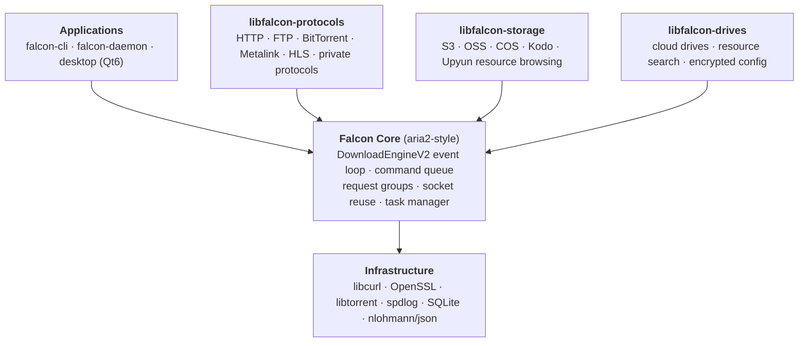

<div align="center">

  

  # Falcon Downloader

  [](LICENSE)
  [](https://github.com/cuihairu/falcon/actions)
  [](https://codecov.io/gh/cuihairu/falcon)
  [](https://github.com/cuihairu/falcon)
  [](https://github.com/cuihairu/falcon/releases)

  **A modern, high-performance, cross-platform download accelerator**

  [English](README.md) | [中文文档](README_CN.md)

</div>

## Features 🚀

- **Dual Download Engines**
  - **V1 engine** (default): libcurl-based, multi-threaded segmented downloading, resume, per-task speed limits
  - **V2 engine** (experimental, `--http-engine v2`): aria2-style event-driven rewrite —
    non-blocking I/O over epoll/kqueue/poll/WSAPoll, command pattern with connection
    reuse, persistent resume via `.falcon.ctrl` control files (If-Range protected),
    multi-source segmented downloading (P2SP) across mirrors, global & per-task speed
    limits, connection-level retries, task timeouts, chunked transfer encoding,
    overwrite protection, and atomic temporary-file publishing
- **Multi-Protocol Support**: HTTP/HTTPS, FTP, Metalink, BitTorrent, Magnet links, private protocols
  - Thunder (迅雷), QQDL (腾讯旋风), FlashGet, ED2K (电驴), HLS/DASH streaming
- **Metalink**: RFC 5854 `.meta4` / Metalink3 `.metalink` mirror lists, multi-mirror
  P2SP segmented download through the V2 engine, whole-file hash verification before publish
- **Daemon & RPC Service** (`falcon-daemon`): aria2-compatible JSON-RPC over HTTP +
  WebSocket on a single port (works with AriaNg), live event stream (download start /
  pause / complete / error / progress), SQLite task persistence with restart recovery,
  `daemon.json` config with SIGHUP hot reload
- **Desktop Application** (Qt6): Fluent-design UI, light/dark themes, frameless window,
  table & grid task views, cloud storage browsing, resource search, dual backend
  (in-process engine or daemon RPC with WebSocket event refresh)
- **CLI** (`falcon-cli`): 60+ aria2-compatible parameters, batch input files, JSON config
- **High Performance**:
  - Multi-connection segmented downloading with adaptive sizing
  - Non-blocking I/O with event-driven architecture
  - Connection pooling for reduced latency
  - Speed control and bandwidth throttling (global & per-task)
- **Advanced Features**:
  - File hash verification (MD5/SHA1/SHA256/SHA512)
  - Resume support for interrupted downloads
  - Multi-mirror failover
  - HTTP proxy (plain and CONNECT tunneling) & SOCKS5
- **Cloud Storage Integration**:
  - Amazon S3, Alibaba Cloud OSS, Tencent COS, Qiniu Kodo, Upyun
  - Custom endpoints for MinIO / RustFS / private-gateway deployments (AWS SigV4 signing)
- **Remote Resource Browsing**: Browse FTP/SFTP/S3/OSS/COS/Kodo/Upyun directories
- **Resource Search**: Built-in search provider framework for torrent and file resources
- **Secure Configuration**: AES-256-GCM encrypted credential storage with master password protection

## Quick Start ⚡

### Installation

```bash
# Clone repository
git clone https://github.com/cuihairu/falcon.git
cd falcon

# Build from source
cmake -B build -S . -DCMAKE_BUILD_TYPE=Release
cmake --build build -j
```

Nightly CI builds (Windows zip / Linux AppImage / macOS app) are attached to the
[Releases](https://github.com/cuihairu/falcon/releases) page. Source build is the
documented path.

### Basic Usage

```bash
# Simple download
falcon-cli https://example.com/file.zip

# Multi-threaded download (5 connections)
falcon-cli -x 5 https://example.com/large_file.iso

# Download with speed limit (1MB/s)
falcon-cli --max-download-limit=1M https://example.com/video.mp4

# Resume behavior is enabled by default; explicit aria2-style switch is also supported
falcon-cli --continue true https://example.com/partial.zip

# Batch input with concurrent tasks
falcon-cli -i urls.txt -j 3

# Custom headers and proxy
falcon-cli --proxy http://127.0.0.1:7890 \
  -H "Authorization: Bearer TOKEN" \
  https://example.com/file.bin

# Try the experimental V2 engine
falcon-cli --http-engine v2 https://example.com/file.zip
```

### aria2-Compatible Parameters

```bash
# Connection settings
falcon-cli -x 16 -s 16 --min-split-size=1M https://example.com/file.zip
# -x: Max connections per task
# -s: Max connections per server

# Retry settings
falcon-cli -r 5 --retry-wait 10 https://example.com/file.zip

# Timeout settings
falcon-cli --timeout 30 https://example.com/file.zip

# HTTP authentication
falcon-cli --http-user=user --http-passwd=pass https://example.com/file.zip

# User agent
falcon-cli --user-agent="Falcon/1.0" https://example.com/file.zip

# Output directory and file name
falcon-cli -d /tmp/downloads -o custom_name.zip https://example.com/file.zip
```

Run `falcon-cli --help` for the full parameter list.

## Supported Protocols 📡

| Protocol | Status | Description |
|----------|--------|-------------|
| HTTP/HTTPS | Enabled | Standard web protocols with resume support |
| FTP/FTPS | Enabled | File Transfer Protocol with passive mode |
| Metalink | Enabled | RFC 5854 `.meta4` / Metalink3 `.metalink` mirror lists with whole-file hash verification |
| SFTP | Optional plugin | Implemented in repo but disabled by default in top-level CMake |
| BitTorrent | Optional plugin | Implemented in repo but disabled by default in top-level CMake |
| Thunder | Optional plugin | Implemented in repo but disabled by default in top-level CMake |
| QQDL | Optional plugin | Implemented in repo but disabled by default in top-level CMake |
| FlashGet | Optional plugin | Implemented in repo but disabled by default in top-level CMake |
| ED2K | Optional plugin | Implemented in repo but disabled by default in top-level CMake |
| HLS/DASH | Optional plugin | Implemented in repo but disabled by default in top-level CMake |

## Cloud Storage Support ☁️

Library-level browsing is implemented for Amazon S3, Alibaba Cloud OSS, Tencent COS,
Qiniu Kodo, and Upyun (`packages/libfalcon-storage`): listing, tree views, object info,
mkdir / rename / recursive delete, quota queries, and custom-endpoint (MinIO /
RustFS / private-gateway) support with AWS Signature V4 request signing for
S3-compatible services that require authentication. The desktop application ships a
cloud storage page backed by these modules.

> **Note**: the CLI currently does not expose storage-browsing commands. Flags like
> `--list`, `--tree`, `--search`, `--add-config`, `--set-master-password` shown in some
> older examples are **not implemented** — use the desktop GUI or call the libraries
> directly.

## Secure Configuration 🔐

`libfalcon-drives` provides an encrypted configuration manager (SQLite-backed,
AES-256-GCM credential encryption protected by a master password). The desktop
application uses it in its settings page. CLI management commands are not exposed yet.

## Advanced Features ⚙️

### Resource Search
`libfalcon-drives` includes a search provider framework (`resource_search`): a provider
interface with URL validation, magnet-link parsing, filtering/sorting/truncation, and a
generic crawler-backed provider. CLI search commands are not implemented yet; see the
library API for integration.

### Remote Directory Browsing
`libfalcon-storage` implements the `ResourceBrowser` interface for FTP, SFTP, S3, OSS,
COS, Kodo, and Upyun — format-tree/table listings, path validation, and recursive
operations. The desktop cloud storage page is built on it.

## Architecture 🏗️

Falcon follows a modular architecture with aria2-inspired event-driven design:



### Event-Driven Architecture

Falcon uses an event-driven command pattern inspired by aria2:

1. **Command Execution**: All download operations are encapsulated as command objects
2. **I/O Multiplexing**: Uses epoll (Linux), kqueue (macOS/BSD), or poll (fallback)
3. **Connection Pooling**: Reuses HTTP/HTTPS connections for better performance
4. **Non-Blocking I/O**: All sockets are non-blocking, driven by events

### Documentation

- [Architecture Overview](docs/aria2_architecture.md) - Detailed architecture documentation
- [API Guide](docs/api_guide.md) - Complete API usage guide
- [Developer Guide](docs/developer_guide.md) - Development setup and guidelines
- [Migration Plan](docs/aria2c-migration-plan.md) - aria2 compatibility roadmap

## Development 👷

### Prerequisites
- CMake 3.15+
- C++17 compatible compiler (GCC 11+ / Clang 14+ / MSVC 2019+ recommended)
- libcurl 7.68+
- OpenSSL 1.1.1+
- nlohmann/json 3.10+
- spdlog 1.9+
- SQLite 3.35+
- libtorrent-rasterbar 2.0+ (optional, BitTorrent plugin)
- Qt 6 (optional, desktop application)

### Build Options
```bash
# Enable/disable components and protocol plugins
cmake -B build -S . \
  -DFALCON_BUILD_CLI=ON \
  -DFALCON_BUILD_DAEMON=ON \
  -DFALCON_BUILD_DESKTOP=ON \
  -DFALCON_ENABLE_HTTP=ON \
  -DFALCON_ENABLE_FTP=ON \
  -DFALCON_ENABLE_METALINK=ON \
  -DFALCON_ENABLE_BITTORRENT=ON \
  -DFALCON_ENABLE_SFTP=ON \
  -DFALCON_ENABLE_THUNDER=ON \
  -DFALCON_ENABLE_QQDL=ON \
  -DFALCON_ENABLE_FLASHGET=ON \
  -DFALCON_ENABLE_ED2K=ON \
  -DFALCON_ENABLE_HLS=ON \
  -DFALCON_ENABLE_CLOUD_STORAGE=ON \
  -DFALCON_ENABLE_RESOURCE_BROWSER=ON \
  -DFALCON_ENABLE_RESOURCE_SEARCH=ON \
  -DFALCON_ENABLE_CONFIG_MANAGER=ON
```

HTTP, FTP, Metalink, cloud storage, resource browsing/search, and the config manager
are ON by default; BitTorrent, SFTP, and the private-protocol plugins are OFF by
default.

## Contributing 🤝

We welcome contributions! Please see our [Contributing Guide](CONTRIBUTING.md) for details.

### Code Style
- Follow Google C++ Style Guide
- Use `clang-format` for code formatting
- Write unit tests for new features

## License 📄

This project is licensed under the Apache License 2.0 - see the [LICENSE](LICENSE) file for details.

## Acknowledgments 🙏

- [libcurl](https://curl.se/) for HTTP/FTP/SFTP support
- [libtorrent](https://www.libtorrent.org/) for BitTorrent support
- [nlohmann/json](https://github.com/nlohmann/json) for JSON handling
- [spdlog](https://github.com/gabime/spdlog) for logging
- [OpenSSL](https://www.openssl.org/) for cryptographic operations
- [SQLite](https://sqlite.org/) for task persistence and configuration storage
- [Qt 6](https://www.qt.io/) for the desktop application

---

<div align="center">
  Made with ❤️ by the Falcon Team
</div>
