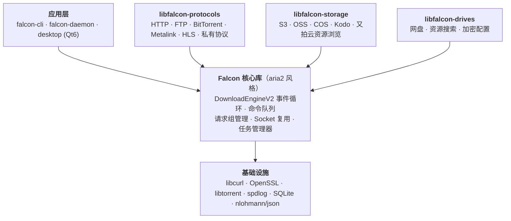

<div align="center">

  

  # Falcon 下载器

  [](LICENSE)
  [](https://github.com/cuihairu/falcon/actions)
  [](https://codecov.io/gh/cuihairu/falcon)
  [](https://github.com/cuihairu/falcon)
  [](https://github.com/cuihairu/falcon/releases)

  **现代化、高性能、跨平台的下载加速器**

  [中文文档](README_CN.md) | [English](README.md)

</div>

## 特性 🚀

- **双下载引擎**
  - **V1 引擎**(默认):基于 libcurl,多线程分段下载、断点续传、任务级限速
  - **V2 引擎**(实验性,`--http-engine v2`):aria2 风格事件驱动重写——非阻塞
    I/O(epoll/kqueue/poll/WSAPoll)、命令模式与连接复用、`.falcon.ctrl` 控制文件
    持久化断点(If-Range 内容变更防护)、多镜像多源分段下载(P2SP)、全局/任务级
    限速、连接级重试、任务超时清理、chunked 传输编码、覆盖保护、临时文件原子发布
- **多协议支持**: HTTP/HTTPS、FTP、Metalink、BitTorrent、磁力链接、私有协议
  - 迅雷 (Thunder)、腾讯旋风 (QQDL)、快车 (FlashGet)、电驴 (ED2K)、HLS/DASH 流媒体
- **Metalink**:RFC 5854 `.meta4` / Metalink3 `.metalink` 镜像列表,经 V2 引擎多镜像
  P2SP 分段下载,发布前整文件哈希校验
- **守护进程与 RPC 服务** (`falcon-daemon`):aria2 兼容 JSON-RPC,同端口 HTTP +
  WebSocket(可直接对接 AriaNg),实时事件流(下载开始/暂停/完成/出错/进度),
  SQLite 任务持久化与重启恢复,`daemon.json` 配置与 SIGHUP 热重载
- **桌面应用** (Qt6):Fluent 设计语言、亮暗主题、无边框窗口、表格/网格双任务视图、
  云盘浏览、资源搜索、双后端(进程内引擎或 Daemon RPC + WebSocket 事件刷新)
- **命令行工具** (`falcon-cli`):60+ 个 aria2 兼容参数、批量输入文件、JSON 配置
- **高性能**:
  - 多连接分段下载,自适应分段
  - 事件驱动的非阻塞 I/O 架构
  - 连接复用降低延迟
  - 速度控制与带宽限制(全局/任务级)
- **高级特性**:
  - 文件哈希校验(MD5/SHA1/SHA256/SHA512)
  - 断点续传,中断自动恢复
  - 多镜像故障切换
  - HTTP 代理(明文与 CONNECT 隧道)与 SOCKS5
- **云存储集成**:
  - 亚马逊 S3、阿里云 OSS、腾讯云 COS、七牛云 Kodo、又拍云
  - 自定义 endpoint,支持 MinIO / RustFS / 私有化网关（AWS SigV4 请求签名）
- **远程资源浏览**: 浏览 FTP/SFTP/S3/OSS/COS/Kodo/又拍云目录
- **资源搜索**: 内置搜索提供者框架,支持种子和文件资源搜索
- **安全配置**: AES-256-GCM 加密存储凭据,主密码保护

## 快速开始 ⚡

### 安装

```bash
# 克隆仓库
git clone https://github.com/cuihairu/falcon.git
cd falcon

# 从源码编译
cmake -B build -S . -DCMAKE_BUILD_TYPE=Release
cmake --build build -j
```

CI 每日构建的三平台产物(Windows zip / Linux AppImage / macOS)附在
[Releases](https://github.com/cuihairu/falcon/releases) 页面。当前文档以源码构建为准。

### 基本使用

```bash
# 简单下载
falcon-cli https://example.com/file.zip

# 多线程下载（5个连接）
falcon-cli -x 5 https://example.com/large_file.iso

# 限速下载（1MB/s）
falcon-cli --max-download-limit=1M https://example.com/video.mp4

# 断点续传默认启用，也可用 aria2 风格显式开关
falcon-cli --continue true https://example.com/partial.zip

# 从文件批量下载
falcon-cli -i urls.txt -j 3

# 通过代理并附加请求头
falcon-cli --proxy http://127.0.0.1:7890 \
  -H "Authorization: Bearer TOKEN" \
  https://example.com/file.bin

# 试用实验性 V2 引擎
falcon-cli --http-engine v2 https://example.com/file.zip
```

### aria2 兼容参数

```bash
# 连接设置
falcon-cli -x 16 -s 16 --min-split-size=1M https://example.com/file.zip
# -x: 单任务最大连接数
# -s: 单服务器最大连接数

# 重试设置
falcon-cli -r 5 --retry-wait 10 https://example.com/file.zip

# 超时设置
falcon-cli --timeout 30 https://example.com/file.zip

# HTTP 认证
falcon-cli --http-user=user --http-passwd=pass https://example.com/file.zip

# 自定义 User-Agent
falcon-cli --user-agent="Falcon/1.0" https://example.com/file.zip

# 输出目录与文件名
falcon-cli -d /tmp/downloads -o custom_name.zip https://example.com/file.zip
```

完整参数列表见 `falcon-cli --help`。

## 支持的协议 📡

| 协议 | 状态 | 描述 |
|------|------|------|
| HTTP/HTTPS | 已启用 | 标准 Web 协议，支持断点续传 |
| FTP/FTPS | 已启用 | 文件传输协议，支持被动模式 |
| Metalink | 已启用 | RFC 5854 `.meta4` / Metalink3 `.metalink` 镜像列表，整文件哈希校验 |
| SFTP | 可选插件 | 仓库内已实现，默认构建关闭 |
| BitTorrent | 可选插件 | 仓库内已实现，默认构建关闭 |
| 迅雷 | 可选插件 | 仓库内已实现，默认构建关闭 |
| 腾讯旋风 | 可选插件 | 仓库内已实现，默认构建关闭 |
| 快车 | 可选插件 | 仓库内已实现，默认构建关闭 |
| 电驴 | 可选插件 | 仓库内已实现，默认构建关闭 |
| HLS/DASH | 可选插件 | 仓库内已实现，默认构建关闭 |

## 云存储支持 ☁️

仓库已实现库层级的云存储浏览（`packages/libfalcon-storage`），覆盖亚马逊 S3、阿里云
OSS、腾讯云 COS、七牛云 Kodo、又拍云：列举、树形视图、对象信息、建目录/改名/
递归删除、配额查询，并支持自定义 endpoint（MinIO / RustFS / 私有化网关），对要求
鉴权的 S3 兼容服务自动进行 AWS Signature V4 请求签名。桌面应用的云盘页
面即基于这些模块构建。

> **注意**：CLI 目前未提供存储浏览命令。部分旧示例中出现的 `--list`、`--tree`、
> `--search`、`--add-config`、`--set-master-password` 等参数**并未实现**——请使用
> 桌面应用，或直接调用相关库。

## 安全配置 🔐

`libfalcon-drives` 提供加密配置管理器（SQLite 存储，AES-256-GCM 凭据加密，主密码
保护）。桌面应用的设置页基于它实现。CLI 管理命令尚未开放。

## 高级功能 ⚙️

### 资源搜索
`libfalcon-drives` 内置搜索提供者框架（`resource_search`）：提供者接口、URL 校验、
磁力链接解析、过滤/排序/截断，以及通用爬虫搜索提供者。CLI 搜索命令尚未实现，集成
请参见库 API。

### 远程目录浏览
`libfalcon-storage` 实现 `ResourceBrowser` 接口，覆盖 FTP、SFTP、S3、OSS、COS、
Kodo、又拍云——格式化树/表格列举、路径校验、递归操作。桌面云盘页面即基于它构建。

## 架构设计 🏗️

Falcon 采用模块化架构，数据面为 aria2 风格的事件驱动设计：



### 事件驱动架构

Falcon 采用 aria2 启发的事件驱动命令模式：

1. **命令执行**：所有下载操作封装为命令对象
2. **I/O 多路复用**：epoll（Linux）、kqueue（macOS/BSD）或 poll（兜底）
3. **连接复用**：HTTP/HTTPS 连接池化，降低延迟
4. **非阻塞 I/O**：所有 socket 非阻塞，由事件驱动

## 开发指南 👷

### 系统要求
- CMake 3.15+
- C++17 兼容的编译器（推荐 GCC 11+ / Clang 14+ / MSVC 2019+）
- libcurl 7.68+
- OpenSSL 1.1.1+
- nlohmann/json 3.10+
- spdlog 1.9+
- SQLite 3.35+
- libtorrent-rasterbar 2.0+（可选，BitTorrent 插件）
- Qt 6（可选，桌面应用）

### 编译选项
```bash
# 启用/禁用组件与协议插件
cmake -B build -S . \
  -DFALCON_BUILD_CLI=ON \
  -DFALCON_BUILD_DAEMON=ON \
  -DFALCON_BUILD_DESKTOP=ON \
  -DFALCON_ENABLE_HTTP=ON \
  -DFALCON_ENABLE_FTP=ON \
  -DFALCON_ENABLE_METALINK=ON \
  -DFALCON_ENABLE_BITTORRENT=ON \
  -DFALCON_ENABLE_SFTP=ON \
  -DFALCON_ENABLE_THUNDER=ON \
  -DFALCON_ENABLE_QQDL=ON \
  -DFALCON_ENABLE_FLASHGET=ON \
  -DFALCON_ENABLE_ED2K=ON \
  -DFALCON_ENABLE_HLS=ON \
  -DFALCON_ENABLE_CLOUD_STORAGE=ON \
  -DFALCON_ENABLE_RESOURCE_BROWSER=ON \
  -DFALCON_ENABLE_RESOURCE_SEARCH=ON \
  -DFALCON_ENABLE_CONFIG_MANAGER=ON
```

HTTP、FTP、Metalink、云存储、资源浏览/搜索与配置管理器默认开启；BitTorrent、
SFTP 与私有协议插件默认关闭。

## 贡献指南 🤝

我们欢迎贡献！请查看我们的[贡献指南](CONTRIBUTING_CN.md)了解详情。

### 代码风格
- 遵循 Google C++ 风格指南
- 使用 `clang-format` 进行代码格式化
- 为新功能编写单元测试

## 许可证 📄

本项目采用 Apache License 2.0 许可证 - 详见 [LICENSE](LICENSE) 文件。

## 致谢 🙏

- [libcurl](https://curl.se/) 用于 HTTP/FTP/SFTP 支持
- [libtorrent](https://www.libtorrent.org/) 用于 BitTorrent 支持
- [nlohmann/json](https://github.com/nlohmann/json) 用于 JSON 处理
- [spdlog](https://github.com/gabime/spdlog) 用于日志
- [OpenSSL](https://www.openssl.org/) 用于加密操作
- [SQLite](https://sqlite.org/) 用于任务持久化与配置存储
- [Qt 6](https://www.qt.io/) 用于桌面应用

## 功能路线图 📋

### 已完成 ✅
- [x] 核心下载引擎（V1 libcurl + V2 事件驱动实验引擎）
- [x] HTTP/HTTPS、FTP/FTPS 插件
- [x] Metalink 下载（多镜像 P2SP 分段 + 整文件哈希校验）
- [x] 命令行工具（60+ aria2 兼容参数）
- [x] Daemon：aria2 兼容 JSON-RPC（HTTP + WebSocket 事件流）、SQLite 持久化、SIGHUP 热重载
- [x] 桌面应用（Qt6，Fluent 设计、亮暗主题、云盘浏览）
- [x] 私有协议支持（迅雷、QQDL、FlashGet、ED2K）
- [x] 云存储浏览（S3、阿里云OSS、腾讯云COS、七牛云、又拍云）
- [x] 资源搜索、加密配置管理

### 进行中 🚧
- [ ] 可选协议插件的默认构建与文档一致性
- [ ] 更多私有协议与网盘直链解析

### 计划中 📅
- [ ] WebDAV / SFTP 协议增强
- [ ] 移动端支持

---

<div align="center">
  Made with ❤️ by Falcon Team
</div>
